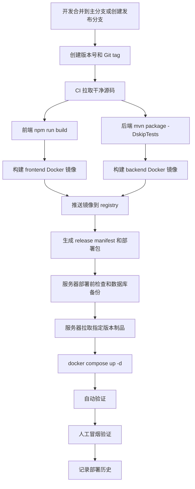

# ArtFetch 制品发布与服务器部署流程设计文档

编写日期：2026-05-23

## 1. 背景

ArtFetch 当前以 Docker Compose 方式运行，核心服务包括：

- `postgres`：PostgreSQL 16，持久化任务、拍品、用户、权限、审计日志和业务配置。
- `backend`：Spring Boot 后端，容器内监听 `8080`。
- `frontend`：Nginx 托管 React 静态资源，并把 `/api/` 反向代理到 `backend:8080`。

现有部署手册偏向“服务器拉代码并在服务器上 build”。这种方式简单直观，但存在几个问题：

- 服务器既承担运行职责，又承担构建职责，部署时间和失败面更大。
- 同一个 Git commit 在不同服务器或不同时间 build，可能得到不同镜像。
- 回滚依赖重新 checkout 和重新 build，速度慢，确定性弱。
- 缺少发布制品清单，难以回答“线上当前跑的是哪个 commit、哪个镜像 digest、哪次发布”。

本文档设计一套更稳定的发布部署流程：在 CI 或受控发布机器上构建不可变制品，把制品发布到镜像仓库或 Release 存储；服务器只拉取已发布制品并重启服务。目标是让发布、部署、验证和回滚都可追溯、可重复、可审计。

## 2. 目标

- 以前端镜像、后端镜像、Compose 部署包作为主要发布制品。
- 每个制品都绑定唯一 Git commit、版本号、镜像 digest 和构建时间。
- 服务器部署时不在生产机编译前端或后端，只拉取已发布制品。
- 支持按版本部署、灰度到预发环境、生产发布和快速回滚。
- 发布前必须通过前端构建、后端构建、镜像构建和基础安全检查。
- 部署前必须备份数据库并记录当前线上版本。
- 部署后必须通过自动验证和人工冒烟验证，不能只以 `docker compose up -d` 成功作为发布成功。
- 生产密钥只保存在服务器 `.env`、密钥管理器或 CI Secret 中，不能写入 Git、制品包、日志或发布说明。

## 3. 非目标

- 不引入 Kubernetes、多机高可用、蓝绿发布或自动扩缩容。
- 不把 PostgreSQL 数据库纳入容器镜像制品。
- 不在本文档中保存任何生产密码、Cookie、Token、对象存储密钥或 SSH 私钥。
- 不改变 ArtFetch 应用内权限模型，不新增后端 API、前端页面或权限码。
- 不要求一次性完成全部自动化。可以先执行手动发布包流程，再逐步迁移到 CI。

## 4. 设计原则

- **不可变制品**：部署版本必须指向镜像 digest 或唯一 tag，发布后不覆盖同名制品。
- **构建与运行分离**：CI 负责 build 和 publish，生产服务器负责 pull 和 run。
- **同源版本号**：后端镜像、前端镜像、部署包和 manifest 使用同一个版本号。
- **先备份后部署**：任何影响生产服务的升级前都要生成数据库备份。
- **失败即停止**：构建失败、镜像推送失败、服务器健康检查失败时停止流程，不继续下一步。
- **可回滚**：部署历史必须保留上一个可用版本和数据库备份路径。
- **最小暴露面**：生产默认只暴露前端入口，数据库、后端、Jupyter 不对公网开放。

## 5. 总体流程



## 6. 制品定义

### 6.1 后端镜像

后端镜像包含 Spring Boot 可运行 JAR 和启动脚本。

建议镜像名：

```text
ghcr.io/<owner>/artfetch-backend:<version>
ghcr.io/<owner>/artfetch-backend:<git-sha>
```

建议同时记录 digest：

```text
ghcr.io/<owner>/artfetch-backend@sha256:<digest>
```

镜像内容来源：

- `backend/Dockerfile`
- `backend/pom.xml`
- `backend/src/**`
- `backend/docker-entrypoint.sh`

构建门禁：

```bash
cd backend
mvn package -DskipTests
docker build -t ghcr.io/<owner>/artfetch-backend:<version> .
```

### 6.2 前端镜像

前端镜像包含 Vite 生产构建结果和 Nginx 配置。

建议镜像名：

```text
ghcr.io/<owner>/artfetch-frontend:<version>
ghcr.io/<owner>/artfetch-frontend:<git-sha>
```

建议同时记录 digest：

```text
ghcr.io/<owner>/artfetch-frontend@sha256:<digest>
```

镜像内容来源：

- `frontend/Dockerfile`
- `frontend/package.json`
- `frontend/src/**`
- `frontend/nginx.conf`

构建门禁：

```bash
cd frontend
npm ci
npm run build
docker build -t ghcr.io/<owner>/artfetch-frontend:<version> .
```

### 6.3 部署包

部署包是一个不含密钥的压缩包，用于服务器部署。它不包含源码构建产物，只包含运行编排和发布元数据。

建议命名：

```text
artfetch-deploy-<version>.tgz
```

建议内容：

```text
artfetch-deploy-<version>/
├── docker-compose.prod.yml
├── .env.example
├── release-manifest.json
├── scripts/
│   ├── preflight.sh
│   ├── backup-db.sh
│   ├── deploy.sh
│   ├── verify.sh
│   └── rollback.sh
└── migrations/
    └── <optional-sql-files>
```

部署包不得包含：

- `.env`
- 数据库密码
- 管理员密码
- 雅昌 Cookie、账号、密码
- 对象存储 Access Key、Secret Key
- SSH 私钥

### 6.4 发布清单

每次发布生成 `release-manifest.json`，作为部署和回滚的事实来源。

示例：

```json
{
  "app": "artfetch",
  "version": "2026.05.23.1",
  "gitSha": "abcdef1234567890",
  "createdAt": "2026-05-23T22:00:00+08:00",
  "images": {
    "backend": {
      "tag": "ghcr.io/<owner>/artfetch-backend:2026.05.23.1",
      "digest": "sha256:<backend-digest>"
    },
    "frontend": {
      "tag": "ghcr.io/<owner>/artfetch-frontend:2026.05.23.1",
      "digest": "sha256:<frontend-digest>"
    }
  },
  "compose": {
    "file": "docker-compose.prod.yml",
    "sha256": "<compose-file-checksum>"
  },
  "migrations": [],
  "build": {
    "frontendBuild": "passed",
    "backendPackage": "passed",
    "imageBuild": "passed"
  }
}
```

## 7. 版本策略

建议使用日期递增版本，便于人工识别：

```text
YYYY.MM.DD.N
```

示例：

```text
2026.05.23.1
2026.05.23.2
```

Git tag 建议：

```text
release/2026.05.23.1
```

镜像 tag 建议同时发布三类：

- `<version>`：人工部署使用。
- `<git-sha>`：精确定位源码使用。
- `stable` 或 `latest`：可选，只用于非生产或人工查看，不作为生产部署依据。

生产部署应优先使用 digest，避免 tag 被误覆盖。

## 8. Compose 生产形态

当前 `docker-compose.yml` 使用 `build:` 在服务器本地构建。制品化部署建议新增 `docker-compose.prod.yml`，使用 `image:` 拉取已发布镜像。

示例：

```yaml
services:
  postgres:
    image: postgres:16-alpine
    container_name: artfetch-postgres
    environment:
      POSTGRES_DB: ${POSTGRES_DB:-artfetch}
      POSTGRES_USER: ${POSTGRES_USER:-artfetch}
      POSTGRES_PASSWORD: ${POSTGRES_PASSWORD:?POSTGRES_PASSWORD is required}
      TZ: Asia/Shanghai
    ports:
      - "${POSTGRES_BIND_HOST:-127.0.0.1}:${POSTGRES_PORT:-5432}:5432"
    volumes:
      - postgres_data:/var/lib/postgresql/data
    healthcheck:
      test: ["CMD-SHELL", "pg_isready -U \"$${POSTGRES_USER}\" -d \"$${POSTGRES_DB}\""]
      interval: 10s
      timeout: 5s
      retries: 5

  backend:
    image: ${ARTFETCH_BACKEND_IMAGE:?ARTFETCH_BACKEND_IMAGE is required}
    container_name: artfetch-backend
    ports:
      - "${BACKEND_BIND_HOST:-127.0.0.1}:${BACKEND_PORT:-8080}:8080"
    environment:
      SPRING_DATASOURCE_URL: jdbc:postgresql://postgres:5432/${POSTGRES_DB:-artfetch}
      SPRING_DATASOURCE_USERNAME: ${POSTGRES_USER:-artfetch}
      SPRING_DATASOURCE_PASSWORD: ${POSTGRES_PASSWORD:?POSTGRES_PASSWORD is required}
      TZ: Asia/Shanghai
      JAVA_TOOL_OPTIONS: -Duser.timezone=Asia/Shanghai
      ARTFETCH_SOURCE_BASE_URL: ${ARTWORK_SOURCE_URL:-https://artso.artron.net/auction/search_auction.php}
      ARTFETCH_SOURCE_REQUEST_DELAY_MS: ${REQUEST_DELAY_MS:-300}
      ARTFETCH_AUTH_ARTRON_COOKIE: ${ARTFETCH_AUTH_ARTRON_COOKIE:-}
      ARTFETCH_AUTH_ARTRON_ACCOUNT: ${ARTFETCH_AUTH_ARTRON_ACCOUNT:-}
      ARTFETCH_AUTH_ARTRON_PASSWORD: ${ARTFETCH_AUTH_ARTRON_PASSWORD:-}
      ARTFETCH_ADMIN_USERNAME: ${ARTFETCH_ADMIN_USERNAME:-admin}
      ARTFETCH_ADMIN_PASSWORD: ${ARTFETCH_ADMIN_PASSWORD:?ARTFETCH_ADMIN_PASSWORD is required}
      ARTFETCH_IMAGE_STORAGE_PATH: /app/storage/original-images
      ARTFETCH_IMAGE_HD_STORAGE_MODE: ${ARTFETCH_IMAGE_HD_STORAGE_MODE:-LOCAL_ONLY}
      ARTFETCH_OBJECT_STORAGE_ENCRYPTION_KEY: ${ARTFETCH_OBJECT_STORAGE_ENCRYPTION_KEY:?ARTFETCH_OBJECT_STORAGE_ENCRYPTION_KEY is required}
      LOG_PATH: /app/logs
    volumes:
      - ./backend/logs:/app/logs
      - ./storage/original-images:/app/storage/original-images
    depends_on:
      postgres:
        condition: service_healthy
    restart: unless-stopped

  frontend:
    image: ${ARTFETCH_FRONTEND_IMAGE:?ARTFETCH_FRONTEND_IMAGE is required}
    container_name: artfetch-frontend
    ports:
      - "${FRONTEND_PORT:-3000}:80"
    depends_on:
      - backend
    restart: unless-stopped

volumes:
  postgres_data:
```

服务器 `.env` 增加：

```bash
ARTFETCH_BACKEND_IMAGE=ghcr.io/<owner>/artfetch-backend@sha256:<backend-digest>
ARTFETCH_FRONTEND_IMAGE=ghcr.io/<owner>/artfetch-frontend@sha256:<frontend-digest>
```

## 9. 发布流程设计

### 9.1 触发条件

建议支持三种触发方式：

- 手动发布：维护者在本地或 CI 页面输入版本号并触发。
- tag 发布：推送 `release/<version>` tag 自动构建并发布制品。
- 主分支候选发布：主分支合并后自动构建候选镜像，但不自动部署生产。

生产发布建议使用手动审批，避免主分支合并后直接影响线上服务。

### 9.2 发布前检查

发布前必须确认：

```bash
git status --short
git rev-parse HEAD
```

要求：

- 发布必须基于干净 Git commit。
- 版本号未被使用。
- release tag 未存在，或明确执行重新发布候选版本。
- `.env`、密钥文件、数据库 dump 不在待发布文件中。
- 前后端依赖锁定文件符合仓库规范。

### 9.3 构建

后端：

```bash
cd backend
mvn package -DskipTests
docker build \
  --label org.opencontainers.image.revision=<git-sha> \
  --label org.opencontainers.image.version=<version> \
  -t ghcr.io/<owner>/artfetch-backend:<version> \
  -t ghcr.io/<owner>/artfetch-backend:<git-sha> \
  .
```

前端：

```bash
cd frontend
npm ci
npm run build
docker build \
  --label org.opencontainers.image.revision=<git-sha> \
  --label org.opencontainers.image.version=<version> \
  -t ghcr.io/<owner>/artfetch-frontend:<version> \
  -t ghcr.io/<owner>/artfetch-frontend:<git-sha> \
  .
```

### 9.4 推送

```bash
docker push ghcr.io/<owner>/artfetch-backend:<version>
docker push ghcr.io/<owner>/artfetch-backend:<git-sha>
docker push ghcr.io/<owner>/artfetch-frontend:<version>
docker push ghcr.io/<owner>/artfetch-frontend:<git-sha>
```

推送后获取 digest：

```bash
docker buildx imagetools inspect ghcr.io/<owner>/artfetch-backend:<version>
docker buildx imagetools inspect ghcr.io/<owner>/artfetch-frontend:<version>
```

### 9.5 生成发布包

```bash
mkdir -p dist/artfetch-deploy-<version>/scripts
cp docker-compose.prod.yml dist/artfetch-deploy-<version>/
cp .env.example dist/artfetch-deploy-<version>/
cp release-manifest.json dist/artfetch-deploy-<version>/
cp scripts/deploy/*.sh dist/artfetch-deploy-<version>/scripts/
tar -C dist -czf dist/artfetch-deploy-<version>.tgz artfetch-deploy-<version>
sha256sum dist/artfetch-deploy-<version>.tgz > dist/artfetch-deploy-<version>.tgz.sha256
```

发布包可以上传到 GitHub Releases、对象存储或内部制品库。

## 10. 服务器部署流程设计

### 10.1 服务器目录

生产服务器建议使用：

```text
/opt/artfetch
├── .env
├── docker-compose.prod.yml
├── release-manifest.json
├── backend/logs/
├── storage/original-images/
├── backups/
└── releases/
```

其中：

- `.env` 只存在服务器本地，不提交 Git。
- `releases/` 保存历史部署包和 manifest。
- `backups/` 保存数据库备份和部署历史。

### 10.2 部署前检查

```bash
cd /opt/artfetch
docker compose -f docker-compose.prod.yml ps
docker system df
df -h
test -f .env
```

检查 `.env` 时只检查变量是否存在，不输出真实值：

```bash
grep -E '^(POSTGRES_PASSWORD|ARTFETCH_ADMIN_PASSWORD|ARTFETCH_OBJECT_STORAGE_ENCRYPTION_KEY|ARTFETCH_BACKEND_IMAGE|ARTFETCH_FRONTEND_IMAGE)=' .env >/dev/null
```

如使用私有镜像仓库，服务器需要先登录 registry：

```bash
docker login ghcr.io
```

登录令牌由用户交互输入或通过服务器安全密钥管理方式提供，不写入仓库。

### 10.3 备份数据库

```bash
cd /opt/artfetch
mkdir -p backups
docker compose --env-file .env -f docker-compose.prod.yml exec -T postgres sh -lc \
  'pg_dump -Fc -U "$POSTGRES_USER" -d "$POSTGRES_DB"' \
  > "backups/artfetch-before-${VERSION}-$(date +%F-%H%M%S).dump"
```

记录当前版本：

```bash
cp release-manifest.json "backups/release-manifest-before-${VERSION}-$(date +%F-%H%M%S).json"
docker compose -f docker-compose.prod.yml ps > "backups/compose-ps-before-${VERSION}-$(date +%F-%H%M%S).txt"
```

### 10.4 安装新部署包

```bash
cd /opt/artfetch
mkdir -p releases
tar -xzf "/tmp/artfetch-deploy-${VERSION}.tgz" -C releases
cp "releases/artfetch-deploy-${VERSION}/docker-compose.prod.yml" ./docker-compose.prod.yml
cp "releases/artfetch-deploy-${VERSION}/release-manifest.json" ./release-manifest.json
```

根据 manifest 更新 `.env` 里的镜像 digest：

```bash
ARTFETCH_BACKEND_IMAGE=ghcr.io/<owner>/artfetch-backend@sha256:<backend-digest>
ARTFETCH_FRONTEND_IMAGE=ghcr.io/<owner>/artfetch-frontend@sha256:<frontend-digest>
```

建议用脚本更新指定变量，避免手工编辑误删其他密钥。

### 10.5 拉取镜像并启动

```bash
cd /opt/artfetch
docker compose -f docker-compose.prod.yml pull backend frontend
docker compose -f docker-compose.prod.yml up -d postgres backend frontend
docker compose -f docker-compose.prod.yml ps
```

如果只发布前端：

```bash
docker compose -f docker-compose.prod.yml pull frontend
docker compose -f docker-compose.prod.yml up -d frontend
```

如果只发布后端：

```bash
docker compose -f docker-compose.prod.yml pull backend
docker compose -f docker-compose.prod.yml up -d backend
```

## 11. 验证流程

### 11.1 自动验证

服务状态：

```bash
cd /opt/artfetch
docker compose -f docker-compose.prod.yml ps
docker inspect artfetch-backend --format '{{.State.Status}} {{.State.Restarting}}'
docker inspect artfetch-frontend --format '{{.State.Status}} {{.State.Restarting}}'
```

HTTP 验证：

```bash
curl -I http://124.174.79.81:3000
curl -i http://124.174.79.81:3000/api/auth/me
```

判断标准：

- 前端入口返回 `200`、`301`、`302`、`304` 均可接受。
- 未登录访问 `/api/auth/me` 必须返回 `401`，用于确认前端 Nginx 已代理到后端鉴权链路。
- 所有 `5xx`、连接失败、超时和 Nginx `502` 都是发布失败。
- `backend` 和 `frontend` 不能处于 `Restarting`、`Exited` 或 `unhealthy`。
- 后端日志不能持续出现新的启动错误、数据库连接错误或权限初始化错误。

日志检查：

```bash
docker compose -f docker-compose.prod.yml logs --tail=200 backend
docker compose -f docker-compose.prod.yml logs --tail=100 frontend
```

### 11.2 人工冒烟验证

每次生产部署后至少验证：

- 登录页可以打开。
- 管理员账号可以登录。
- 任务列表可以加载。
- 艺术品列表可以加载。
- 图片访问和高清图状态展示正常。
- Excel 导出可以下载。
- 如本次涉及对象存储，测试配置读取、连接测试和图片访问链路。
- 如本次涉及评估模块，验证评估项目列表、详情、专家评估和审核入口。

### 11.3 发布成功标准

只有同时满足以下条件，才记录为发布成功：

- 制品版本和 manifest 与目标版本一致。
- 数据库备份存在且文件非空。
- 容器状态正常。
- 自动 HTTP 验证通过。
- 关键日志无持续异常。
- 人工冒烟验证通过，或明确标记为“自动验证通过，等待人工确认”。

## 12. 回滚设计

### 12.1 应用回滚

应用回滚优先回滚镜像和 Compose，不默认恢复数据库。

```bash
cd /opt/artfetch
cp backups/release-manifest-before-<version>-<timestamp>.json ./release-manifest.json
```

根据旧 manifest 更新 `.env`：

```bash
ARTFETCH_BACKEND_IMAGE=ghcr.io/<owner>/artfetch-backend@sha256:<old-backend-digest>
ARTFETCH_FRONTEND_IMAGE=ghcr.io/<owner>/artfetch-frontend@sha256:<old-frontend-digest>
```

重启：

```bash
docker compose -f docker-compose.prod.yml pull backend frontend
docker compose -f docker-compose.prod.yml up -d backend frontend
docker compose -f docker-compose.prod.yml ps
```

回滚后仍需执行完整验证。

### 12.2 数据库回滚

数据库恢复是破坏性操作，只能在明确确认后执行。

恢复前必须：

- 停止后端和前端，避免写入。
- 再做一次当前数据库备份。
- 明确要恢复的备份文件。
- 确认这会丢弃备份之后的新写入。

示例：

```bash
cd /opt/artfetch
docker compose -f docker-compose.prod.yml stop backend frontend
docker compose --env-file .env -f docker-compose.prod.yml exec -T postgres sh -lc \
  'pg_dump -Fc -U "$POSTGRES_USER" -d "$POSTGRES_DB"' \
  > "backups/artfetch-before-db-restore-$(date +%F-%H%M%S).dump"
cat backups/<backup-file>.dump | docker compose --env-file .env -f docker-compose.prod.yml exec -T postgres sh -lc \
  'pg_restore --clean --if-exists --single-transaction -U "$POSTGRES_USER" -d "$POSTGRES_DB"'
docker compose -f docker-compose.prod.yml up -d backend frontend
```

### 12.3 数据库兼容策略

为了让应用回滚可行，数据库变更应遵守：

- 优先做向后兼容变更，例如新增列、扩大字段长度、新增表。
- 删除列、重命名列、改变语义前，先经历兼容版本。
- 后端发布时允许旧字段和新字段同时存在一段时间。
- 破坏性迁移必须有独立恢复方案和人工审批。

## 13. 环境分层

建议至少保留两个环境：

- `staging`：预发环境，自动部署候选版本，允许验证新制品。
- `production`：生产环境，手动审批后部署已验证版本。

环境差异只通过 `.env` 和部署目标区分，不通过修改源码区分。

关键差异：

| 配置项 | staging | production |
| --- | --- | --- |
| 前端端口 | 可用测试端口 | `3000` 或正式域名 |
| 数据库 | 独立测试库 | 生产库 |
| 管理员密码 | 测试密码 | 生产强密码 |
| 雅昌认证 | 可选测试账号 | 生产账号或 Cookie |
| 对象存储 | 测试 bucket | 生产 bucket |
| 发布策略 | 自动或半自动 | 手动审批 |

## 14. CI/CD 设计建议

仓库当前没有 `.github/workflows`。建议后续新增以下工作流。

### 14.1 Pull Request 检查

触发：

- PR 打开或更新。

步骤：

- `frontend/npm ci`
- `frontend/npm run build`
- `backend/mvn package -DskipTests`
- 可选：`backend/mvn test`
- 可选：Docker image build，不 push。

### 14.2 发布制品

触发：

- 手动输入版本号。
- 或推送 `release/<version>` tag。

步骤：

- checkout 指定 Git ref。
- 验证版本号格式和 tag 唯一。
- 运行 PR 检查同等构建门禁。
- 构建前端镜像和后端镜像。
- 推送镜像到 GHCR 或内部 registry。
- 生成 `release-manifest.json`。
- 打包 `artfetch-deploy-<version>.tgz`。
- 上传 GitHub Release 或内部制品库。

### 14.3 部署到预发

触发：

- 发布制品成功后自动部署。
- 或手动选择版本部署。

步骤：

- SSH 到预发服务器。
- 下载部署包。
- 备份预发数据库。
- 更新 `.env` 镜像 digest。
- `docker compose pull && docker compose up -d`。
- 自动验证。

### 14.4 部署到生产

触发：

- 手动审批。

步骤：

- 检查目标版本已在预发验证通过。
- SSH 到生产服务器。
- 下载部署包。
- 备份生产数据库。
- 更新 `.env` 镜像 digest。
- 拉取镜像并重启服务。
- 自动验证。
- 等待人工冒烟确认。
- 记录部署历史。

## 15. 安全设计

### 15.1 密钥管理

密钥存放位置：

- CI：使用 GitHub Actions Secrets 或内部 CI Secret。
- 服务器：使用 `/opt/artfetch/.env`，权限 `600`。
- 人员：使用密码管理器。

禁止：

- 把 `.env` 打入部署包。
- 在日志中打印完整 `.env`。
- 把 registry token 写入仓库。
- 把生产密码写入文档或 issue。

### 15.2 镜像安全

建议：

- 镜像使用固定基础镜像版本，定期升级。
- 发布时记录镜像 digest。
- 可选生成 SBOM。
- 可选运行镜像漏洞扫描。
- 生产部署使用 digest，而不是可变 tag。

### 15.3 端口和网络

生产默认：

- 开放：`22/tcp`、前端入口端口或正式 `80/443`。
- 不开放：`5432/tcp`、`8080/tcp`、`8888/tcp`。

如临时开放后端调试端口，验证完成后必须关闭。

## 16. 部署历史记录

建议在服务器记录：

```text
/opt/artfetch/backups/deploy-history.log
```

记录内容：

- 部署时间。
- 操作人或触发来源。
- 版本号。
- Git commit。
- 前端镜像 digest。
- 后端镜像 digest。
- 数据库备份文件。
- 自动验证结果。
- 人工冒烟结果。

示例：

```text
2026-05-23 22:30:00 version=2026.05.23.1 git=abcdef1 backend=sha256:... frontend=sha256:... backup=backups/artfetch-before-2026.05.23.1-2026-05-23-223000.sql status=auto-verified
```

不要记录密钥、Cookie、密码或完整 Authorization header。

## 17. 迁移路径

建议分三阶段落地。

### 阶段一：保留现有 Compose，补齐发布纪律

- 继续使用服务器拉代码 build。
- 每次部署前强制本地 `npm run build` 和 `mvn package -DskipTests`。
- 每次部署前备份数据库。
- 每次部署后记录部署 commit 和验证结果。

### 阶段二：引入生产 Compose 和手动制品发布

- 新增 `docker-compose.prod.yml`。
- 本地或 CI 构建前后端镜像并推送 registry。
- 服务器改为通过 image digest 部署。
- 部署包包含 prod compose、manifest 和脚本。

### 阶段三：CI/CD 自动发布和预发验证

- 新增 PR 检查工作流。
- 新增发布制品工作流。
- 新增预发部署工作流。
- 生产部署保留手动审批。

## 18. 风险与应对

| 风险 | 影响 | 应对 |
| --- | --- | --- |
| 镜像 tag 被覆盖 | 线上版本不确定 | 生产使用 digest 部署 |
| 服务器拉不到私有镜像 | 部署失败 | 部署前验证 `docker login` 和 `docker pull` |
| 数据库迁移不兼容 | 回滚困难 | 采用兼容迁移，破坏性迁移单独审批 |
| `.env` 被误打包 | 密钥泄露 | 发布脚本显式排除并扫描敏感文件 |
| 前端能打开但 API 502 或 5xx | Nginx 代理后端失败或后端启动异常 | 自动验证必须检查 `/api/auth/me` 返回未登录 `401` |
| 磁盘满导致启动失败 | 容器无法更新 | 部署前检查 `df -h` 和 `docker system df` |
| 只部署前端或后端导致协议不匹配 | 页面或接口异常 | manifest 标记兼容版本，必要时前后端同步部署 |

## 19. 待落地清单

- 新增 `docker-compose.prod.yml`，从 `ARTFETCH_BACKEND_IMAGE` 和 `ARTFETCH_FRONTEND_IMAGE` 读取镜像。
- 新增发布脚本目录，例如 `scripts/release/`。
- 新增部署脚本目录，例如 `scripts/deploy/`。
- 新增 `release-manifest.json` 生成脚本。
- 确定镜像仓库地址，例如 GHCR 或内部 registry。
- 确定版本号规范和 release tag 规范。
- 新增 PR 构建检查工作流。
- 新增发布制品工作流。
- 新增预发服务器或预发 Compose profile。
- 更新现有部署手册，让生产升级优先使用已发布制品。

## 20. 真实发布与部署流程模拟

本节给出一套可以直接落地的模拟流程。示例假设：

- 发布版本：`2026.05.24.1`
- Git tag：`release/2026.05.24.1`
- 镜像仓库：`ghcr.io/<owner>`
- 服务器 SSH：`artfetch-prod`
- 服务器目录：`/opt/artfetch`
- 生产访问地址：`http://124.174.79.81:3000`
- 生产 Compose 文件：`docker-compose.prod.yml`

以下命令里的 `<owner>`、`<your-ghcr-user>`、`<token>` 必须替换为实际值。不要把 token、密码、Cookie 写入脚本、Git 或部署包。

### 20.1 发布前人工确认

发布前先确认这次发布范围：

```bash
cd /Users/wyn/code/ArtFetch

git status --short
git branch --show-current
git rev-parse HEAD
git log -1 --oneline
```

要求：

- `git status --short` 为空，或已经明确把要发布的改动提交到 Git。
- 本次发布 commit 已经过代码审查或至少经过本地构建。
- 如果改了数据库实体、`SchemaMaintenanceService`、`application.yml`、`docker-compose.yml`、对象存储或图片迁移逻辑，必须按“全量后端发布”处理。
- 如果线上正在跑采集、原图下载、高清图下载、成交价补充、高清图迁移任务，先安排维护窗口，或等待任务结束后再发布。

查询服务器运行中任务：

```bash
ssh artfetch-prod 'bash -s' <<'REMOTE'
set -euo pipefail
cd /opt/artfetch
COMPOSE_FILE="${COMPOSE_FILE:-docker-compose.prod.yml}"

echo "Search task status:"
docker compose -f "$COMPOSE_FILE" exec -T postgres sh -lc \
  'psql -U "$POSTGRES_USER" -d "$POSTGRES_DB" -c "select status, count(*) from search_tasks group by status order by status;"'

echo "Running search tasks:"
docker compose -f "$COMPOSE_FILE" exec -T postgres sh -lc \
  'psql -U "$POSTGRES_USER" -d "$POSTGRES_DB" -c "select id, task_type, name, keyword, updated_at from search_tasks where status = '\''RUNNING'\'' order by updated_at desc limit 20;"'

echo "Running HD image migration tasks:"
docker compose -f "$COMPOSE_FILE" exec -T postgres sh -lc \
  'psql -U "$POSTGRES_USER" -d "$POSTGRES_DB" -c "select id, name, status, updated_at from hd_image_migration_tasks where status = '\''RUNNING'\'' order by updated_at desc limit 20;"' || true

echo "Uploading HD image migration items:"
docker compose -f "$COMPOSE_FILE" exec -T postgres sh -lc \
  'psql -U "$POSTGRES_USER" -d "$POSTGRES_DB" -c "select migration_task_id, status, count(*) from hd_image_migration_items where status in ('\''UPLOADING'\'') group by migration_task_id, status order by migration_task_id;"' || true
REMOTE
```

如果存在 `RUNNING` 任务，默认不要重启后端。可以选择：

- 等任务自然完成。
- 在页面手动暂停任务。
- 明确进入维护窗口并接受任务中断风险。

### 20.2 一次性准备生产 Compose 文件

仓库新增 `docker-compose.prod.yml`，生产环境只使用 `image:`，不使用 `build:`。

```yaml
services:
  postgres:
    image: postgres:16-alpine
    container_name: artfetch-postgres
    environment:
      POSTGRES_DB: ${POSTGRES_DB:-artfetch}
      POSTGRES_USER: ${POSTGRES_USER:-artfetch}
      POSTGRES_PASSWORD: ${POSTGRES_PASSWORD:?POSTGRES_PASSWORD is required}
      TZ: Asia/Shanghai
    ports:
      - "${POSTGRES_BIND_HOST:-127.0.0.1}:${POSTGRES_PORT:-5432}:5432"
    volumes:
      - postgres_data:/var/lib/postgresql/data
    healthcheck:
      test: ["CMD-SHELL", "pg_isready -U \"$${POSTGRES_USER}\" -d \"$${POSTGRES_DB}\""]
      interval: 10s
      timeout: 5s
      retries: 5

  backend:
    image: ${ARTFETCH_BACKEND_IMAGE:?ARTFETCH_BACKEND_IMAGE is required}
    container_name: artfetch-backend
    ports:
      - "${BACKEND_BIND_HOST:-127.0.0.1}:${BACKEND_PORT:-8080}:8080"
    environment:
      SPRING_DATASOURCE_URL: jdbc:postgresql://postgres:5432/${POSTGRES_DB:-artfetch}
      SPRING_DATASOURCE_USERNAME: ${POSTGRES_USER:-artfetch}
      SPRING_DATASOURCE_PASSWORD: ${POSTGRES_PASSWORD:?POSTGRES_PASSWORD is required}
      TZ: Asia/Shanghai
      JAVA_TOOL_OPTIONS: -Duser.timezone=Asia/Shanghai
      ARTFETCH_SOURCE_BASE_URL: ${ARTWORK_SOURCE_URL:-https://artso.artron.net/auction/search_auction.php}
      ARTFETCH_SOURCE_REQUEST_DELAY_MS: ${REQUEST_DELAY_MS:-300}
      ARTFETCH_AUTH_ARTRON_COOKIE: ${ARTFETCH_AUTH_ARTRON_COOKIE:-}
      ARTFETCH_AUTH_ARTRON_ACCOUNT: ${ARTFETCH_AUTH_ARTRON_ACCOUNT:-}
      ARTFETCH_AUTH_ARTRON_PASSWORD: ${ARTFETCH_AUTH_ARTRON_PASSWORD:-}
      ARTFETCH_ADMIN_USERNAME: ${ARTFETCH_ADMIN_USERNAME:-admin}
      ARTFETCH_ADMIN_PASSWORD: ${ARTFETCH_ADMIN_PASSWORD:?ARTFETCH_ADMIN_PASSWORD is required}
      ARTFETCH_IMAGE_STORAGE_PATH: /app/storage/original-images
      ARTFETCH_IMAGE_HD_STORAGE_MODE: ${ARTFETCH_IMAGE_HD_STORAGE_MODE:-LOCAL_ONLY}
      ARTFETCH_OBJECT_STORAGE_ENCRYPTION_KEY: ${ARTFETCH_OBJECT_STORAGE_ENCRYPTION_KEY:?ARTFETCH_OBJECT_STORAGE_ENCRYPTION_KEY is required}
      LOG_PATH: /app/logs
    volumes:
      - ./backend/logs:/app/logs
      - ./storage/original-images:/app/storage/original-images
    depends_on:
      postgres:
        condition: service_healthy
    restart: unless-stopped

  frontend:
    image: ${ARTFETCH_FRONTEND_IMAGE:?ARTFETCH_FRONTEND_IMAGE is required}
    container_name: artfetch-frontend
    ports:
      - "${FRONTEND_PORT:-3000}:80"
    depends_on:
      - backend
    restart: unless-stopped

volumes:
  postgres_data:
```

服务器 `/opt/artfetch/.env` 必须额外包含：

```bash
ARTFETCH_BACKEND_IMAGE=ghcr.io/<owner>/artfetch-backend@sha256:<backend-digest>
ARTFETCH_FRONTEND_IMAGE=ghcr.io/<owner>/artfetch-frontend@sha256:<frontend-digest>
```

首次切换到制品化部署时，可以先填一个已发布版本的 digest。后续部署脚本会自动更新这两个变量。

### 20.3 发布脚本

仓库已经落地发布脚本：`scripts/release/artfetch-release.sh`。该脚本是发布制品流程的唯一事实来源，文档不再复制完整脚本，避免脚本演进后文档内嵌副本过期。修改发布逻辑时必须同步修改脚本，并重新执行本节的干跑命令。

脚本能力：

- 校验版本号格式：`YYYY.MM.DD.N`。
- 默认要求 Git 工作区干净；本地演练可加 `--dry-run --allow-dirty`。
- `--allow-dirty` 只能和 `--dry-run` 同时使用，真实发布不允许脏工作区。
- 检查未跟踪的 `.env`、`.sql`、`.dump`、私钥文件，避免把密钥或备份误打入发布上下文。
- 前端执行 `npm ci` 和 `npm run build`。
- 后端优先执行 `backend/mvnw package -DskipTests`，其次执行系统 `mvn package -DskipTests`；如果本机没有 Maven，则使用 `maven:3.9-eclipse-temurin-17` Docker 镜像完成后端打包。
- 真实发布会创建并推送 `release/<version>` tag，使用 Docker Buildx 构建并推送镜像。
- 真实发布的生产镜像引用使用 `image@sha256:<digest>` 写入 manifest，避免 tag 被覆盖导致线上版本不确定。
- 干跑发布只构建本地镜像 `artfetch-local/artfetch-backend:<version>` 和 `artfetch-local/artfetch-frontend:<version>`，不推送 Git tag，不推送镜像，不能直接用于生产部署。
- 生成 `dist/artfetch-deploy-<version>/release-manifest.json`、`docker-compose.prod.yml`、`.env.example`、部署脚本和回滚脚本。
- 生成 `dist/artfetch-deploy-<version>.tgz` 和 `dist/artfetch-deploy-<version>.tgz.sha256`；校验文件只包含包文件名，上传到 `/tmp` 后可直接执行 `sha256sum -c`。

查看脚本帮助：

```bash
cd /Users/wyn/code/ArtFetch
scripts/release/artfetch-release.sh --help
```

本地发布制品演练命令：

```bash
cd /Users/wyn/code/ArtFetch
scripts/release/artfetch-release.sh --dry-run --allow-dirty 2026.05.24.99 local
```

本地演练后必须做静态校验：

```bash
cd /Users/wyn/code/ArtFetch/dist
sha256sum -c artfetch-deploy-2026.05.24.99.tgz.sha256

tar -tzf artfetch-deploy-2026.05.24.99.tgz
cat artfetch-deploy-2026.05.24.99/release-manifest.json
```

期望至少看到：

```text
artfetch-deploy-2026.05.24.99.tgz: OK
artfetch-deploy-2026.05.24.99/
artfetch-deploy-2026.05.24.99/release-manifest.json
artfetch-deploy-2026.05.24.99/docker-compose.prod.yml
artfetch-deploy-2026.05.24.99/.env.example
artfetch-deploy-2026.05.24.99/scripts/artfetch-deploy-release.sh
artfetch-deploy-2026.05.24.99/scripts/artfetch-rollback-release.sh
```

真实发布命令：

```bash
cd /Users/wyn/code/ArtFetch

export GHCR_USER="<your-ghcr-user>"
export GHCR_TOKEN="<token-with-package-write>"
echo "$GHCR_TOKEN" | docker login ghcr.io -u "$GHCR_USER" --password-stdin

export PLATFORMS=linux/amd64
scripts/release/artfetch-release.sh 2026.05.24.1 <owner>
```

真实发布后检查 tag 和镜像 digest：

```bash
git ls-remote --tags origin release/2026.05.24.1

docker buildx imagetools inspect ghcr.io/<owner>/artfetch-backend:2026.05.24.1
docker buildx imagetools inspect ghcr.io/<owner>/artfetch-frontend:2026.05.24.1

cd /Users/wyn/code/ArtFetch/dist
sha256sum -c artfetch-deploy-2026.05.24.1.tgz.sha256
cat artfetch-deploy-2026.05.24.1/release-manifest.json
```

如果服务器是 ARM 架构，先确认：

```bash
ssh artfetch-prod 'docker info --format "{{.OSType}}/{{.Architecture}}"'
```

按结果调整：

```bash
export PLATFORMS=linux/arm64
```

如果希望同一个 release 同时支持 x86 和 ARM：

```bash
export PLATFORMS=linux/amd64,linux/arm64
```

### 20.4 服务器部署脚本

仓库已经落地部署脚本：`scripts/deploy/artfetch-deploy-release.sh`。该脚本面向“已有 ArtFetch 生产环境升级”；如果是第一台全新服务器，先按 20.8 完成首次部署，后续版本升级再使用本脚本。

脚本参数和环境变量：

```bash
bash /opt/artfetch/scripts/artfetch-deploy-release.sh <version> /tmp/artfetch-deploy-<version>.tgz

PROJECT_DIR=/opt/artfetch              # 默认值
BASE_URL=http://124.174.79.81:3000     # 默认值，用于前端和 API 验证
COMPOSE_FILE=docker-compose.prod.yml   # 默认值
ALLOW_RUNNING_TASKS=0                  # 默认不允许带运行任务发布
MIN_FREE_MB=2048                       # 默认要求 /opt/artfetch 所在分区至少剩余 2GB
```

脚本执行顺序：

1. 检查 `docker`、`docker compose`、`sha256sum`、`tar`、`python3`、`curl`、`awk` 是否可用。
2. 检查 `/opt/artfetch` 所在分区剩余空间是否满足 `MIN_FREE_MB`。
3. 校验部署包和 `${PACKAGE}.sha256`。
4. 解压部署包到临时目录。
5. 校验 `docker-compose.prod.yml` 与 manifest 中的 SHA256 是否一致。
6. 校验 manifest 的 `app=artfetch`、`version=<version>`。
7. 从 manifest 读取后端和前端镜像引用。
8. 检查 `/opt/artfetch/.env` 中必需变量存在且不是 `change-me` 占位值，不打印真实密钥。
9. 生成 `.env.candidate` 并写入候选镜像引用。
10. 执行 `docker compose --env-file .env.candidate -f docker-compose.prod.yml.candidate config`。
11. 查询数据库中的运行任务，默认阻止发布窗口打断 `search_tasks`、`hd_image_migration_tasks` 和 `hd_image_migration_items` 的运行或上传状态。
12. 在停止服务前先 `docker pull` 候选镜像，避免已停服务后才发现镜像不可拉取。
13. 停止 `frontend` 和 `backend`，保留 `postgres` 运行。
14. 执行 `pg_dump -Fc` 生成数据库备份。
15. 备份当前 `.env`、Compose、manifest。
16. 安装新 Compose、manifest 和 `.env`。
17. 启动 `postgres`、`backend`、`frontend`。
18. 验证容器稳定、后端 `/actuator/health`、前端入口、`/api/auth/me` 未登录返回 401。
19. 扫描最近 3 分钟 backend 日志中的 `ERROR`、`Exception`、`Failed to start`。
20. 写入 `backups/deploy-history.log`。

把脚本上传或在服务器创建后赋权：

```bash
ssh artfetch-prod 'mkdir -p /opt/artfetch/scripts'
scp scripts/deploy/artfetch-deploy-release.sh artfetch-prod:/opt/artfetch/scripts/artfetch-deploy-release.sh
scp scripts/deploy/artfetch-rollback-release.sh artfetch-prod:/opt/artfetch/scripts/artfetch-rollback-release.sh
ssh artfetch-prod 'chmod +x /opt/artfetch/scripts/artfetch-deploy-release.sh /opt/artfetch/scripts/artfetch-rollback-release.sh'
```

部署前可以先在服务器做只读预检查：

```bash
ssh artfetch-prod 'bash -s' <<'REMOTE'
set -euo pipefail
cd /opt/artfetch

test -f .env
test -f docker-compose.prod.yml
chmod 600 .env

command -v docker
command -v sha256sum
command -v tar
command -v python3
command -v curl
docker compose version

docker compose --env-file .env -f docker-compose.prod.yml config >/dev/null
docker compose --env-file .env -f docker-compose.prod.yml ps

df -h / /opt/artfetch
docker system df
REMOTE
```

执行部署：

```bash
ssh artfetch-prod 'bash /opt/artfetch/scripts/artfetch-deploy-release.sh 2026.05.24.1 /tmp/artfetch-deploy-2026.05.24.1.tgz'
```

如果这是维护窗口，并且已经确认允许中断运行任务：

```bash
ssh artfetch-prod 'ALLOW_RUNNING_TASKS=1 bash /opt/artfetch/scripts/artfetch-deploy-release.sh 2026.05.24.1 /tmp/artfetch-deploy-2026.05.24.1.tgz'
```

失败时脚本会输出 rollback prefix，例如：

```text
Rollback backup prefix: 2026.05.24.1-2026-05-24-223000
Rollback command:
  bash /opt/artfetch/scripts/artfetch-rollback-release.sh 2026.05.24.1-2026-05-24-223000
```

### 20.5 一次完整发布到服务器

本地构建并生成部署包：

```bash
cd /Users/wyn/code/ArtFetch

export GHCR_USER="<your-ghcr-user>"
export GHCR_TOKEN="<token-with-package-write>"
echo "$GHCR_TOKEN" | docker login ghcr.io -u "$GHCR_USER" --password-stdin

export PLATFORMS=linux/amd64
scripts/release/artfetch-release.sh 2026.05.24.1 <owner>
```

上传部署包：

```bash
scp \
  dist/artfetch-deploy-2026.05.24.1.tgz \
  dist/artfetch-deploy-2026.05.24.1.tgz.sha256 \
  artfetch-prod:/tmp/
```

上传后先在服务器校验包完整性：

```bash
ssh artfetch-prod 'cd /tmp && sha256sum -c artfetch-deploy-2026.05.24.1.tgz.sha256'
```

服务器登录镜像仓库。只在服务器交互输入 token，不写入命令历史：

```bash
ssh artfetch-prod
docker login ghcr.io
exit
```

执行部署：

```bash
ssh artfetch-prod 'bash /opt/artfetch/scripts/artfetch-deploy-release.sh 2026.05.24.1 /tmp/artfetch-deploy-2026.05.24.1.tgz'
```

如果这是维护窗口，且已经确认允许中断运行任务：

```bash
ssh artfetch-prod 'ALLOW_RUNNING_TASKS=1 bash /opt/artfetch/scripts/artfetch-deploy-release.sh 2026.05.24.1 /tmp/artfetch-deploy-2026.05.24.1.tgz'
```

部署完成后人工验证：

```bash
open http://124.174.79.81:3000/login
```

手工验证清单：

- 登录页打开。
- 管理员登录成功。
- 任务列表加载成功。
- 艺术品列表加载成功。
- 任意一条艺术品详情可打开。
- Excel 导出能下载。
- 如本次涉及对象存储，进入对象存储设置页执行连接测试。
- 如本次涉及高清图迁移，确认高清图迁移页能打开，但不要在发布窗口随意启动大迁移任务。

人工验证完成后，在服务器记录结果：

```bash
ssh artfetch-prod 'bash -s' <<'REMOTE'
set -euo pipefail
cd /opt/artfetch
{
  printf "%s " "$(date '+%F %T')"
  printf "version=%s " "2026.05.24.1"
  printf "status=manual-smoke-passed\n"
} >> backups/deploy-history.log
REMOTE
```

### 20.6 部署失败时快速回滚脚本

仓库已经落地回滚脚本：`scripts/deploy/artfetch-rollback-release.sh`。它只回滚应用镜像、Compose、`.env` 和 manifest，不自动恢复数据库。

回滚命令使用部署失败时输出的 backup prefix：

```bash
ssh artfetch-prod 'bash /opt/artfetch/scripts/artfetch-rollback-release.sh 2026.05.24.1-2026-05-24-223000'
```

脚本会恢复以下文件：

```text
backups/env-before-2026.05.24.1-2026-05-24-223000
backups/docker-compose.prod.yml-before-2026.05.24.1-2026-05-24-223000
backups/release-manifest-before-2026.05.24.1-2026-05-24-223000.json
```

回滚后自动验证：

- 后端 `/actuator/health` 返回 `UP`。
- 前端入口能访问。
- `/api/auth/me` 未登录返回 401。
- 记录 `backups/deploy-history.log`。

只有当应用回滚后仍无法恢复，并且确认必须丢弃备份后的生产写入时，才考虑数据库恢复。数据库恢复必须单独执行，不能放入自动回滚脚本：

```bash
ssh artfetch-prod 'bash -s' <<'REMOTE'
set -euo pipefail
cd /opt/artfetch

RESTORE_FILE="backups/<backup-file>.dump"

docker compose --env-file .env -f docker-compose.prod.yml stop backend frontend

docker compose --env-file .env -f docker-compose.prod.yml exec -T postgres sh -lc \
  'pg_dump -Fc -U "$POSTGRES_USER" -d "$POSTGRES_DB"' \
  > "backups/artfetch-before-db-restore-$(date +%F-%H%M%S).dump"

cat "$RESTORE_FILE" | docker compose --env-file .env -f docker-compose.prod.yml exec -T postgres sh -lc \
  'pg_restore --clean --if-exists --single-transaction -U "$POSTGRES_USER" -d "$POSTGRES_DB"'

docker compose --env-file .env -f docker-compose.prod.yml up -d backend frontend
REMOTE
```

### 20.7 发布完成后的清理

确认发布成功后可以清理临时包：

```bash
ssh artfetch-prod 'rm -f /tmp/artfetch-deploy-2026.05.24.1.tgz /tmp/artfetch-deploy-2026.05.24.1.tgz.sha256'
```

不要马上清理旧镜像。至少保留最近 3 个生产成功版本，确保快速回滚可用。

查看镜像占用：

```bash
ssh artfetch-prod 'docker system df'
```

确认最近版本都已在 registry 和服务器缓存中可用后，才清理悬空镜像：

```bash
ssh artfetch-prod 'docker image prune'
```

禁止在没有明确确认的情况下执行：

```bash
docker compose down -v
docker volume rm
docker system prune -a --volumes
```

### 20.8 全新服务器首次部署

如果服务器上还没有 ArtFetch，不执行升级脚本，因为没有旧数据库可备份。首次部署按下面流程走。

上传部署包：

```bash
scp \
  dist/artfetch-deploy-2026.05.24.1.tgz \
  dist/artfetch-deploy-2026.05.24.1.tgz.sha256 \
  artfetch-prod:/tmp/
```

初始化目录：

```bash
ssh artfetch-prod 'bash -s' <<'REMOTE'
set -euo pipefail

sudo mkdir -p /opt/artfetch
sudo chown -R "$USER:$USER" /opt/artfetch

cd /opt/artfetch
mkdir -p releases backups scripts backend/logs storage/original-images
chmod 700 backups
REMOTE
```

解包并校验：

```bash
ssh artfetch-prod 'bash -s' <<'REMOTE'
set -euo pipefail

VERSION="2026.05.24.1"
PACKAGE="/tmp/artfetch-deploy-${VERSION}.tgz"

cd /tmp
sha256sum -c "artfetch-deploy-${VERSION}.tgz.sha256"

cd /opt/artfetch
tar -xzf "$PACKAGE" -C releases
cp "releases/artfetch-deploy-${VERSION}/docker-compose.prod.yml" ./docker-compose.prod.yml
cp "releases/artfetch-deploy-${VERSION}/release-manifest.json" ./release-manifest.json
cp "releases/artfetch-deploy-${VERSION}/.env.example" ./.env
chmod 600 .env
REMOTE
```

在服务器交互编辑 `.env`，填入生产密钥：

```bash
ssh artfetch-prod
cd /opt/artfetch
vi .env
chmod 600 .env
exit
```

不要把 `.env` 复制回本地，也不要在聊天、文档、提交记录里回显真实值。

从 manifest 写入镜像 digest：

```bash
ssh artfetch-prod 'bash -s' <<'REMOTE'
set -euo pipefail
cd /opt/artfetch

BACKEND_IMAGE="$(python3 - <<'PY'
import json
with open("release-manifest.json", "r", encoding="utf-8") as f:
    print(json.load(f)["images"]["backend"]["ref"])
PY
)"

FRONTEND_IMAGE="$(python3 - <<'PY'
import json
with open("release-manifest.json", "r", encoding="utf-8") as f:
    print(json.load(f)["images"]["frontend"]["ref"])
PY
)"

python3 - ".env" "$BACKEND_IMAGE" "$FRONTEND_IMAGE" <<'PY'
import sys
from pathlib import Path

env_path = Path(sys.argv[1])
updates = {
    "ARTFETCH_BACKEND_IMAGE": sys.argv[2],
    "ARTFETCH_FRONTEND_IMAGE": sys.argv[3],
}

lines = env_path.read_text(encoding="utf-8").splitlines()
seen = set()
out = []
for line in lines:
    if not line or line.lstrip().startswith("#") or "=" not in line:
        out.append(line)
        continue
    key = line.split("=", 1)[0]
    if key in updates:
        out.append(f"{key}={updates[key]}")
        seen.add(key)
    else:
        out.append(line)

for key, value in updates.items():
    if key not in seen:
        out.append(f"{key}={value}")

env_path.write_text("\n".join(out) + "\n", encoding="utf-8")
PY

chmod 600 .env
REMOTE
```

首次启动前检查变量存在，不输出真实值：

```bash
ssh artfetch-prod 'bash -s' <<'REMOTE'
set -euo pipefail
cd /opt/artfetch

for key in \
  POSTGRES_PASSWORD \
  ARTFETCH_ADMIN_PASSWORD \
  ARTFETCH_OBJECT_STORAGE_ENCRYPTION_KEY \
  ARTFETCH_BACKEND_IMAGE \
  ARTFETCH_FRONTEND_IMAGE
do
  if ! grep -Eq "^${key}=" .env; then
    echo "Missing .env key: $key"
    exit 1
  fi
  value="$(grep -E "^${key}=" .env | tail -n 1 | cut -d= -f2-)"
  if [ -z "$value" ] || printf '%s' "$value" | grep -qi 'change-me'; then
    echo "Required .env key still looks empty or placeholder-like: $key"
    exit 1
  fi
done

docker compose --env-file .env -f docker-compose.prod.yml config >/dev/null
REMOTE
```

服务器登录镜像仓库：

```bash
ssh artfetch-prod
docker login ghcr.io
exit
```

启动核心服务：

```bash
ssh artfetch-prod 'bash -s' <<'REMOTE'
set -euo pipefail
cd /opt/artfetch

docker compose --env-file .env -f docker-compose.prod.yml pull backend frontend
docker compose --env-file .env -f docker-compose.prod.yml up -d postgres backend frontend
docker compose --env-file .env -f docker-compose.prod.yml ps
REMOTE
```

首次部署验证：

```bash
ssh artfetch-prod 'bash -s' <<'REMOTE'
set -euo pipefail
cd /opt/artfetch

BACKEND_PORT="$(docker compose --env-file .env -f docker-compose.prod.yml port backend 8080 | tail -n 1)"

for i in $(seq 1 60); do
  if curl -fsS "http://${BACKEND_PORT}/actuator/health" | grep -q '"status":"UP"'; then
    break
  fi
  sleep 2
  if [ "$i" = "60" ]; then
    docker compose --env-file .env -f docker-compose.prod.yml logs --tail=200 backend
    exit 1
  fi
done

curl -fsSI http://124.174.79.81:3000 >/dev/null

API_CODE="$(curl -sS -o /tmp/artfetch-api-check-body -w '%{http_code}' http://124.174.79.81:3000/api/auth/me || true)"
if [ "$API_CODE" != "401" ]; then
  echo "API auth check failed: $API_CODE; expected 401 for unauthenticated /api/auth/me."
  cat /tmp/artfetch-api-check-body || true
  exit 1
fi

{
  printf "%s " "$(date '+%F %T')"
  printf "version=%s " "2026.05.24.1"
  printf "status=first-deploy-auto-verified\n"
} >> backups/deploy-history.log
REMOTE
```

最后打开页面做人工冒烟：

```bash
open http://124.174.79.81:3000/login
```

### 20.9 本地发布制品演练结果

2026-05-24 已在 `/Users/wyn/code/ArtFetch` 做了一次本地发布制品演练，命令如下：

```bash
cd /Users/wyn/code/ArtFetch
scripts/release/artfetch-release.sh --dry-run --allow-dirty 2026.05.24.99 local
```

演练结果：

- `npm ci` 和 `npm run build` 通过。
- 本机没有系统 Maven，脚本自动使用 `maven:3.9-eclipse-temurin-17` Docker 镜像执行 `mvn package -DskipTests`，后端打包通过。
- 后端本地镜像构建通过：`artfetch-local/artfetch-backend:2026.05.24.99`。
- 前端本地镜像构建通过：`artfetch-local/artfetch-frontend:2026.05.24.99`。
- 产物包生成：`dist/artfetch-deploy-2026.05.24.99.tgz`。
- SHA256 校验通过：`sha256sum -c artfetch-deploy-2026.05.24.99.tgz.sha256` 返回 `OK`。
- 产物包包含 `release-manifest.json`、`docker-compose.prod.yml`、`.env.example`、部署脚本和回滚脚本。
- manifest 记录了 `dryRun=true`、Git SHA、镜像引用、镜像 digest、Compose SHA256 和构建结果。

演练后对流程做出的调整：

- 发布脚本的 `.tgz.sha256` 改为只写包文件名，确保包和校验文件上传到 `/tmp` 后可以直接校验。
- `.env.example` 增加 `ARTFETCH_BACKEND_IMAGE` 和 `ARTFETCH_FRONTEND_IMAGE` 占位变量，首次部署时不会漏掉镜像配置入口。
- Maven Docker fallback 增加 `HOME=/tmp` 和 `MAVEN_CONFIG=/tmp/.m2`，减少无系统 Maven 环境下的权限噪音。
- 新增 `backend/.dockerignore` 和 `frontend/.dockerignore`，避免把 `node_modules`、`dist`、`target`、日志、密钥文件和数据库备份放进 Docker build context；前端构建上下文从演练前约 141MB 降到约 2KB。
- 前端 Dockerfile 改为复制 `package-lock.json` 并使用 `npm ci`，确保镜像构建依赖与本地发布构建一致。
- 部署脚本增加命令依赖、Docker Compose 插件和最低磁盘空间检查，失败时会清理候选 `.env` 和候选 Compose。
- 回滚脚本增加命令依赖和 Docker Compose 插件检查，减少服务器环境缺失时的半截执行。
- 文档改为以 `scripts/release/` 和 `scripts/deploy/` 下的真实脚本为准，不再复制完整脚本正文，降低文档和脚本漂移风险。

演练中仍需后续治理但不阻塞发布流程的问题：

- 前端 `npm audit` 报告 3 个依赖漏洞，其中 1 个 high，需要单独评估升级影响。
- Vite 报告主 JS chunk 大于 500KB，建议后续用路由级动态导入或手动分包优化首屏加载。
- 本次是干跑发布，镜像没有推送到 registry，不能用于生产服务器部署。生产部署必须运行 20.3 的真实发布命令，生成 registry digest 后再部署。
