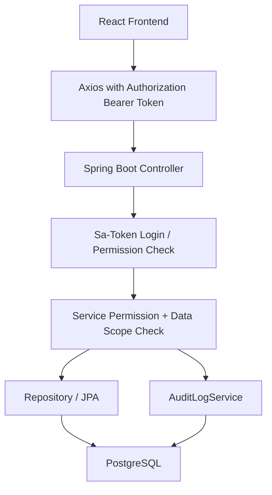
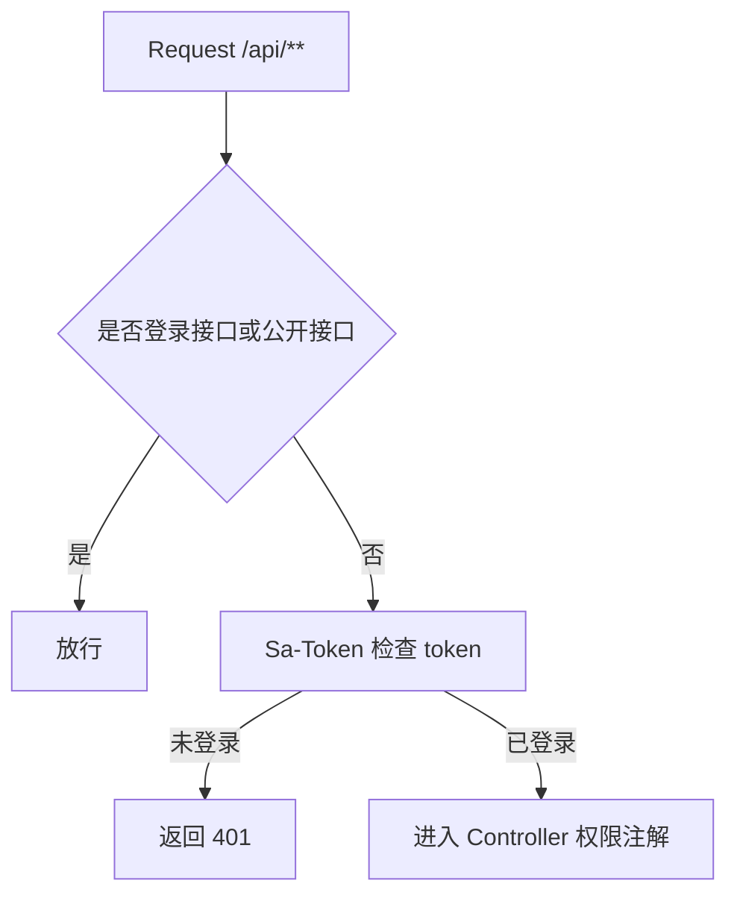
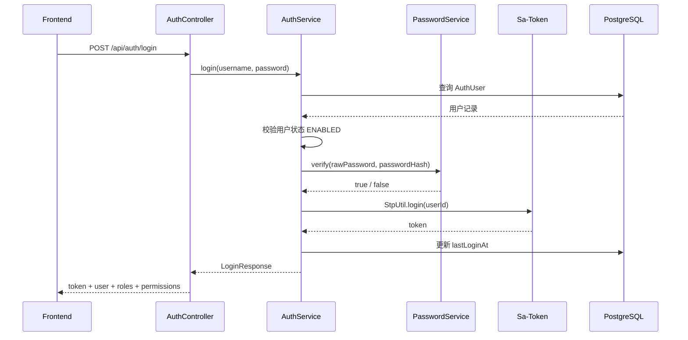
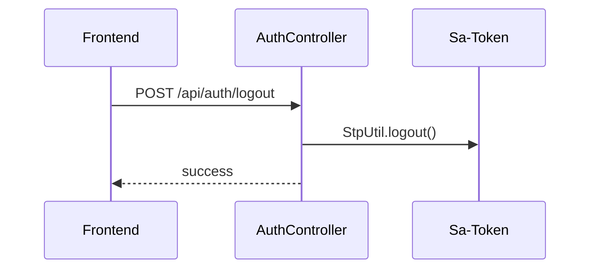
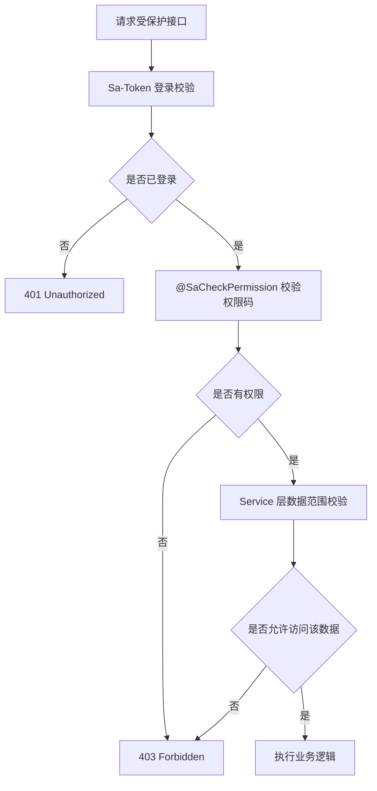
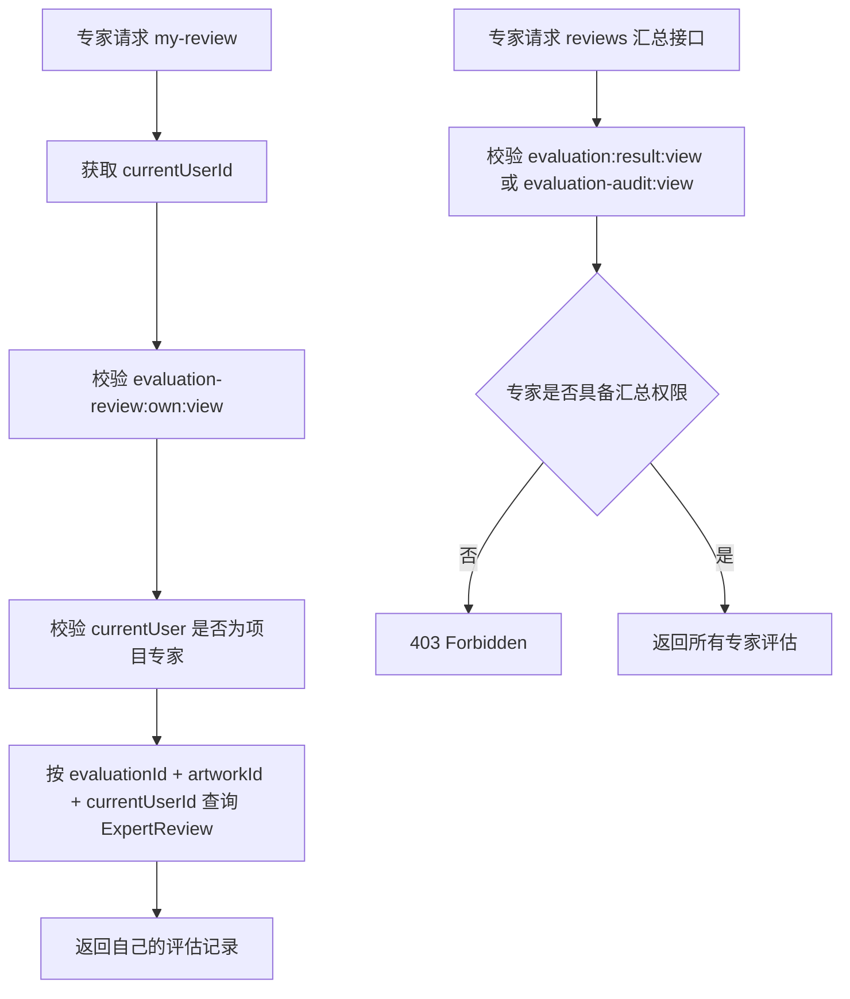
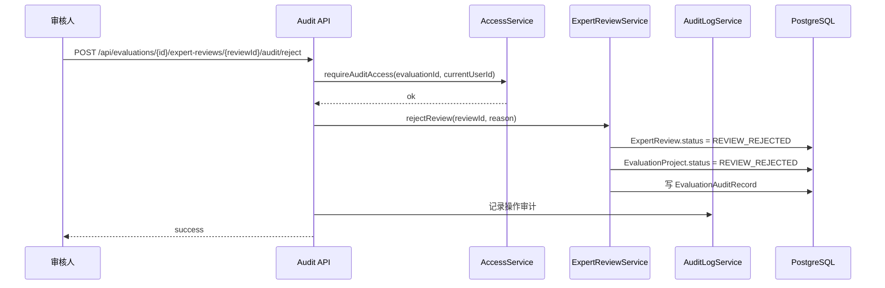
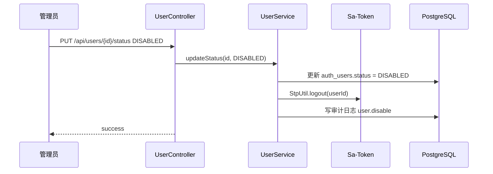

# ArtFetch Sa-Token 鉴权后端设计文档

## 文档信息

| 项 | 内容 |
|---|---|
| 当前版本 | v3 |
| 文档状态 | 设计评审中 |
| 最后更新日期 | 2026-04-25 |
| 关联 PRD | `docs/prd-users-roles-permissions.md` |
| 适用范围 | 后端鉴权、用户、角色、权限、数据范围、审计日志 |

## 版本记录

| 版本 | 日期 | 变更说明 |
|---|---|---|
| v1 | 2026-04-25 | 初版，定义 Sa-Token 鉴权后端设计、表结构、对象、流程和验收标准。 |
| v2 | 2026-04-25 | 简化默认角色为管理员、专家、审核人；补充默认角色权限映射；明确数据相关功能暂归管理员；移除强制改密要求。 |
| v3 | 2026-04-25 | 补充 Sa-Token 拦截器配置细节、完整默认权限种子、停用用户 token 失效流程和普通索引 DDL。 |

## 1. 设计目标

本设计文档用于指导 ArtFetch 后端实现用户、角色、权限与数据范围控制。鉴权框架选用 Sa-Token，权限模型采用 RBAC 为主，结合少量 ABAC 数据范围校验，覆盖当前已实现的采集任务和艺术品数据功能，并支撑后续艺术品评估模块。

核心目标：

- 用户可以登录、退出、获取当前用户信息。
- 管理员可以管理用户、角色和角色权限。
- 后端接口必须进行登录校验和权限校验。
- 前端菜单、按钮可以根据当前用户权限动态展示。
- 专家只能访问自己的评估项目和自己的专家评估记录。
- 审核人可以查看待审核项目和多专家评估结果。
- 审核人可以驳回某专家对某艺术品的单条评估。
- 系统记录关键鉴权和业务操作审计日志。
- 初始化默认角色和默认权限，降低首版实现成本。

## 2. 需求追踪矩阵

| 编号 | 需求 | 后端设计覆盖 |
|---|---|---|
| AUTH-01 | 用户名 / 密码登录 | `AuthController.login`、`AuthService.login`、Sa-Token `StpUtil.login`、密码哈希校验 |
| AUTH-02 | 用户退出 | `AuthController.logout`、Sa-Token `StpUtil.logout` |
| AUTH-03 | 获取当前用户信息 | `AuthController.currentUser` 返回用户、角色、权限 |
| AUTH-04 | 用户列表 | `UserController.listUsers`，需要 `user:view` |
| AUTH-05 | 新增用户 | `UserController.createUser`，需要 `user:create` |
| AUTH-06 | 编辑用户 | `UserController.updateUser`，需要 `user:update` |
| AUTH-07 | 启用 / 停用用户 | `UserController.updateStatus`，需要 `user:disable` 或 `user:update` |
| AUTH-08 | 重置密码 | `UserController.resetPassword`，需要 `user:update` |
| AUTH-09 | 修改自己的密码 | `AuthController.changePassword`，登录用户可调用 |
| AUTH-10 | 分配用户角色 | `UserController.updateUserRoles`，需要 `user:update` |
| AUTH-11 | 角色列表 | `RoleController.listRoles`，需要 `role:view` |
| AUTH-12 | 新增角色 | `RoleController.createRole`，需要 `role:create` |
| AUTH-13 | 编辑角色 | `RoleController.updateRole`，需要 `role:update` |
| AUTH-14 | 启用 / 停用角色 | `RoleController.updateStatus`，需要 `role:disable` 或 `role:update` |
| AUTH-15 | 给角色分配权限 | `RoleController.updateRolePermissions`，需要 `role:update` |
| AUTH-16 | 权限列表查看 | `PermissionController.listPermissions`，需要 `role:view` 或 `user:view` |
| AUTH-17 | 内置权限编码 | `PermissionInitializer` 初始化固定权限 |
| AUTH-18 | 菜单权限 | `CurrentUserDto.permissions` 返回前端，前端按权限展示菜单 |
| AUTH-19 | 按钮权限 | `CurrentUserDto.permissions` 返回前端，前端按权限展示按钮 |
| AUTH-20 | 接口权限 | Sa-Token 注解 `@SaCheckPermission` |
| AUTH-21 | 未登录返回 401 | Sa-Token 全局异常处理 |
| AUTH-22 | 无权限返回 403 | Sa-Token 全局异常处理 |
| AUTH-23 | 专家只能看自己的评估项目 | `EvaluationAccessService.requireExpertAssigned` |
| AUTH-24 | 专家只能看自己的评估记录 | `ExpertReviewAccessService.requireOwnReview` |
| AUTH-25 | 专家不能看其他专家评分、评语、估价 | 专家接口只提供 `my-review`，汇总接口要求审核或管理权限 |
| AUTH-26 | 审核人能看待审核项目 | `EvaluationAccessService.requireAuditorAccess` |
| AUTH-27 | 管理员能看全部 | `AccessContext.isAdmin` 快速放行数据范围 |
| AUTH-28 | 操作审计 | `AuditLogService.record`，关键接口写入审计日志 |
| AUTH-29 | 默认角色初始化 | `AuthDataInitializer` 初始化 ADMIN、EXPERT、AUDITOR |
| AUTH-30 | 默认权限初始化 | `AuthDataInitializer` 初始化任务、艺术品、评估、用户角色权限 |

## 3. 总体架构



后端鉴权分三层：

1. **登录态校验**：Sa-Token 判断请求是否携带有效 token。
2. **权限码校验**：Controller 方法使用 `@SaCheckPermission` 校验功能权限。
3. **数据范围校验**：Service 层判断当前用户是否能访问具体业务数据，例如某个评估项目或某条专家评估记录。

## 4. 技术选型

### 4.1 鉴权框架

使用 Sa-Token。

原因：

- 相比 Spring Security，配置更轻，概念更少。
- 支持登录、角色、权限、注解鉴权。
- 支持前后端分离 token 模式。
- 可扩展 Redis、JWT、SSO。
- 适合当前 Spring Boot 单体应用。

### 4.2 密码哈希

推荐使用 JDK 标准 `PBKDF2WithHmacSHA256`，避免为密码哈希额外引入安全框架。

存储格式建议：

```text
pbkdf2_sha256$120000$base64Salt$base64Hash
```

### 4.3 Token 模式

第一版明确不接 Redis，使用 Sa-Token 默认 token 和应用内存会话。

适用前提：

- 后端单实例部署。
- 接受应用重启后用户需要重新登录。
- 暂不做多实例负载均衡。

后续扩展：

- 如果后续 Docker 多实例部署，或需要重启后 token 不失效，再接 Redis。
- 如果需要完全无状态 token，可后续切换 Sa-Token JWT 插件。

## 5. 后端模块设计

建议新增包结构：

```text
backend/src/main/java/com/artfetch/auth/
  config/
    SaTokenConfig.java
    AuthDataInitializer.java
  controller/
    AuthController.java
    UserController.java
    RoleController.java
    PermissionController.java
    AuditLogController.java
  dto/
    LoginRequest.java
    LoginResponse.java
    CurrentUserDto.java
    UserDto.java
    RoleDto.java
    PermissionDto.java
    AuditLogDto.java
    CreateUserRequest.java
    UpdateUserRequest.java
    ResetPasswordRequest.java
    ChangePasswordRequest.java
    UpdateUserRolesRequest.java
    UpdateRolePermissionsRequest.java
  entity/
    AuthUser.java
    AuthRole.java
    AuthPermission.java
    AuthUserRole.java
    AuthRolePermission.java
    AuditLog.java
  repository/
    AuthUserRepository.java
    AuthRoleRepository.java
    AuthPermissionRepository.java
    AuthUserRoleRepository.java
    AuthRolePermissionRepository.java
    AuditLogRepository.java
  service/
    AuthService.java
    CurrentUserService.java
    UserService.java
    RoleService.java
    PermissionService.java
    PasswordService.java
    AuditLogService.java
    PermissionLoadService.java
    DataScopeService.java
  satoken/
    StpInterfaceImpl.java
  support/
    AuthConstants.java
    PermissionCodes.java
    RoleCodes.java
    AuthExceptionHandler.java
```

评估模块后续建议新增访问控制服务：

```text
backend/src/main/java/com/artfetch/service/
  EvaluationAccessService.java
  ExpertReviewAccessService.java
```

## 6. Sa-Token 接入设计

### 6.1 Maven 依赖

后端 `pom.xml` 建议新增：

```xml
<dependency>
    <groupId>cn.dev33</groupId>
    <artifactId>sa-token-spring-boot3-starter</artifactId>
    <version>${sa-token.version}</version>
</dependency>
```

第一版不引入 Redis 相关依赖。以下依赖仅作为后续多实例或持久化登录态扩展时考虑：

```xml
<dependency>
    <groupId>cn.dev33</groupId>
    <artifactId>sa-token-redis-jackson</artifactId>
    <version>${sa-token.version}</version>
</dependency>
```

### 6.2 配置

`application.yml` 建议增加：

```yaml
sa-token:
  token-name: Authorization
  token-prefix: Bearer
  timeout: 604800
  active-timeout: -1
  is-concurrent: true
  is-share: false
  token-style: uuid
  is-log: false
```

说明：

- `token-name` 使用 `Authorization`，前端请求头为 `Authorization: Bearer <token>`。
- `timeout` 第一版建议 7 天。
- `is-share: false` 表示同一账号多端登录生成不同 token，便于后续单端退出。
- 第一版不配置 Redis，token 会话存储在后端应用内存中。
- 后端重启后，用户需要重新登录。

### 6.3 路由拦截

需要放行：

- `POST /api/auth/login`
- `OPTIONS /**` 预检请求。
- 静态资源和前端入口。
- 健康检查接口，如果后续增加。

其他 `/api/**` 默认需要登录。



建议放行路径：

| 路径 | 说明 |
|---|---|
| `POST /api/auth/login` | 登录接口 |
| `OPTIONS /**` | 浏览器预检请求 |
| `/` | 前端入口 |
| `/index.html` | 前端入口 |
| `/assets/**` | Vite 构建静态资源 |
| `/favicon.svg` | 站点图标 |
| `/favicon.ico` | 兼容浏览器图标 |
| `/error` | Spring Boot 错误页 |
| `/actuator/health` | 健康检查，后续如启用 Actuator |

`SaTokenConfig` 伪代码：

```java
@Configuration
public class SaTokenConfig implements WebMvcConfigurer {

    @Override
    public void addInterceptors(InterceptorRegistry registry) {
        registry.addInterceptor(new SaInterceptor(handle -> {
                    SaRouter.match("/api/**")
                            .notMatch("/api/auth/login")
                            .check(r -> StpUtil.checkLogin());
                }))
                .addPathPatterns("/**")
                .excludePathPatterns(
                        "/",
                        "/index.html",
                        "/assets/**",
                        "/favicon.svg",
                        "/favicon.ico",
                        "/error",
                        "/actuator/health"
                );
    }
}
```

说明：

- `OPTIONS /**` 建议通过 Web 配置或 Filter 直接放行，避免浏览器预检被登录拦截。
- 生产环境如果由 Nginx 服务前端静态资源，后端可以只关注 `/api/**`。
- 如果后端同时托管前端构建产物，需要保留上面的静态资源放行规则。

### 6.4 权限加载

实现 Sa-Token `StpInterface`：

```java
public class StpInterfaceImpl implements StpInterface {
    @Override
    public List<String> getPermissionList(Object loginId, String loginType) {
        return permissionLoadService.findPermissionCodesByUserId(Long.valueOf(loginId.toString()));
    }

    @Override
    public List<String> getRoleList(Object loginId, String loginType) {
        return permissionLoadService.findRoleCodesByUserId(Long.valueOf(loginId.toString()));
    }
}
```

## 7. 鉴权流程设计

### 7.1 登录流程



### 7.2 退出流程



### 7.3 接口权限流程



### 7.4 专家互不可见流程



### 7.5 单条专家评估驳回流程



## 8. 数据库表设计

表名前缀使用 `auth_`，避免与业务表冲突。

### 8.1 auth_users

用户表。

| 字段 | 类型 | 约束 | 说明 |
|---|---|---|---|
| id | BIGSERIAL | PK | 用户 ID |
| username | VARCHAR(100) | NOT NULL UNIQUE | 登录账号 |
| password_hash | TEXT | NOT NULL | 密码哈希 |
| display_name | VARCHAR(100) | NOT NULL | 显示名称 |
| email | VARCHAR(255) | NULL | 邮箱 |
| phone | VARCHAR(50) | NULL | 手机号 |
| status | VARCHAR(30) | NOT NULL | ENABLED / DISABLED |
| last_login_at | TIMESTAMP | NULL | 最近登录时间 |
| created_at | TIMESTAMP | NOT NULL | 创建时间 |
| updated_at | TIMESTAMP | NOT NULL | 更新时间 |

索引：

- `uk_auth_users_username(username)`
- `idx_auth_users_status(status)`

### 8.2 auth_roles

角色表。

| 字段 | 类型 | 约束 | 说明 |
|---|---|---|---|
| id | BIGSERIAL | PK | 角色 ID |
| code | VARCHAR(100) | NOT NULL UNIQUE | 角色编码 |
| name | VARCHAR(100) | NOT NULL | 角色名称 |
| description | TEXT | NULL | 描述 |
| enabled | BOOLEAN | NOT NULL | 是否启用 |
| built_in | BOOLEAN | NOT NULL | 是否内置角色 |
| created_at | TIMESTAMP | NOT NULL | 创建时间 |
| updated_at | TIMESTAMP | NOT NULL | 更新时间 |

### 8.3 auth_permissions

权限表。

| 字段 | 类型 | 约束 | 说明 |
|---|---|---|---|
| id | BIGSERIAL | PK | 权限 ID |
| code | VARCHAR(150) | NOT NULL UNIQUE | 权限编码 |
| name | VARCHAR(100) | NOT NULL | 权限名称 |
| module | VARCHAR(80) | NOT NULL | 模块，如 TASK、ARTWORK、EVALUATION |
| resource_type | VARCHAR(50) | NOT NULL | MENU / BUTTON / API / DATA |
| description | TEXT | NULL | 描述 |
| enabled | BOOLEAN | NOT NULL | 是否启用 |
| built_in | BOOLEAN | NOT NULL | 是否内置权限 |
| created_at | TIMESTAMP | NOT NULL | 创建时间 |
| updated_at | TIMESTAMP | NOT NULL | 更新时间 |

### 8.4 auth_user_roles

用户角色关联表。

| 字段 | 类型 | 约束 | 说明 |
|---|---|---|---|
| id | BIGSERIAL | PK | ID |
| user_id | BIGINT | NOT NULL FK | 用户 ID |
| role_id | BIGINT | NOT NULL FK | 角色 ID |
| created_at | TIMESTAMP | NOT NULL | 创建时间 |

唯一约束：

- `uk_auth_user_roles_user_role(user_id, role_id)`

### 8.5 auth_role_permissions

角色权限关联表。

| 字段 | 类型 | 约束 | 说明 |
|---|---|---|---|
| id | BIGSERIAL | PK | ID |
| role_id | BIGINT | NOT NULL FK | 角色 ID |
| permission_id | BIGINT | NOT NULL FK | 权限 ID |
| created_at | TIMESTAMP | NOT NULL | 创建时间 |

唯一约束：

- `uk_auth_role_permissions_role_permission(role_id, permission_id)`

### 8.6 auth_audit_logs

审计日志表。

| 字段 | 类型 | 约束 | 说明 |
|---|---|---|---|
| id | BIGSERIAL | PK | 审计日志 ID |
| user_id | BIGINT | NULL | 操作用户 ID，未登录失败可为空 |
| username | VARCHAR(100) | NULL | 操作账号 |
| action | VARCHAR(100) | NOT NULL | 操作编码 |
| resource_type | VARCHAR(80) | NULL | 资源类型 |
| resource_id | VARCHAR(100) | NULL | 资源 ID |
| description | TEXT | NULL | 操作描述 |
| ip_address | VARCHAR(80) | NULL | IP |
| user_agent | TEXT | NULL | User-Agent |
| success | BOOLEAN | NOT NULL | 是否成功 |
| error_message | TEXT | NULL | 错误信息 |
| created_at | TIMESTAMP | NOT NULL | 创建时间 |

索引：

- `idx_auth_audit_logs_user_id(user_id)`
- `idx_auth_audit_logs_action(action)`
- `idx_auth_audit_logs_created_at(created_at)`
- `idx_auth_audit_logs_resource(resource_type, resource_id)`

### 8.7 推荐 DDL

```sql
CREATE TABLE IF NOT EXISTS auth_users (
  id BIGSERIAL PRIMARY KEY,
  username VARCHAR(100) NOT NULL UNIQUE,
  password_hash TEXT NOT NULL,
  display_name VARCHAR(100) NOT NULL,
  email VARCHAR(255),
  phone VARCHAR(50),
  status VARCHAR(30) NOT NULL DEFAULT 'ENABLED',
  last_login_at TIMESTAMP,
  created_at TIMESTAMP NOT NULL DEFAULT NOW(),
  updated_at TIMESTAMP NOT NULL DEFAULT NOW()
);

CREATE TABLE IF NOT EXISTS auth_roles (
  id BIGSERIAL PRIMARY KEY,
  code VARCHAR(100) NOT NULL UNIQUE,
  name VARCHAR(100) NOT NULL,
  description TEXT,
  enabled BOOLEAN NOT NULL DEFAULT TRUE,
  built_in BOOLEAN NOT NULL DEFAULT FALSE,
  created_at TIMESTAMP NOT NULL DEFAULT NOW(),
  updated_at TIMESTAMP NOT NULL DEFAULT NOW()
);

CREATE TABLE IF NOT EXISTS auth_permissions (
  id BIGSERIAL PRIMARY KEY,
  code VARCHAR(150) NOT NULL UNIQUE,
  name VARCHAR(100) NOT NULL,
  module VARCHAR(80) NOT NULL,
  resource_type VARCHAR(50) NOT NULL,
  description TEXT,
  enabled BOOLEAN NOT NULL DEFAULT TRUE,
  built_in BOOLEAN NOT NULL DEFAULT FALSE,
  created_at TIMESTAMP NOT NULL DEFAULT NOW(),
  updated_at TIMESTAMP NOT NULL DEFAULT NOW()
);

CREATE TABLE IF NOT EXISTS auth_user_roles (
  id BIGSERIAL PRIMARY KEY,
  user_id BIGINT NOT NULL REFERENCES auth_users(id),
  role_id BIGINT NOT NULL REFERENCES auth_roles(id),
  created_at TIMESTAMP NOT NULL DEFAULT NOW(),
  CONSTRAINT uk_auth_user_roles_user_role UNIQUE (user_id, role_id)
);

CREATE TABLE IF NOT EXISTS auth_role_permissions (
  id BIGSERIAL PRIMARY KEY,
  role_id BIGINT NOT NULL REFERENCES auth_roles(id),
  permission_id BIGINT NOT NULL REFERENCES auth_permissions(id),
  created_at TIMESTAMP NOT NULL DEFAULT NOW(),
  CONSTRAINT uk_auth_role_permissions_role_permission UNIQUE (role_id, permission_id)
);

CREATE TABLE IF NOT EXISTS auth_audit_logs (
  id BIGSERIAL PRIMARY KEY,
  user_id BIGINT,
  username VARCHAR(100),
  action VARCHAR(100) NOT NULL,
  resource_type VARCHAR(80),
  resource_id VARCHAR(100),
  description TEXT,
  ip_address VARCHAR(80),
  user_agent TEXT,
  success BOOLEAN NOT NULL DEFAULT TRUE,
  error_message TEXT,
  created_at TIMESTAMP NOT NULL DEFAULT NOW()
);

CREATE INDEX IF NOT EXISTS idx_auth_users_status
  ON auth_users(status);

CREATE INDEX IF NOT EXISTS idx_auth_audit_logs_user_id
  ON auth_audit_logs(user_id);

CREATE INDEX IF NOT EXISTS idx_auth_audit_logs_action
  ON auth_audit_logs(action);

CREATE INDEX IF NOT EXISTS idx_auth_audit_logs_created_at
  ON auth_audit_logs(created_at);

CREATE INDEX IF NOT EXISTS idx_auth_audit_logs_resource
  ON auth_audit_logs(resource_type, resource_id);
```

## 9. 后端对象设计

### 9.1 Entity

#### AuthUser

| 字段 | Java 类型 | 说明 |
|---|---|---|
| id | Long | 用户 ID |
| username | String | 登录账号 |
| passwordHash | String | 密码哈希 |
| displayName | String | 显示名 |
| email | String | 邮箱 |
| phone | String | 手机 |
| status | UserStatus | ENABLED / DISABLED |
| lastLoginAt | LocalDateTime | 最近登录时间 |
| createdAt | LocalDateTime | 创建时间 |
| updatedAt | LocalDateTime | 更新时间 |

#### AuthRole

| 字段 | Java 类型 | 说明 |
|---|---|---|
| id | Long | 角色 ID |
| code | String | 角色编码 |
| name | String | 角色名称 |
| description | String | 描述 |
| enabled | boolean | 是否启用 |
| builtIn | boolean | 是否内置 |
| createdAt | LocalDateTime | 创建时间 |
| updatedAt | LocalDateTime | 更新时间 |

#### AuthPermission

| 字段 | Java 类型 | 说明 |
|---|---|---|
| id | Long | 权限 ID |
| code | String | 权限编码 |
| name | String | 权限名称 |
| module | String | 模块 |
| resourceType | PermissionResourceType | MENU / BUTTON / API / DATA |
| description | String | 描述 |
| enabled | boolean | 是否启用 |
| builtIn | boolean | 是否内置 |
| createdAt | LocalDateTime | 创建时间 |
| updatedAt | LocalDateTime | 更新时间 |

#### AuditLog

| 字段 | Java 类型 | 说明 |
|---|---|---|
| id | Long | 日志 ID |
| userId | Long | 用户 ID |
| username | String | 用户名 |
| action | String | 操作编码 |
| resourceType | String | 资源类型 |
| resourceId | String | 资源 ID |
| description | String | 描述 |
| ipAddress | String | IP |
| userAgent | String | User-Agent |
| success | boolean | 是否成功 |
| errorMessage | String | 错误信息 |
| createdAt | LocalDateTime | 创建时间 |

### 9.2 Enum

```java
public enum UserStatus {
    ENABLED,
    DISABLED
}

public enum PermissionResourceType {
    MENU,
    BUTTON,
    API,
    DATA
}
```

### 9.3 DTO

#### LoginRequest

| 字段 | 类型 | 校验 |
|---|---|---|
| username | String | 必填 |
| password | String | 必填 |

#### LoginResponse

| 字段 | 类型 | 说明 |
|---|---|---|
| tokenName | String | token header 名称 |
| tokenValue | String | token 值 |
| tokenPrefix | String | Bearer |
| expiresIn | long | 过期秒数 |
| user | CurrentUserDto | 当前用户 |

#### CurrentUserDto

| 字段 | 类型 | 说明 |
|---|---|---|
| id | Long | 用户 ID |
| username | String | 登录账号 |
| displayName | String | 显示名 |
| roles | List<String> | 角色编码 |
| permissions | List<String> | 权限编码 |

#### UserDto

包含用户基础字段、角色编码、创建时间、更新时间，不返回 `passwordHash`。

#### RoleDto

包含角色基础字段、权限编码列表。

#### PermissionDto

包含权限编码、名称、模块、资源类型、描述。

## 10. 后端 API 设计

### 10.1 认证接口

| 方法 | 路径 | 权限 | 说明 |
|---|---|---|---|
| POST | `/api/auth/login` | 公开 | 登录 |
| POST | `/api/auth/logout` | 登录 | 退出 |
| GET | `/api/auth/me` | 登录 | 当前用户信息 |
| POST | `/api/auth/change-password` | 登录 | 修改自己的密码 |

### 10.2 用户管理接口

| 方法 | 路径 | 权限 | 说明 |
|---|---|---|---|
| GET | `/api/users` | `user:view` | 用户列表 |
| POST | `/api/users` | `user:create` | 新增用户 |
| GET | `/api/users/{id}` | `user:view` | 用户详情 |
| PUT | `/api/users/{id}` | `user:update` | 编辑用户 |
| PUT | `/api/users/{id}/status` | `user:update` | 启用 / 停用 |
| POST | `/api/users/{id}/reset-password` | `user:update` | 重置密码 |
| PUT | `/api/users/{id}/roles` | `user:update` | 分配角色 |

用户停用流程：



规则：

- 用户状态从 `ENABLED` 改为 `DISABLED` 时，后端必须让该用户 token 失效。
- 如果 Sa-Token 当前存储模式无法精确清理该用户所有端 token，至少应在权限加载或请求前置校验中检查用户状态，发现 `DISABLED` 立即拒绝访问。
- 已停用用户不能登录，也不能继续访问受保护接口。

### 10.3 角色管理接口

| 方法 | 路径 | 权限 | 说明 |
|---|---|---|---|
| GET | `/api/roles` | `role:view` | 角色列表 |
| POST | `/api/roles` | `role:create` | 新增角色 |
| GET | `/api/roles/{id}` | `role:view` | 角色详情 |
| PUT | `/api/roles/{id}` | `role:update` | 编辑角色 |
| PUT | `/api/roles/{id}/status` | `role:update` | 启用 / 停用 |
| PUT | `/api/roles/{id}/permissions` | `role:update` | 分配权限 |

### 10.4 权限接口

| 方法 | 路径 | 权限 | 说明 |
|---|---|---|---|
| GET | `/api/permissions` | `role:view` | 权限列表 |

第一版权限为系统内置，不提供新增、删除权限接口。

### 10.5 审计日志接口

| 方法 | 路径 | 权限 | 说明 |
|---|---|---|---|
| GET | `/api/audit-logs` | `audit-log:view` | 审计日志列表 |

如第一版不做审计日志页面，可以先不开放查询接口，但表和写入服务建议预留。

## 11. 已有接口权限改造设计

### 11.1 TaskController

| 接口 | 权限注解 |
|---|---|
| `POST /api/tasks` | `@SaCheckPermission("task:create")` |
| `GET /api/tasks` | `@SaCheckPermission("task:view")` |
| `GET /api/tasks/{id}` | `@SaCheckPermission("task:view")` |
| `POST /api/tasks/{id}/start` | `@SaCheckPermission("task:start")` |
| `POST /api/tasks/{id}/pause` | `@SaCheckPermission("task:pause")` |
| `POST /api/tasks/{id}/resume` | `@SaCheckPermission("task:resume")` |
| `POST /api/tasks/{id}/cancel` | `@SaCheckPermission("task:cancel")` |
| `DELETE /api/tasks/{id}` | `@SaCheckPermission("task:delete")` |
| `GET /api/tasks/{id}/failures` | `@SaCheckPermission("task:failure:view")` |
| `POST /api/tasks/{id}/failures/retry` | `@SaCheckPermission("task:failure:retry")` |
| `POST /api/tasks/{taskId}/failures/{failureId}/retry` | `@SaCheckPermission("task:failure:retry")` |

### 11.2 ArtworkController

| 接口 | 权限注解 |
|---|---|
| `GET /api/artworks` | `@SaCheckPermission("artwork:view")` |
| `GET /api/artworks/{id}` | `@SaCheckPermission("artwork:view")` |
| `GET /api/artworks/{id}/original-image` | `@SaCheckPermission("artwork:image:view")` |
| `GET /api/artworks/{id}/hd-image` | `@SaCheckPermission("artwork:image:view")` |
| `POST /api/artworks/{id}/original-image/redownload` | `@SaCheckPermission("artwork:image:redownload")` |
| `POST /api/artworks/{id}/hd-image/redownload` | `@SaCheckPermission("artwork:image:redownload")` |
| `POST /api/artworks/{id}/transaction-price/supplement` | `@SaCheckPermission("artwork:transaction-price:supplement")` |
| `GET /api/artworks/export` | `@SaCheckPermission("artwork:export")` |

### 11.3 ObjectStorageConfigController

| 接口 | 权限注解 |
|---|---|
| `GET /api/settings/object-storage` | `@SaCheckPermission("settings:object-storage:view")` |
| `POST /api/settings/object-storage` | `@SaCheckPermission("settings:object-storage:manage")` |
| `PUT /api/settings/object-storage/{id}` | `@SaCheckPermission("settings:object-storage:manage")` |
| `POST /api/settings/object-storage/{id}/test` | `@SaCheckPermission("settings:object-storage:manage")` |
| `POST /api/settings/object-storage/{id}/enable` | `@SaCheckPermission("settings:object-storage:manage")` |
| `POST /api/settings/object-storage/{id}/disable` | `@SaCheckPermission("settings:object-storage:manage")` |

### 11.4 HdImageMigrationController

| 接口 | 权限注解 |
|---|---|
| `GET /api/hd-image-migrations` | `@SaCheckPermission("hd-image:migration:view")` |
| `POST /api/hd-image-migrations` | `@SaCheckPermission("hd-image:migration:manage")` |
| `GET /api/hd-image-migrations/{id}` | `@SaCheckPermission("hd-image:migration:view")` |
| `POST /api/hd-image-migrations/{id}/start` | `@SaCheckPermission("hd-image:migration:manage")` |
| `POST /api/hd-image-migrations/{id}/pause` | `@SaCheckPermission("hd-image:migration:manage")` |
| `POST /api/hd-image-migrations/{id}/resume` | `@SaCheckPermission("hd-image:migration:manage")` |
| `POST /api/hd-image-migrations/{id}/cancel` | `@SaCheckPermission("hd-image:migration:manage")` |
| `POST /api/hd-image-migrations/{id}/retry-failed` | `@SaCheckPermission("hd-image:migration:manage")` |
| `GET /api/hd-image-migrations/{id}/items` | `@SaCheckPermission("hd-image:migration:view")` |

## 12. 评估模块权限设计

评估模块和专家移动端均已接入鉴权。专家移动端使用 `/api/expert/evaluations/*` 专用接口，避免复用包含后台字段和聚合信息的项目 DTO。

### 12.1 专家自己的接口

专家接口必须基于当前登录用户定位专家身份，不允许前端传入 `expertId` 决定查看谁。

| 接口 | 权限 | 数据范围 |
|---|---|---|
| `GET /api/evaluations/{id}/artworks/{artworkId}/my-review` | `evaluation-review:own:view` | 当前用户必须是项目专家 |
| `PUT /api/evaluations/{id}/artworks/{artworkId}/my-review` | `evaluation-review:own:save` | 当前用户必须是该记录专家 |
| `POST /api/evaluations/{id}/artworks/{artworkId}/my-review/submit` | `evaluation-review:own:submit` | 当前用户必须是该记录专家 |
| `GET /api/expert/evaluations` | `evaluation-review:assigned:view` | 仅返回当前专家已发布项目和本人进度 |
| `GET /api/expert/evaluations/{id}/artworks` | `evaluation-review:own:view` | 仅返回当前专家本人的作品状态，不返回其他专家或后台配置 |
| `GET /api/expert/evaluations/{id}/artworks/{artworkId}/images/preview` | `artwork:image:view` | 当前专家必须被分配到项目，作品属于项目且存在本人评估记录 |
| `GET /api/expert/evaluations/{id}/artworks/{artworkId}/images/original` | `artwork:image:view` | 当前专家必须被分配到项目，作品属于项目且存在本人评估记录 |
| `GET /api/expert/evaluations/{id}/artworks/{artworkId}/images/hd` | `artwork:image:view` | 当前专家必须被分配到项目，作品属于项目且存在本人评估记录 |

### 12.2 审核和汇总接口

| 接口 | 权限 | 数据范围 |
|---|---|---|
| `GET /api/evaluations/{id}/artworks/{artworkId}/reviews` | `evaluation:result:view` 或 `evaluation-audit:view` | 管理员或审核人 |
| `POST /api/evaluations/{id}/audit/approve` | `evaluation-audit:approve` | 当前用户必须有审核项目权限 |
| `POST /api/evaluations/{id}/expert-reviews/{reviewId}/audit/reject` | `evaluation-audit:reject-review` | 当前用户必须有审核项目权限 |

## 13. 数据范围服务设计

### 13.1 DataScopeService

通用数据范围入口。

职责：

- 判断当前用户是否管理员。
- 判断用户是否有某权限。
- 为业务服务提供统一的当前用户上下文。

核心方法：

```java
Long currentUserId();
boolean isAdmin();
boolean hasPermission(String permissionCode);
void requirePermission(String permissionCode);
```

### 13.2 EvaluationAccessService

评估项目访问控制。

核心方法：

```java
void requireEvaluationView(Long evaluationId, Long userId);
void requireEvaluationManage(Long evaluationId, Long userId);
void requireExpertAssigned(Long evaluationId, Long userId);
void requireAuditorAccess(Long evaluationId, Long userId);
```

规则：

- ADMIN：全部通过。
- EXPERT：只能访问分配给自己的项目。
- AUDITOR：只能访问待审核或被分配审核的项目。

### 13.3 ExpertReviewAccessService

专家评估记录访问控制。

核心方法：

```java
void requireOwnReview(Long reviewId, Long userId);
void requireReviewSummaryAccess(Long evaluationId, Long userId);
void requireRejectReviewAccess(Long reviewId, Long auditorId);
```

规则：

- 专家只能访问自己的 `ExpertReview`。
- 管理员和审核人可访问汇总。
- 驳回单条评估时，审核人必须对该评估所属项目有审核权限。

## 14. 默认角色和权限初始化

### 14.1 默认角色

| 角色编码 | 角色名称 |
|---|---|
| ADMIN | 系统管理员 |
| EXPERT | 专家 |
| AUDITOR | 审核人 |

### 14.2 默认权限

第一版初始化以下内置权限：

| 权限编码 | 权限名称 | 模块 | 资源类型 | 说明 |
|---|---|---|---|---|
| `task:view` | 查看任务 | TASK | API | 查看任务列表、任务详情 |
| `task:create` | 创建任务 | TASK | API | 创建检索、图片、成交价等任务 |
| `task:start` | 启动任务 | TASK | API | 启动任务 |
| `task:pause` | 暂停任务 | TASK | API | 暂停任务 |
| `task:resume` | 恢复任务 | TASK | API | 恢复任务 |
| `task:cancel` | 取消任务 | TASK | API | 取消任务 |
| `task:delete` | 删除任务 | TASK | API | 删除任务 |
| `task:failure:view` | 查看失败记录 | TASK | API | 查看任务失败记录 |
| `task:failure:retry` | 重试失败记录 | TASK | API | 重试失败记录 |
| `artwork:view` | 查看艺术品 | ARTWORK | API | 查看艺术品列表、详情 |
| `artwork:image:view` | 查看图片 | ARTWORK | API | 查看原图、高清图 |
| `artwork:image:redownload` | 重新下载图片 | ARTWORK | API | 重新下载原图或高清图 |
| `artwork:transaction-price:supplement` | 补充成交价 | ARTWORK | API | 单件补充成交价 |
| `artwork:export` | 导出艺术品 | ARTWORK | API | 导出 Excel |
| `settings:object-storage:view` | 查看对象存储配置 | SETTINGS | API | 查看火山 TOS 对象存储配置 |
| `settings:object-storage:manage` | 管理对象存储配置 | SETTINGS | API | 创建、编辑、启用、禁用和测试火山 TOS 配置 |
| `hd-image:migration:view` | 查看高清图迁移 | ARTWORK | API | 查看高清大图对象存储迁移任务和明细 |
| `hd-image:migration:manage` | 管理高清图迁移 | ARTWORK | API | 创建、启动、暂停、取消和重试高清大图迁移任务 |
| `evaluation-metric:view` | 查看评估指标 | EVALUATION | API | 查看指标库 |
| `evaluation-metric:create` | 创建评估指标 | EVALUATION | API | 新建指标定义 |
| `evaluation-metric:update` | 编辑评估指标 | EVALUATION | API | 编辑指标定义 |
| `evaluation-metric:disable` | 停用评估指标 | EVALUATION | API | 停用指标定义 |
| `evaluation-template:view` | 查看指标模板 | EVALUATION | API | 查看模板 |
| `evaluation-template:create` | 创建指标模板 | EVALUATION | API | 新建模板 |
| `evaluation-template:update` | 编辑指标模板 | EVALUATION | API | 编辑模板 |
| `evaluation-template:disable` | 停用指标模板 | EVALUATION | API | 停用模板 |
| `evaluation:view` | 查看评估项目 | EVALUATION | API | 查看评估项目列表、详情 |
| `evaluation:create` | 创建评估项目 | EVALUATION | API | 新建评估项目 |
| `evaluation:update` | 编辑评估项目 | EVALUATION | API | 编辑项目基本信息、艺术品、指标、专家 |
| `evaluation:delete` | 删除评估项目 | EVALUATION | API | 删除草稿或未开始项目 |
| `evaluation:publish` | 发布评估项目 | EVALUATION | API | 发布评估项目并锁定配置，允许专家开始评估 |
| `evaluation:submit-review` | 提交审核 | EVALUATION | API | 将评估项目提交审核 |
| `evaluation:result:view` | 查看评估结果 | EVALUATION | API | 查看多专家评估结果 |
| `evaluation-review:assigned:view` | 查看我的评估 | EVALUATION_REVIEW | API | 查看分配给自己的评估项目 |
| `evaluation-review:own:view` | 查看自己的评估 | EVALUATION_REVIEW | API | 查看自己的专家评估记录 |
| `evaluation-review:own:save` | 保存自己的评估 | EVALUATION_REVIEW | API | 保存草稿 |
| `evaluation-review:own:submit` | 提交自己的评估 | EVALUATION_REVIEW | API | 提交专家评估 |
| `evaluation-review:own:resubmit` | 重新提交被驳回评估 | EVALUATION_REVIEW | API | 修改并重新提交被驳回的单条评估 |
| `evaluation-audit:view` | 查看待审核项目 | EVALUATION_AUDIT | API | 查看审核页 |
| `evaluation-audit:approve` | 审核通过 | EVALUATION_AUDIT | API | 审核通过整个项目 |
| `evaluation-audit:reject-review` | 驳回单条专家评估 | EVALUATION_AUDIT | API | 驳回某专家对某艺术品的评估 |
| `evaluation-audit:history:view` | 查看审核历史 | EVALUATION_AUDIT | API | 查看审核记录 |
| `user:view` | 查看用户 | AUTH | API | 查看用户列表 |
| `user:create` | 创建用户 | AUTH | API | 新增用户 |
| `user:update` | 编辑用户 | AUTH | API | 编辑用户、重置密码、分配角色 |
| `user:disable` | 停用用户 | AUTH | API | 停用用户 |
| `role:view` | 查看角色 | AUTH | API | 查看角色列表 |
| `role:create` | 创建角色 | AUTH | API | 新建角色 |
| `role:update` | 编辑角色 | AUTH | API | 编辑角色权限 |
| `role:disable` | 停用角色 | AUTH | API | 停用角色 |
| `audit-log:view` | 查看审计日志 | AUDIT | API | 查看系统审计日志列表 |

初始化规则：

- 系统启动时检查权限编码是否存在。
- 不存在则插入。
- 已存在则更新名称、模块、资源类型、描述。
- 内置权限不允许删除。

### 14.3 默认角色权限映射

第一版只初始化三个角色：管理员、专家、审核人。数据采集、艺术品数据维护、图片重下载、成交价补充、导出等数据相关功能暂时全部归管理员，后续如果需要数据工程师或数据运营角色，再新增角色拆分。

| 角色 | 默认权限 |
|---|---|
| ADMIN | 全部内置权限，包括任务、艺术品、评估指标、评估模板、评估项目、专家评估汇总、审核、用户、角色、审计日志 |
| EXPERT | `evaluation-review:assigned:view`、`evaluation-review:own:view`、`evaluation-review:own:save`、`evaluation-review:own:submit`、`evaluation-review:own:resubmit` |
| AUDITOR | `evaluation:view`、`evaluation:result:view`、`evaluation-audit:view`、`evaluation-audit:approve`、`evaluation-audit:reject-review`、`evaluation-audit:history:view` |

说明：

- EXPERT 不授予 `artwork:view`、`artwork:image:view` 等通用艺术品数据权限。专家查看艺术品基础信息应通过评估项目上下文接口返回，并受项目分配关系限制。
- AUDITOR 不授予通用任务或艺术品数据管理权限。审核页需要的艺术品基础信息应通过评估审核接口返回，并受审核项目范围限制。
- ADMIN 拥有 `audit-log:view`。

### 14.4 默认管理员

第一版建议通过环境变量初始化默认管理员：

```yaml
artfetch:
  auth:
    admin-username: admin
    admin-password: change-me
```

启动时：

- 如果用户表为空，创建默认管理员。
- 默认管理员绑定 ADMIN 角色。
- 不做强制修改密码流程；是否提示修改默认密码由前端体验决定，不作为后端强制状态。

## 15. 密码设计

### 15.1 哈希算法

推荐 PBKDF2：

- 算法：`PBKDF2WithHmacSHA256`
- 迭代次数：120000
- salt：16 字节随机数
- hash：32 字节

### 15.2 PasswordService

职责：

```java
String hashPassword(String rawPassword);
boolean matches(String rawPassword, String passwordHash);
void validatePasswordStrength(String rawPassword);
```

密码强度第一版建议：

- 长度至少 8 位。
- 不能全为空白。
- 不能等于用户名。

后续可增强：

- 大小写、数字、特殊字符组合。
- 历史密码不可重复。
- 登录失败锁定。

## 16. 审计日志设计

### 16.1 需要记录的动作

| 动作 | action |
|---|---|
| 登录成功 | `auth.login.success` |
| 登录失败 | `auth.login.failure` |
| 退出登录 | `auth.logout` |
| 创建用户 | `user.create` |
| 编辑用户 | `user.update` |
| 停用用户 | `user.disable` |
| 重置密码 | `user.reset-password` |
| 创建角色 | `role.create` |
| 修改角色权限 | `role.update-permissions` |
| 创建任务 | `task.create` |
| 删除任务 | `task.delete` |
| 导出艺术品 | `artwork.export` |
| 提交专家评估 | `evaluation-review.submit` |
| 审核通过 | `evaluation-audit.approve` |
| 驳回单条专家评估 | `evaluation-audit.reject-review` |

### 16.2 AuditLogService

核心方法：

```java
void recordSuccess(String action, String resourceType, String resourceId, String description);
void recordFailure(String action, String resourceType, String resourceId, String description, Exception e);
```

审计日志写入失败不应阻断主业务流程，但应记录后端日志。

## 17. 异常与响应设计

### 17.1 HTTP 状态码

| 场景 | 状态码 |
|---|---|
| 未登录 | 401 |
| 无权限 | 403 |
| 参数错误 | 400 |
| 资源不存在 | 404 |
| 业务状态不允许 | 409 |
| 服务端异常 | 500 |

### 17.2 错误响应

```json
{
  "error": "FORBIDDEN",
  "message": "没有权限执行该操作",
  "timestamp": "2026-04-25T15:00:00"
}
```

### 17.3 Sa-Token 异常处理

`AuthExceptionHandler` 处理：

- `NotLoginException` -> 401
- `NotPermissionException` -> 403
- `NotRoleException` -> 403

## 18. 安全注意事项

- 不在任何 DTO 中返回 `passwordHash`。
- 登录失败提示统一为“用户名或密码错误”，避免暴露账号是否存在。
- 停用用户应立即使其 token 失效。
- 修改密码后建议当前用户重新登录。
- 管理员重置密码后不做强制改密状态；如需提醒用户修改密码，可由运营流程或前端提示承担。
- 专家接口不允许前端传入 `expertId` 来决定访问哪个专家评估。
- 专家端图片必须通过 `/api/expert/evaluations/*/images/*` 鉴权接口读取；通用艺术品图片接口也要对没有 `artwork:view` 的账号追加本人项目分配关系校验。
- 通用评估详情、作品列表、指标列表和专家列表属于后台接口，要求 `evaluation:view`；专家端只能调用 `/api/expert/evaluations/*` 专用接口。
- 后端必须做权限和数据范围校验，前端隐藏菜单按钮只作为体验优化。
- 审计日志不记录明文密码或 token。

## 19. 实施顺序建议

1. 引入 Sa-Token 依赖和基础配置。
2. 新增用户、角色、权限、审计日志表。
3. 实现密码哈希服务。
4. 实现默认角色、权限、管理员初始化。
5. 实现登录、退出、当前用户接口。
6. 实现 Sa-Token `StpInterface` 权限加载。
7. 实现用户管理接口。
8. 实现角色和权限接口。
9. 为现有 TaskController、ArtworkController 添加权限注解。
10. 实现全局异常处理。
11. 接入审计日志。
12. 后续评估模块实现时接入数据范围服务。

## 20. 验收标准

### 20.1 登录与退出

- 用户可以用正确账号密码登录。
- 登录后返回 token。
- 错误账号密码不能登录。
- 停用用户不能登录。
- 用户可以退出登录。
- 退出后原 token 不能继续访问受保护接口。

### 20.2 当前用户

- 登录用户可以获取自己的用户信息。
- 返回角色编码列表。
- 返回权限编码列表。
- 不返回密码哈希。

### 20.3 用户管理

- 有 `user:view` 的用户可以查看用户列表。
- 有 `user:create` 的用户可以创建用户。
- 有 `user:update` 的用户可以编辑用户、重置密码、分配角色。
- 无权限用户访问用户管理接口返回 403。

### 20.4 角色和权限

- 有 `role:view` 的用户可以查看角色和权限。
- 有 `role:create` 的用户可以创建角色。
- 有 `role:update` 的用户可以编辑角色和分配权限。
- 内置权限初始化后可查询。

### 20.5 接口权限

- 无 token 请求受保护 API 返回 401。
- 有 token 但无权限请求受保护 API 返回 403。
- 有权限用户可以访问对应 API。
- 已有任务和艺术品 API 均受权限保护。

### 20.6 数据范围

- 专家只能查看分配给自己的评估项目。
- 专家只能查看自己的专家评估记录。
- 专家不能查看其他专家评分、评语和估价。
- 审核人可以查看待审核项目下全部专家评估。
- 审核人可以驳回某专家对某艺术品的单条评估。

### 20.7 审计日志

- 登录成功和登录失败写入审计日志。
- 用户、角色、权限变更写入审计日志。
- 关键业务操作写入审计日志。
- 审计日志不包含明文密码和 token。
## 21. 手机端评估项目权限补充（2026-06-20）

`/m/evaluations` 复用桌面端评估项目的稳定权限码，不新增只用于隐藏移动端入口的重复权限。移动端详情、编辑、发布、提交审核、审核和删除分别按 `evaluation:view`、`evaluation:update`、`evaluation:publish`、`evaluation:submit-review`、`evaluation-audit:*` 和 `evaluation:delete` 控制。

审核数据范围保持不变：管理员可兜底审核；非管理员必须同时拥有对应审核权限且是项目指定审核人。评估结果、审核记录、审核通过和单条评估驳回接口均需要控制器权限注解，并继续在服务层校验项目数据范围。
