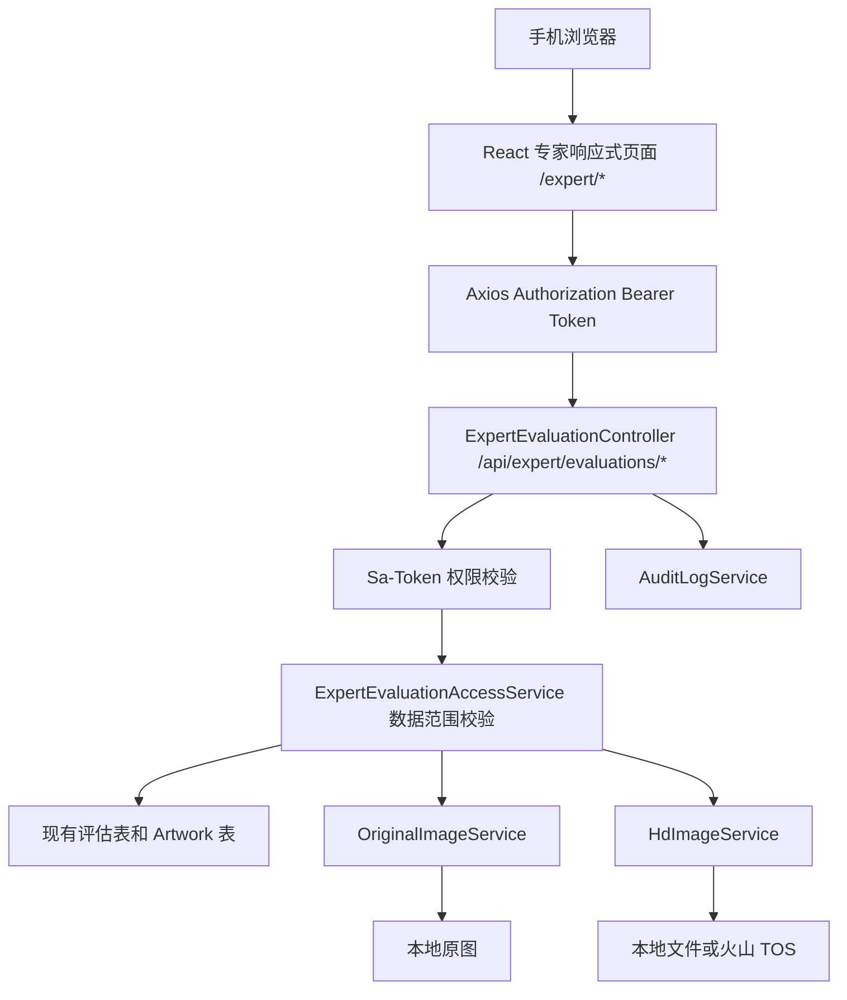
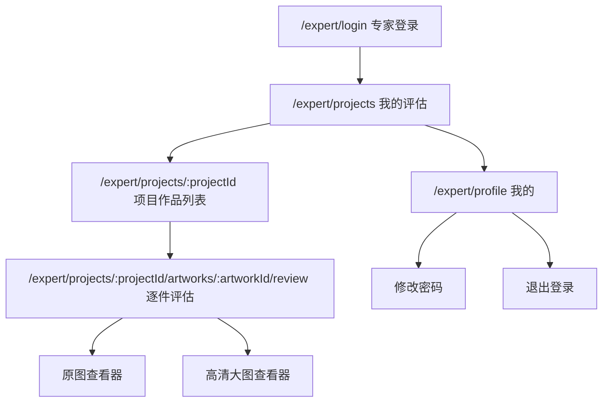
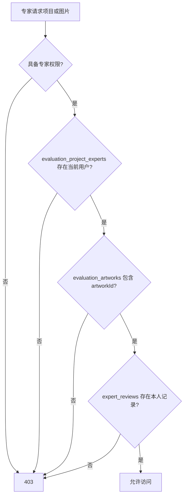
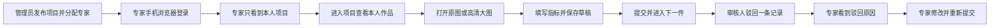

# ArtFetch 专家移动端响应式 Web 详细设计

## 文档信息

| 项 | 内容 |
|---|---|
| 当前版本 | v1 |
| 文档状态 | 设计评审中 |
| 编写日期 | 2026-05-30 |
| 关联文档 | `docs/prd-evaluation.md`、`docs/design-auth-sa-token.md`、`docs/design-hd-image-object-storage-migration.md` |
| 适用范围 | 专家使用手机浏览器登录、查看本人评估项目、逐件评估、查看预览图、原图和高清大图 |

## 1. 背景

ArtFetch 已经具备评估项目、专家账号、专家评估记录、动态指标、草稿保存、逐件提交、审核驳回后重提、原图读取和高清大图读取能力。

现有前端页面主要面向桌面浏览器：

- `/my-evaluations` 使用表格展示专家项目。
- `/evaluations/:id` 同时承载管理员、审核人和专家的项目详情。
- `/evaluations/:evaluationId/artworks/:artworkId/review` 已经支持专家评估，但布局仍偏桌面端。
- `/api/artworks/{id}/original-image` 和 `/api/artworks/{id}/hd-image` 已经通过 `Authorization` 请求头读取图片，但仅校验全局图片权限，没有校验该艺术品是否属于当前专家被分配的评估项目。

本设计不建设原生 App，也不增加独立部署的前端工程。目标是在现有 React 单页应用中增加一个专家专用的响应式 Web 入口，手机浏览器访问即可使用。

## 2. 设计目标

### 2.1 业务目标

- 专家使用现有系统账号登录。
- 专家只能看到分配给自己的评估项目。
- 专家进入项目后，只看到该项目中自己需要完成的艺术品和自己的完成进度。
- 专家可以逐件填写动态评估指标、最终估价和整体评语。
- 专家可以保存草稿、提交单件评估，并修改被审核人驳回的单件评估。
- 专家可以查看预览图、原图和高清无损大图。
- 原图和高清大图必须通过鉴权接口读取，并校验当前专家对项目和作品的数据范围。
- 专家不能看到其他专家姓名、进度、评分、评语、最终估价和审核记录。

### 2.2 产品目标

- 页面适配常见手机屏幕，优先保障 `360px` 至 `430px` 宽度下的可用性。
- 评估操作尽可能短：进入项目后可直接定位下一件待处理作品。
- 表单适合触控操作，主要按钮固定在可见区域。
- 高清大图按需加载，避免进入页面即消耗大量流量。
- 保留桌面端管理员和审核人页面，避免移动端改造影响现有后台操作。

### 2.3 非目标

- 不开发 iOS、Android、小程序或桌面客户端。
- 不做离线评估、离线图片缓存或断网后自动同步。
- 不开放专家查看艺术品全库、搜索任务、导出、用户管理、角色管理、指标管理和审核功能。
- 不允许专家查看其他专家的任何评估内容。
- 不允许专家重新下载或重新生成原图、高清图。
- 第一阶段不新增项目截止时间、消息推送、短信提醒和站内通知。
- 第一阶段不新增“整项目一次性提交”动作，继续沿用逐件提交评估记录的现有模型。

## 3. 复用范围与现状差距

### 3.1 可直接复用

| 能力 | 当前实现 | 复用方式 |
|---|---|---|
| 登录态 | Sa-Token + `Authorization: Bearer <token>` | 继续复用 `/api/auth/login`、`/api/auth/current-user`、`/api/auth/logout` |
| 专家角色 | `EXPERT` | 继续复用默认专家角色 |
| 专家基础权限 | `evaluation-review:*`、`artwork:image:view` | 继续复用，不为移动端新增重复权限码 |
| 评估项目 | `evaluation_projects` | 继续复用 |
| 项目专家关系 | `evaluation_project_experts` | 继续复用，作为项目访问范围依据 |
| 项目艺术品 | `evaluation_artworks` | 继续复用 |
| 专家评估 | `expert_reviews`、`expert_review_scores` | 继续复用 |
| 动态指标 | `evaluation_project_metrics` | 继续复用 |
| 原图读取 | `OriginalImageService` | 增加专家数据范围校验后复用 |
| 高清图读取 | `HdImageService` | 增加专家数据范围校验后复用，本地和对象存储读取逻辑不变 |

### 3.2 必须改造

| 现状 | 风险或问题 | 设计处理 |
|---|---|---|
| 专家项目列表复用项目级汇总 DTO | 完成数是所有专家的总数，不是当前专家自己的进度 | 新增专家专用列表 DTO，返回本人进度 |
| 专家项目详情复用通用 `EvaluationProjectDto` | 会返回其他专家、项目级审核信息和后台配置详情 | 新增专家专用详情 DTO，只返回专家需要的信息 |
| 艺术品列表使用项目聚合状态 | 多专家项目中无法准确表达当前专家对某件作品的状态 | 专家接口按当前用户的 `expert_reviews.status` 返回本人状态 |
| 图片接口只校验 `artwork:image:view` | 专家可能通过枚举艺术品 ID 读取未分配作品图片 | 新增专家专用图片接口，服务层校验“当前专家 + 项目 + 艺术品”关系 |
| 专家评估页只有高清图入口 | 无法明确选择原图和高清图 | 增加“查看原图”“查看高清大图”两个入口 |
| 专家页面使用桌面表格和横向导航 | 手机屏幕操作不便 | 增加 `/expert/*` 路由和独立响应式布局 |

## 4. 总体方案

### 4.1 前后端关系



### 4.2 前端部署方式

- 与现有后台共用 `frontend/` React 工程、Vite 构建产物和 Nginx 容器。
- 使用同一个域名和同一个 `/api` 反向代理。
- 不新增独立子域名，不新增额外 Docker 服务。
- 新增 `/expert/*` 路由分支和 `ExpertMobileLayout`。
- 普通后台页面继续使用现有桌面布局。

### 4.3 入口策略

建议提供固定入口：

```text
/expert/login
```

登录成功后：

- 拥有 `evaluation-review:assigned:view` 的账号默认进入 `/expert/projects`。
- 未拥有该权限的账号访问 `/expert/*` 时显示无权限页。
- 已登录专家访问 `/login` 或 `/expert/login` 时，优先跳转 `/expert/projects`。
- 管理员和审核人仍从现有 `/login` 进入后台。

第一阶段不依赖 User-Agent 强制跳转。专家即使使用桌面浏览器，也可以访问响应式专家入口；管理员即使使用手机，也仍可按需访问后台。

## 5. 信息架构

### 5.1 页面结构



### 5.2 底部导航

专家布局只保留两个一级入口：

| 导航 | 路由 | 说明 |
|---|---|---|
| 我的评估 | `/expert/projects` | 查看本人被分配的项目 |
| 我的 | `/expert/profile` | 查看账号、修改密码、退出登录 |

评估页不显示底部导航，改用顶部返回按钮和底部固定操作栏，为表单腾出空间。

## 6. 页面详细设计

### 6.1 专家登录页

路由：

```text
/expert/login
```

复用现有 `/api/auth/login`。

页面元素：

| 元素 | 说明 |
|---|---|
| 品牌区 | ArtFetch 标识、标题“专家评估” |
| 用户名 | 必填，支持浏览器密码管理器 |
| 密码 | 必填，支持显示和隐藏 |
| 登录按钮 | 全宽主按钮 |
| 错误提示 | 账号密码错误、账号停用、网络异常 |

交互规则：

- 登录成功后请求 `/api/auth/current-user` 或使用登录响应中的用户权限。
- 具备 `evaluation-review:assigned:view` 时跳转 `/expert/projects`。
- 不具备专家评估权限时清除登录态并提示“当前账号未开通专家评估权限”。
- 使用现有 Sa-Token 内存会话策略，后端重启后用户需要重新登录。

响应式要求：

- 登录卡片宽度为 `min(100% - 32px, 380px)`。
- 输入框和按钮高度不小于 `44px`。
- 页面不得出现横向滚动。

### 6.2 我的评估项目页

路由：

```text
/expert/projects
```

页面目标：只展示当前专家被分配且已经发布的项目，提供本人维度的进度。

页面结构：

```text
┌─────────────────────────────┐
│ 我的评估                  刷新 │
├─────────────────────────────┤
│ [全部] [待处理] [已完成]       │
├─────────────────────────────┤
│ 项目名称                       │
│ 进行中        已完成 8 / 20     │
│ [继续评估]                     │
├─────────────────────────────┤
│ 项目名称                       │
│ 审核驳回      待修改 1 件       │
│ [处理驳回]                     │
└─────────────────────────────┘
│ 我的评估                  我的 │
└─────────────────────────────┘
```

项目卡片字段：

| 字段 | 说明 |
|---|---|
| 项目名称 | 必显 |
| 项目说明 | 最多展示两行 |
| 项目状态 | 转换为专家可理解的中文状态 |
| 本人进度 | `本人已提交数 / 本人作品总数` |
| 待处理数 | `NOT_STARTED + DRAFT + REVIEW_REJECTED` |
| 驳回数 | 存在时使用醒目标签 |
| 最近更新时间 | 使用本人项目关系或本人评估记录的最近更新时间 |
| 主操作 | 根据状态显示“开始评估”“继续评估”“处理驳回”“查看” |

筛选标签：

| 标签 | 规则 |
|---|---|
| 全部 | 当前专家的全部已发布项目 |
| 待处理 | 存在本人未开始、草稿或驳回记录 |
| 已完成 | 本人全部评估记录已提交或重新提交 |

空状态：

- 没有项目时显示“暂无分配给你的评估项目”。
- 请求失败时显示重试按钮。

### 6.3 项目作品列表页

路由：

```text
/expert/projects/:projectId
```

页面目标：展示当前项目中本人需要评估的作品，并快速进入下一件待处理作品。

顶部项目摘要：

| 字段 | 说明 |
|---|---|
| 项目名称 | 必显 |
| 项目说明 | 可折叠 |
| 本人进度 | 进度条 + `已完成 n / 总数 m` |
| 驳回提示 | 有驳回记录时显示“有 n 件评估被驳回，请优先修改” |
| 继续评估 | 自动定位第一条 `REVIEW_REJECTED`，其次 `DRAFT`，最后 `NOT_STARTED` |

作品卡片：

| 字段 | 说明 |
|---|---|
| 预览缩略图 | 通过专家鉴权预览接口加载 |
| 标题 | 必显 |
| 作者 | 无数据时显示 `—` |
| 拍品编号 | 无数据时不展示 |
| 本人状态 | `未开始`、`草稿`、`已提交`、`审核驳回`、`已重新提交` |
| 驳回原因摘要 | 仅本人记录被驳回时显示，最多两行 |
| 操作 | “开始评估”“继续填写”“修改评估”“查看已提交内容” |

筛选标签：

```text
全部 | 待评估 | 草稿 | 已提交 | 已驳回
```

排序规则：

1. `REVIEW_REJECTED`
2. `DRAFT`
3. `NOT_STARTED`
4. `SUBMITTED`
5. `RESUBMITTED`

同一状态内按项目作品加入顺序排序。

限制：

- 不显示项目中的其他专家。
- 不显示项目筛选条件。
- 不显示管理员操作按钮、审核记录和多专家汇总结果。
- 项目为 `COMPLETED` 或 `CANCELLED` 时只读。
- 项目为 `IN_REVIEW` 时只读。

### 6.4 逐件评估页

路由：

```text
/expert/projects/:projectId/artworks/:artworkId/review
```

页面目标：在手机屏幕上完成一件作品的评估。

#### 6.4.1 页面结构

```text
┌─────────────────────────────┐
│ ← 返回作品列表      第 3 / 20 件 │
├─────────────────────────────┤
│ [作品预览图]                  │
│ [查看原图] [查看高清大图]       │
├─────────────────────────────┤
│ 标题 / 作者 / 编号              │
│ [展开更多作品信息]              │
├─────────────────────────────┤
│ 驳回原因（存在时）              │
├─────────────────────────────┤
│ 指标 1 *                       │
│ [输入控件]                     │
│ [指标备注]                     │
│ 指标 2                         │
│ [输入控件]                     │
├─────────────────────────────┤
│ 最终估价 *     币种 *           │
│ 整体评语                       │
├─────────────────────────────┤
│ 上一件   保存草稿   提交并下一件  │
└─────────────────────────────┘
```

#### 6.4.2 作品信息

默认显示：

- 标题
- 作者
- 拍品编号
- 材质
- 尺寸
- 拍卖公司
- 拍卖日期
- 原始估价

其他已有字段放入“展开更多作品信息”区域，避免首屏过长。

#### 6.4.3 动态指标

继续复用项目快照中的 `evaluation_project_metrics`，按 `sortOrder` 展示。

控件映射：

| `inputComponent` | 手机端组件 | 说明 |
|---|---|---|
| `input-number` | 数字输入框 | 使用数字键盘，显示最小值、最大值和步长 |
| `textarea` | 多行文本框 | 默认 3 行，可自动增高 |
| `radio` | 纵向单选项 | 小屏下禁止横向挤压 |
| `checkbox-group` | 纵向多选项 | 每项可点击区域不小于 `44px` |
| `select` | 下拉选择框 | 宽度占满容器 |
| 其他或空值 | 单行文本框 | 兼容历史指标 |

每个指标显示：

- 名称
- 是否必填
- 评分范围或控件类型
- 评分指引 `scoringGuide`
- 输入控件
- 可选指标备注

#### 6.4.4 草稿与提交

按钮：

| 按钮 | 行为 |
|---|---|
| 保存草稿 | 调用保存接口，不校验必填项，成功后保留当前页面 |
| 提交评估 | 校验最终估价、币种和必填指标，成功后当前记录变为只读 |
| 提交并下一件 | 提交成功后跳转下一件待处理作品；没有待处理作品时返回项目页 |
| 上一件 / 下一件 | 切换作品；存在未保存修改时弹出确认框 |

第一阶段建议支持轻量自动保存：

- 用户修改表单后标记为“未保存”。
- 用户停止输入 `1500ms` 后自动保存草稿。
- 切换页面、返回列表和浏览器刷新前，如有未保存内容则提示用户。
- 自动保存失败时保留本地表单值，并显示“自动保存失败，请点击保存草稿”。
- 对 `SUBMITTED`、`RESUBMITTED`、`IN_REVIEW`、`COMPLETED` 和 `CANCELLED` 状态禁用编辑和自动保存。

#### 6.4.5 状态显示

| 后端状态 | 页面文案 | 是否可编辑 |
|---|---|---|
| `NOT_STARTED` | 未开始 | 是 |
| `DRAFT` | 草稿 | 是 |
| `SUBMITTED` | 已提交 | 否 |
| `REVIEW_REJECTED` | 审核驳回，请修改 | 是 |
| `RESUBMITTED` | 已重新提交 | 否 |

项目进入 `IN_REVIEW` 后，即使某条记录仍为草稿，也按只读处理并提示“项目审核中，暂不能修改”。

### 6.5 图片查看器

逐件评估页提供三个图片层级：

| 层级 | 加载时机 | 用途 |
|---|---|---|
| 预览图 | 作品卡片或评估页打开时 | 快速识别作品 |
| 原图 | 用户点击“查看原图”时 | 查看来源原图 |
| 高清大图 | 用户点击“查看高清大图”时 | 查看拼接后的高清无损图 |

查看器要求：

- 使用全屏遮罩层。
- 支持双指缩放、拖动、双击放大、关闭。
- 显示当前图片类型：“预览图”“原图”“高清大图”。
- 高清大图加载前显示预计会消耗较多流量的提示。
- 高清图不可用时禁用按钮并显示“高清图尚未准备好”。
- 原图不可用时禁用按钮并显示“原图尚未准备好”。
- 关闭查看器时释放浏览器 `Blob URL`。

性能策略：

- 页面首次进入只请求预览图，不预加载原图和高清图。
- 图片请求继续使用 Axios `responseType: 'blob'`，以携带 `Authorization` 请求头。
- 高清图保持后端流式读取；前端只在用户主动点击后创建 `Blob URL`。
- 第一阶段不在浏览器持久缓存高清图，避免共享手机残留敏感图片。

## 7. 专家状态视图

项目后端状态仍复用现有 `EvaluationProjectStatus`，但专家端使用简化文案：

| 后端状态 | 专家端展示 | 专家端行为 |
|---|---|---|
| `DRAFT`、`PENDING` | 不展示 | 管理员尚未发布 |
| `PUBLISHED` | 待开始 | 可以开始评估 |
| `IN_PROGRESS` | 评估中 | 可以编辑未提交记录 |
| `READY_FOR_REVIEW` | 已完成待审核 | 本人记录只读 |
| `IN_REVIEW` | 审核中 | 全部只读 |
| `REVIEW_REJECTED` | 有评估被驳回 | 仅本人被驳回记录可编辑 |
| `COMPLETED` | 已完成 | 全部只读 |
| `CANCELLED` | 已取消 | 全部只读 |

注意：

- 项目状态是全局状态，专家端项目卡片还必须返回本人统计数据。
- 多专家项目中，其他专家的进度不能影响当前专家看到的“本人是否完成”。
- 专家端不得使用 `evaluation_artworks.status` 判断本人状态，因为该字段是多专家聚合状态。必须读取当前专家对应的 `expert_reviews.status`。

## 8. 后端接口设计

### 8.1 设计原则

- 新增专家专用接口前缀 `/api/expert/evaluations`。
- 专家专用 DTO 只返回专家完成工作所需字段。
- Controller 使用权限注解做功能权限校验。
- Service 层使用当前登录用户做数据范围校验。
- 图片接口必须同时校验项目分配关系和作品归属关系。
- 现有管理员、审核人接口保留，避免影响后台。

### 8.2 接口列表

| 方法 | 路径 | 权限 | 用途 |
|---|---|---|---|
| `GET` | `/api/expert/evaluations` | `evaluation-review:assigned:view` | 获取本人项目列表 |
| `GET` | `/api/expert/evaluations/{evaluationId}` | `evaluation-review:assigned:view` | 获取本人项目摘要 |
| `GET` | `/api/expert/evaluations/{evaluationId}/artworks` | `evaluation-review:own:view` | 获取本人作品和本人评估状态 |
| `GET` | `/api/expert/evaluations/{evaluationId}/artworks/{artworkId}/review` | `evaluation-review:own:view` | 获取本人单件评估表单 |
| `PUT` | `/api/expert/evaluations/{evaluationId}/artworks/{artworkId}/review` | `evaluation-review:own:save` | 保存本人草稿 |
| `POST` | `/api/expert/evaluations/{evaluationId}/artworks/{artworkId}/review/submit` | `evaluation-review:own:submit` 或重提权限 | 提交或重新提交本人单件评估 |
| `GET` | `/api/expert/evaluations/{evaluationId}/artworks/{artworkId}/images/preview` | `artwork:image:view` | 读取预览图 |
| `GET` | `/api/expert/evaluations/{evaluationId}/artworks/{artworkId}/images/original` | `artwork:image:view` | 读取原图 |
| `GET` | `/api/expert/evaluations/{evaluationId}/artworks/{artworkId}/images/hd` | `artwork:image:view` | 读取高清无损大图 |

分页和筛选建议：

```text
GET /api/expert/evaluations?page=0&size=20&filter=pending
GET /api/expert/evaluations/{evaluationId}/artworks?status=REVIEW_REJECTED&page=0&size=20
```

### 8.3 专家项目列表 DTO

```json
{
  "items": [
    {
      "evaluationId": 12,
      "name": "2026 春拍书画评估",
      "description": "请重点关注保存状况",
      "evaluationStatus": "IN_PROGRESS",
      "totalCount": 20,
      "submittedCount": 8,
      "pendingCount": 11,
      "rejectedCount": 1,
      "draftCount": 3,
      "nextArtworkId": 501,
      "updatedAt": "2026-05-30T10:20:00"
    }
  ],
  "page": 0,
  "size": 20,
  "total": 1,
  "totalPages": 1
}
```

约束：

- 不返回 `expertCount`、`experts`、`auditorName` 和其他专家进度。
- `submittedCount` 包含 `SUBMITTED` 和 `RESUBMITTED`。
- `pendingCount` 包含 `NOT_STARTED`、`DRAFT` 和 `REVIEW_REJECTED`。
- `nextArtworkId` 优先选择驳回记录，其次草稿，最后未开始记录。

### 8.4 专家项目作品 DTO

```json
{
  "evaluationId": 12,
  "name": "2026 春拍书画评估",
  "description": "请重点关注保存状况",
  "evaluationStatus": "IN_PROGRESS",
  "totalCount": 20,
  "submittedCount": 8,
  "rejectedCount": 1,
  "nextArtworkId": 501,
  "artworks": [
    {
      "artworkId": 501,
      "title": "山水",
      "artist": "示例作者",
      "lotNumber": "LOT-001",
      "reviewStatus": "REVIEW_REJECTED",
      "rejectedReason": "请补充保存状况说明",
      "previewImageAvailable": true,
      "originalImageAvailable": true,
      "hdImageAvailable": true,
      "updatedAt": "2026-05-30T10:20:00"
    }
  ]
}
```

约束：

- `reviewStatus` 读取当前登录专家自己的 `expert_reviews.status`。
- 不返回其他专家记录。
- 不返回裸图片 URL、对象存储 URL、本地路径或雅昌来源地址。
- 预览图、原图和高清图均由专家鉴权接口提供。

### 8.5 专家评估表单 DTO

在现有 `ExpertReviewFormDto` 基础上增加手机端需要的导航信息：

```json
{
  "evaluationId": 12,
  "evaluationName": "2026 春拍书画评估",
  "evaluationStatus": "IN_PROGRESS",
  "artworkIndex": 3,
  "artworkTotal": 20,
  "previousArtworkId": 500,
  "nextArtworkId": 502,
  "nextPendingArtworkId": 507,
  "artwork": {
    "id": 501,
    "title": "山水",
    "artist": "示例作者",
    "lotNumber": "LOT-001",
    "medium": "纸本设色",
    "dimensions": "68 × 136 cm",
    "auctionHouse": "示例拍卖",
    "auctionDate": "2026-05-01",
    "valuation": "RMB 100,000 - 150,000",
    "previewImageAvailable": true,
    "originalImageAvailable": true,
    "hdImageAvailable": true
  },
  "metrics": [],
  "review": {}
}
```

建议为专家端定义精简 `ExpertArtworkDto`，不要直接返回完整 `ArtworkDto`，避免暴露：

- 本地存储路径
- 对象存储元数据
- 图片来源 URL
- 不属于评估工作所需的后台字段

### 8.6 保存和提交请求

继续复用现有请求结构：

```json
{
  "finalEstimate": "120000 - 150000",
  "finalEstimateCurrency": "RMB",
  "comment": "整体保存状况良好",
  "scores": [
    {
      "projectMetricId": 1001,
      "score": 8,
      "optionValue": null,
      "textValue": null,
      "comment": "构图完整"
    }
  ]
}
```

服务端规则：

- 保存草稿时允许未填写必填项。
- 提交时必须填写最终估价和币种。
- 提交时校验全部必填指标。
- `SUBMITTED` 和 `RESUBMITTED` 不允许再次直接编辑。
- `REVIEW_REJECTED` 允许修改和重新提交。
- 重新提交时除 `evaluation-review:own:submit` 外，还必须具备 `evaluation-review:own:resubmit`。
- 所有保存和提交都必须校验当前登录用户是该条评估记录的专家。

### 8.7 图片接口

专家专用图片接口示例：

```text
GET /api/expert/evaluations/12/artworks/501/images/original
GET /api/expert/evaluations/12/artworks/501/images/hd
```

服务层检查顺序：

1. 当前用户已登录且状态为启用。
2. 当前用户具备 `artwork:image:view`。
3. `evaluationId` 对应项目存在且未删除。
4. 当前用户存在于 `evaluation_project_experts`。
5. `artworkId` 存在于该项目的 `evaluation_artworks`。
6. 当前用户在 `expert_reviews` 中存在该项目和作品的本人记录。
7. 图片文件存在且可读取。

检查失败时：

- 越权统一返回 `403`。
- 项目或艺术品不存在返回 `404`。
- 图片尚未准备好返回 `409` 或业务错误信息。
- 不在错误响应中暴露本地路径、对象存储 key 和上游图片地址。

读取逻辑：

- 原图继续委托 `OriginalImageService.loadOriginalImage(artworkId)`。
- 高清图继续委托 `HdImageService.loadHdImage(artworkId)`。
- 高清图已经迁移到对象存储时，继续由后端读取或转发，不返回裸 TOS 地址。
- 专家端不得调用图片重新下载接口。

预览图接口实现建议：

- 第一阶段由后端代理现有 `imageUrl`，或在原图已落盘时读取原图并按合理尺寸输出。
- 后端返回适合列表展示的图片，不向前端暴露雅昌图片 URL。
- 如果预览图代理改造工作量较大，可先在评估页保留现有缩略图 URL，但原图和高清图必须优先完成数据范围收口。此项属于过渡方案，不作为最终验收标准。

## 9. 后端模块设计

建议新增：

```text
backend/src/main/java/com/artfetch/evaluation/
  controller/
    ExpertEvaluationController.java
  dto/
    ExpertAssignedProjectListItemDto.java
    ExpertAssignedProjectDto.java
    ExpertArtworkListItemDto.java
    ExpertArtworkDto.java
    ExpertReviewMobileFormDto.java
  service/
    ExpertEvaluationService.java
    ExpertEvaluationAccessService.java
```

职责：

| 类 | 职责 |
|---|---|
| `ExpertEvaluationController` | 暴露 `/api/expert/evaluations/*`，声明权限注解 |
| `ExpertEvaluationService` | 查询当前专家项目、本人进度、作品列表、下一件待处理作品 |
| `ExpertEvaluationAccessService` | 校验当前专家分配关系、项目作品关系、本人评估记录、图片访问范围 |
| `ExpertReviewService` | 保留现有评分保存、提交和必填校验，可由专家 Controller 复用 |
| `OriginalImageService` | 保留原图读取逻辑 |
| `HdImageService` | 保留本地和对象存储高清图读取逻辑 |

Repository 建议补充按当前专家查询的方法，避免先加载全项目记录再在内存中过滤：

```text
ExpertReviewRepository
  findByEvaluationIdAndExpertIdOrderByArtworkIdAsc(...)
  findByExpertIdAndEvaluationIdIn(...)
  countByEvaluationIdAndExpertIdAndStatusIn(...)

EvaluationProjectExpertRepository
  findByExpertIdOrderByAssignedAtDesc(...)

EvaluationArtworkRepository
  existsByEvaluationIdAndArtworkId(...)
```

## 10. 权限与数据范围

### 10.1 权限复用

专家移动端复用当前权限码：

| 权限码 | 用途 |
|---|---|
| `evaluation-review:assigned:view` | 查看本人项目 |
| `evaluation-review:own:view` | 查看本人作品和本人评估表单 |
| `evaluation-review:own:save` | 保存本人草稿 |
| `evaluation-review:own:submit` | 提交本人评估 |
| `evaluation-review:own:resubmit` | 重新提交本人被驳回评估 |
| `artwork:image:view` | 读取本人被分配作品的图片 |

默认 `EXPERT` 角色已经具备以上权限，不需要增加角色种子。

### 10.2 数据范围

权限码只能表达“专家是否具备某项功能”，不能表达“专家能访问哪条数据”。必须在 Service 层追加 ABAC 数据范围校验。



安全约束：

- 前端隐藏按钮只是体验优化，不作为授权依据。
- 专家专用项目详情不得调用通用 `GET /api/evaluations/{id}`。
- 专家专用图片不得调用通用 `/api/artworks/{id}/original-image` 和 `/api/artworks/{id}/hd-image`。
- 后续应评估是否限制专家角色调用通用图片接口，避免专家绕过专家专用接口。
- 推荐在通用图片接口增加数据范围分流：管理员按后台权限访问；专家必须额外满足至少一个本人项目分配关系。

## 11. 审计日志

复用现有 `AuditLogService`，新增以下敏感操作日志：

| Action | 触发时机 | Resource |
|---|---|---|
| `evaluation-review.draft.save` | 专家手动保存草稿 | `EXPERT_REVIEW:{reviewId}` |
| `evaluation-review.submit` | 专家首次提交 | `EXPERT_REVIEW:{reviewId}` |
| `evaluation-review.resubmit` | 专家修改驳回记录后重提 | `EXPERT_REVIEW:{reviewId}` |
| `evaluation-image.original.view` | 专家查看原图 | `ARTWORK:{artworkId}` |
| `evaluation-image.hd.view` | 专家查看高清大图 | `ARTWORK:{artworkId}` |

日志描述建议包含：

- `evaluationId`
- `artworkId`
- `reviewId`
- 当前专家账号
- 成功或失败

日志禁止包含：

- 图片 URL
- 本地文件路径
- 对象存储 bucket、object key
- 评估表单完整内容
- token

自动保存策略下，避免每次键入都写审计日志。只在实际后端草稿保存成功时记录，必要时可增加节流或只记录手动保存。

## 12. 前端模块设计

建议新增：

```text
frontend/src/
  layouts/
    ExpertMobileLayout.tsx
  pages/expert/
    ExpertLoginPage.tsx
    ExpertProjectsPage.tsx
    ExpertProjectDetailPage.tsx
    ExpertArtworkReviewPage.tsx
    ExpertProfilePage.tsx
  components/expert/
    ExpertProjectCard.tsx
    ExpertArtworkCard.tsx
    ExpertReviewMetricField.tsx
    ProtectedImageViewer.tsx
    ExpertReviewActionBar.tsx
  api/
    expertEvaluations.ts
  styles/
    expert-mobile.css
```

也可以暂时继续将专家 API 放在现有 `frontend/src/api/index.ts` 中；当接口数量超过约 10 个时再拆分文件。

### 12.1 布局规则

`ExpertMobileLayout`：

- 最大内容宽度建议为 `640px`，在平板和桌面浏览器中居中展示。
- 页面背景使用现有后台的浅灰色。
- 顶部栏高度建议 `52px`。
- 底部导航高度建议 `56px`，并考虑 iPhone 安全区：

```css
padding-bottom: env(safe-area-inset-bottom);
```

- 评估页底部操作栏使用 `position: sticky` 或 `fixed`，并为正文预留底部空间。

### 12.2 断点

| 断点 | 处理 |
|---|---|
| `< 576px` | 单列卡片、输入框全宽、按钮优先全宽或均分 |
| `576px - 767px` | 单列为主，作品基础信息可两列 |
| `>= 768px` | 保持移动端窄版布局并居中，不切换后台桌面表格 |

### 12.3 触控与可访问性

- 可点击区域高度不小于 `44px`。
- 不依赖鼠标悬停展示关键操作。
- 输入框、选择框和按钮保持足够间距。
- 状态不能只依赖颜色，必须有中文文案。
- 图片按钮必须有明确标签。
- 错误信息显示在页面可见位置，并使用 `message` 或表单校验提示。

## 13. 数据库设计

第一阶段不要求新增数据库表或字段。

原因：

- 项目分配关系已有 `evaluation_project_experts`。
- 项目作品关系已有 `evaluation_artworks`。
- 专家本人状态已有 `expert_reviews.status`。
- 草稿和提交更新时间已有 `expert_reviews.updated_at`、`submitted_at`、`resubmitted_at`。
- 图片元数据已有 `artworks.original_image_*` 和 `artworks.hd_image_*`。
- 审计日志已有 `audit_logs`。

查询性能检查：

- `expert_reviews` 已有 `idx_expert_review_expert_id`。
- `expert_reviews` 已有 `(evaluation_id, artwork_id, expert_id)` 唯一索引。
- 如果专家项目数量和作品数量增长明显，建议增加：

```sql
create index if not exists idx_expert_reviews_expert_evaluation_status
on expert_reviews (expert_id, evaluation_id, status);

create index if not exists idx_evaluation_artworks_evaluation_artwork
on evaluation_artworks (evaluation_id, artwork_id);
```

索引是否落库应在实现阶段结合现有 PostgreSQL 执行计划确认。

## 14. 异常与边界处理

| 场景 | 页面行为 |
|---|---|
| token 失效 | 清理本地 token，跳转 `/expert/login` |
| 账号被停用 | 提示账号不可用，跳转登录 |
| 项目尚未发布 | 专家列表不展示；直接访问返回 `404` 或 `403` |
| 项目已取消 | 展示只读状态，不允许继续保存 |
| 项目审核中 | 展示只读状态，不允许保存和提交 |
| 评估已提交 | 只读查看 |
| 评估被驳回 | 显示驳回原因，允许修改并重新提交 |
| 图片未准备好 | 禁用对应按钮，展示说明 |
| 高清图读取失败 | 提示稍后重试，不暴露对象存储错误细节 |
| 网络中断 | 保留当前表单值，提示手动重试保存 |
| 切换作品时有未保存内容 | 弹窗确认是否离开 |
| 连续点击提交 | 按钮进入 loading 状态，避免重复请求 |

并发处理：

- 第一阶段不新增乐观锁字段。
- 同一个专家账号在多个浏览器同时编辑同一条草稿时，后保存的数据覆盖先保存的数据。
- 页面应显示最近保存时间，降低误覆盖概率。
- 后续如出现真实并发需求，再为 `expert_reviews` 增加 `version` 字段并启用 JPA 乐观锁。

## 15. 测试设计

### 15.1 后端接口测试

必须覆盖：

1. 专家只能查询本人项目。
2. 未发布项目不出现在专家项目列表。
3. 多专家项目中，项目列表返回本人进度，不返回其他专家信息。
4. 作品列表返回当前专家自己的 `reviewStatus`。
5. 专家不能访问未分配项目。
6. 专家不能访问已分配项目之外的作品。
7. 专家不能通过枚举 `artworkId` 读取其他作品原图。
8. 专家不能通过枚举 `artworkId` 读取其他作品高清图。
9. 专家可以保存不完整草稿。
10. 专家提交时缺少最终估价、币种或必填指标会失败。
11. 已提交记录不能再次修改。
12. 被驳回记录可以重新提交。
13. 重新提交缺少 `evaluation-review:own:resubmit` 时返回 `403`。
14. 图片读取成功后记录审计日志。

### 15.2 前端测试

必须覆盖：

1. `360px`、`390px`、`430px` 宽度下无横向滚动。
2. 项目列表使用卡片而不是桌面表格。
3. 项目作品列表只显示本人状态。
4. 评估表单的数字、文本、单选、多选、下拉输入均可操作。
5. 原图和高清图按钮根据可用状态正确启用和禁用。
6. 图片查看器支持打开、缩放、拖动和关闭。
7. 关闭图片后释放 `Blob URL`。
8. 有未保存改动时离开页面会提示。
9. 自动保存失败后表单内容仍保留。
10. token 失效后跳转专家登录页。

### 15.3 验收场景



验收通过条件：

- 全流程可在手机浏览器完成。
- 专家看不到其他专家数据。
- 专家无法读取未分配作品图片。
- 原图和高清图始终通过鉴权接口访问。
- 管理员和审核人原有桌面功能不受影响。

## 16. 实施顺序

建议按以下顺序实施：

1. 新增专家专用 Service、数据范围校验和精简 DTO。
2. 新增专家项目、作品、评估和图片接口。
3. 为通用图片接口补充专家角色的数据范围限制，关闭绕过路径。
4. 增加图片查看和专家提交相关审计日志。
5. 新增 `/expert/*` 响应式页面和专家布局。
6. 接入原图、高清图查看器和表单草稿保存。
7. 增加自动保存、离开提示和“提交并下一件”。
8. 完成后端测试、前端构建和手机断点验收。
9. 按仓库要求重新构建并重启受影响的前端和后端服务。

## 17. 预估改造文件

后端：

```text
backend/src/main/java/com/artfetch/evaluation/controller/ExpertEvaluationController.java
backend/src/main/java/com/artfetch/evaluation/service/ExpertEvaluationService.java
backend/src/main/java/com/artfetch/evaluation/service/ExpertEvaluationAccessService.java
backend/src/main/java/com/artfetch/evaluation/dto/*
backend/src/main/java/com/artfetch/evaluation/repository/ExpertReviewRepository.java
backend/src/main/java/com/artfetch/evaluation/repository/EvaluationArtworkRepository.java
backend/src/main/java/com/artfetch/controller/ArtworkController.java
backend/src/main/java/com/artfetch/auth/service/AuditLogService.java
```

前端：

```text
frontend/src/App.tsx
frontend/src/api/index.ts
frontend/src/types/index.ts
frontend/src/layouts/ExpertMobileLayout.tsx
frontend/src/pages/expert/*
frontend/src/components/expert/*
frontend/src/styles/expert-mobile.css
```

文档同步：

```text
docs/prd-evaluation.md
docs/design-auth-sa-token.md
```

## 18. 后续扩展

以下能力不属于第一阶段，但当前设计保留扩展空间：

- 项目截止时间和逾期只读策略。
- 专家待办数量角标。
- 站内消息、短信或企业微信提醒。
- 评估草稿版本和乐观锁。
- 低清、中清、高清多规格图片。
- 图片分片加载或深度缩放查看器。
- PWA 桌面图标和更新提示。
