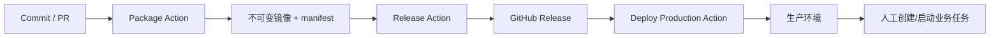

# GitHub Actions 制品发布与生产部署设计

## 背景

当前 ArtFetch 的发布方式更接近“本地构建 + 手工部署到服务器”。这种方式在小规模迭代时可用，但当一次变更同时包含后端任务类型、数据库约束、前端入口和生产业务任务时，容易出现几个问题：

- 构建产物不可追踪，线上到底运行哪份代码不够清晰。
- 发布和业务任务执行混在一起，失败后难以判断该回滚代码还是暂停任务。
- 服务器现场构建依赖网络和环境状态，稳定性弱于使用预构建镜像。
- 缺少清晰的审批边界，任何最新代码都可能被误部署。

本设计将流水线拆为三类动作：Package、Release、Deploy。核心原则是：指定 commit 构建一次，形成不可变制品；Release 只晋升已验证制品；Deploy 只部署指定 Release；生产业务任务作为发布后的人工操作，不放入默认上线流水线。

## 目标

- 使用 GitHub Actions 构建后端和前端制品。
- 将制品推送到 GHCR，并用 commit SHA 和版本号追踪。
- GitHub Release 记录被认可的制品版本和 manifest。
- 生产部署只消费 Release 中声明的镜像 digest，不在服务器上重新构建源码。
- 将“创建补充拍品描述任务”等业务操作从应用发布中拆出，先由人工通过页面或 API 执行。
- 保留数据库备份、健康检查、人工审批和回滚路径。

## 非目标

- 不在 GitHub Actions 日志中打印生产密钥、数据库密码、Artron Cookie 或对象存储密钥。
- 不把创建业务任务作为生产部署的默认步骤。
- 不使用 `latest` 作为生产部署依据。
- 不在没有数据库备份的情况下执行生产部署。

## 总体流程



## 已确认决策

- 生产部署方式：GitHub-hosted runner 通过 SSH 连接生产服务器执行部署。
- 生产镜像版本：生产服务器使用 `.env.release` 记录本次部署的 backend/frontend 镜像 digest，并复用现有 `docker-compose.prod.yml` 的镜像变量。
- 运行中任务策略：部署前如果发现线上存在 `RUNNING` 任务，直接阻断部署，不自动暂停，也不提供强制继续开关。
- PR 策略：PR 只做编译和测试检查，不推送可部署镜像。
- Release 策略：创建 GitHub Release 必须人工确认。
- 生产部署策略：部署到生产环境必须人工确认，并使用 GitHub Environment `production` 审批。
- 业务任务策略：补充拍品描述等业务任务先不做 Ops Action，发布成功后人工创建和启动。
- SSH 用户策略：生产部署使用 `root` 通过 SSH 执行，但必须限制在 GitHub `production` Environment 审批后使用。

## Package Action

建议文件：`.github/workflows/package.yml`

### 触发方式

- `pull_request`：只验证 PR 是否可构建和测试通过，不推送镜像。
- `push` 到主分支：为主分支 commit 构建候选制品并推送镜像。
- `workflow_dispatch`：允许手动指定 ref 重新打包。

### 输入

- `ref`：要打包的 commit、branch 或 tag。手动触发时必填或默认当前分支。

### 主要步骤

1. Checkout 指定 ref。
2. 后端构建与测试：
   - `mvn test` 或按项目阶段使用 `mvn package -DskipTests`。
   - 构建 backend Docker image。
3. 前端构建：
   - `npm ci`
   - `npm run build`
   - 构建 frontend Docker image。
4. 推送镜像到 GHCR，仅在 `push` 到主分支或手动触发时执行：
   - `ghcr.io/<owner>/artfetch-backend:sha-<commit>`
   - `ghcr.io/<owner>/artfetch-frontend:sha-<commit>`
5. 获取镜像 digest。
6. 生成 `release-manifest.json`。
7. 上传 manifest 和构建摘要为 workflow artifact。

### Manifest 示例

```json
{
  "app": "ArtFetch",
  "commit": "abcdef1234567890",
  "branch": "main",
  "builtAt": "2026-05-29T10:00:00Z",
  "images": {
    "backend": {
      "repository": "ghcr.io/example/artfetch-backend",
      "tag": "sha-abcdef1",
      "digest": "sha256:..."
    },
    "frontend": {
      "repository": "ghcr.io/example/artfetch-frontend",
      "tag": "sha-abcdef1",
      "digest": "sha256:..."
    }
  },
  "compose": {
    "file": "docker-compose.prod.yml"
  }
}
```

### 成功标准

- 后端构建成功。
- 前端构建成功。
- Docker 镜像成功推送。
- manifest 中包含 commit 和镜像 digest。

## Release Action

建议文件：`.github/workflows/release.yml`

### 触发方式

- `workflow_dispatch` 手动触发。
- 使用 GitHub Environment 或仓库权限限制，确保只有被授权的人可以创建正式 Release。

### 输入

- `packageRunId` 或 `commit`：指定已经通过 Package 的构建。
- `version`：发布版本，例如 `v2026.05.29-description-task`。
- `releaseNotes`：发布说明。

### 主要步骤

1. 校验指定 commit 的 Package Action 已成功。
2. 下载对应 `release-manifest.json`。
3. 校验 manifest 中的镜像 digest 存在于 GHCR。
4. 创建 Git tag。
5. 创建 GitHub Release。
6. 将 manifest、部署说明、变更摘要附加到 Release。
7. 可选：给同一镜像额外打版本标签：
   - `ghcr.io/<owner>/artfetch-backend:<version>`
   - `ghcr.io/<owner>/artfetch-frontend:<version>`

### 关键约束

Release Action 不重新构建代码。它只认可和晋升已经构建过的制品。

## Deploy Production Action

建议文件：`.github/workflows/deploy-production.yml`

### 触发方式

- `workflow_dispatch` 手动触发。
- `release.published`：正式 Release 发布后自动进入 `production` Environment 部署队列。
- 使用 GitHub Environment：`production`。
- 生产环境开启 required reviewers。

即使由 `release.published` 自动入队，部署仍必须经过 GitHub Environment `production` 的审批和 secrets 边界；该触发只减少人工复制版本号的步骤，不绕过生产审批。

### 输入

- `version`：要部署的 GitHub Release 版本。

### 部署方式

Deploy Action 使用 GitHub-hosted runner 通过 SSH 连接生产服务器，在生产项目目录中执行部署命令。服务器上的生产密钥仍保留在远端 `.env` 中，GitHub Actions 不读取、不打印生产 `.env`。

生产服务器增加 `.env.release` 文件，用来记录本次部署的不可变镜像。变量名与现有 `docker-compose.prod.yml` 保持一致：

```env
ARTFETCH_BACKEND_IMAGE=ghcr.io/<owner>/artfetch-backend@sha256:...
ARTFETCH_FRONTEND_IMAGE=ghcr.io/<owner>/artfetch-frontend@sha256:...
```

生产 Compose 使用镜像变量：

```yaml
services:
  backend:
    image: ${ARTFETCH_BACKEND_IMAGE}
  frontend:
    image: ${ARTFETCH_FRONTEND_IMAGE}
```

部署命令示例：

```bash
docker compose --env-file .env --env-file .env.release -f docker-compose.prod.yml pull backend frontend
docker compose --env-file .env --env-file .env.release -f docker-compose.prod.yml up -d backend frontend
```

## 现有生产环境接入流程

线上服务器已经部署并运行了一套 ArtFetch，因此接入 GitHub Actions 不能按全新部署处理。首次接入的目标是“接管发布方式”，不是重建生产环境。

### 接入原则

- 不删除、不重建 PostgreSQL volume。
- 不执行 `docker compose down -v`。
- 不覆盖现有 `.env`，只检查必要变量是否存在。
- 不打印 `.env`、Cookie、数据库密码、对象存储密钥等敏感值。
- 首次接入优先只替换 `backend` 和 `frontend`，保持 `postgres` 数据卷和持久化目录不变。
- 首次接入前必须有数据库备份和当前部署快照。

### 第一步：只读盘点

在真正部署前，先通过 SSH 执行只读检查，形成当前生产环境基线：

- 生产目录，例如 `/opt/artfetch`。
- 当前 Git commit 或当前镜像 ID。
- 当前 compose 文件路径和服务名。
- `docker compose ps` 输出。
- PostgreSQL volume 名称。
- 持久化目录：
  - `backend/logs`
  - `storage/original-images`
  - 备份目录
- `.env` 必要变量是否存在，只输出存在/缺失，不输出值。
- 是否存在 `RUNNING` 状态任务。
- 当前前端和 API 是否可访问。

已确认生产目录为 `/opt/artfetch`。如果发现 compose 文件名、服务名或 compose project 名称与本文档不一致，Deploy Action 先不进入写入阶段，必须人工确认后再适配。

### 现有 Docker Compose 启动方式处理

线上已经通过 `docker compose` 启动服务，因此首次接入时不能假设使用的是哪一个 compose 文件。Action 需要先识别现状，再决定是否接管。

只读盘点时执行：

```bash
cd /opt/artfetch
docker compose ls
docker compose ps
docker compose config --services
```

同时检查当前目录中是否存在：

- `docker-compose.yml`
- `docker-compose.prod.yml`
- `.env`
- `.env.release`

接管规则：

- 如果线上已经使用 `docker-compose.prod.yml`，则继续沿用它，只新增或更新 `.env.release`。
- 如果线上使用的是普通 `docker-compose.yml`，首次接管不直接覆盖原文件；先备份当前 compose 文件，再选择以下方式之一：
  - 将生产命令切换为 `docker-compose.prod.yml`。
  - 或在现有 compose 文件基础上增加 release override 文件。
- 无论哪种方式，都必须保持服务名为 `postgres`、`backend`、`frontend`，否则部署脚本需要同步调整。
- 首次接管只执行 `pull backend frontend` 和 `up -d backend frontend`，不对 `postgres` 执行重建、删除或 volume 操作。

如果当前 compose 是从源码 `build` backend/frontend，而不是使用 `image`，则首次接管的核心变更是把 backend/frontend 切换为 Release manifest 指定的镜像 digest。该切换必须在备份当前 compose 文件后执行。

### 未正式使用环境的重置接入路径

如果确认当前线上环境还没有正式投入使用，可以选择比“平滑接管”更简单的重置接入路径。该路径的目标是清理旧的应用部署痕迹，然后按 GitHub Actions Release 镜像方式重新启动生产环境。

即使环境未正式使用，也不能跳过确认和最小备份，因为 `.env`、对象存储配置、图片目录、数据库里可能已经有后续需要参考的数据。

#### 适用条件

必须同时满足：

- 已确认线上没有正式用户依赖该环境。
- 已确认线上没有正在运行的任务。
- 已确认现有数据库数据、拍品图片、日志和任务记录可以丢弃，或已经完成备份。
- 已确认生产 `.env` 中的密钥和配置需要保留。
- 已由人工明确选择“重置接入”，不能由 Action 自动推断。

#### 重置前备份

重置前至少保留：

- 当前 `.env`。
- 当前 compose 文件。
- 当前数据库 dump，即使预计不再使用。
- 当前 `storage/original-images` 目录，如果其中已有下载图片。
- 当前 `backend/logs`，用于排查旧环境问题。

备份可以放在服务器本地备份目录，例如 `/opt/artfetch/backups/pre-reset-<timestamp>/`。备份文件不上传到 GitHub。

#### 重置策略

重置应优先采用“停止并归档”，而不是直接永久删除：

1. 停止旧服务。
2. 将旧部署目录或关键文件归档到备份目录。
3. 保留或重建 `/opt/artfetch` 目录。
4. 写入新的 `docker-compose.prod.yml`、`.env` 和 `.env.release`。
5. 使用 Release manifest 指定的镜像 digest 启动 `postgres`、`backend`、`frontend`。
6. 验证新环境。

只有在人工明确确认“旧数据不需要保留”后，才允许删除旧 volume 或旧图片目录。默认不执行 `docker compose down -v`。

#### 与平滑接管的取舍

| 路径 | 优点 | 风险 |
| --- | --- | --- |
| 平滑接管 | 最大限度保留现状，适合已投入使用环境 | 需要识别现有 compose 和镜像来源 |
| 重置接入 | 更干净，后续维护简单 | 如果判断错误，可能丢失有价值数据 |

当前如果确认线上尚未正式使用，可以优先选择“重置接入”。但文档仍保留“平滑接管”路径，以备后续环境已经承载正式数据时使用。

### 第二步：首次备份

首次接入前至少备份以下内容：

- PostgreSQL dump。
- 当前 `.env`，保存到服务器安全目录，不上传到 GitHub。
- 当前 compose 文件。
- 当前 `.env.release`，如果已经存在。
- 当前运行镜像 ID 或镜像 digest。
- 当前线上 Git commit，如果服务器目录仍保留 Git 仓库。

备份完成后记录一条 baseline：

```text
baseline:
  capturedAt: <timestamp>
  projectDir: /opt/artfetch
  backendImage: <current backend image id or digest>
  frontendImage: <current frontend image id or digest>
  postgresVolume: <volume name>
  dbBackup: <backup path>
```

### 第三步：准备 `.env.release`

首次接入时新增 `.env.release`，只写镜像版本变量：

```env
ARTFETCH_BACKEND_IMAGE=ghcr.io/<owner>/artfetch-backend@sha256:...
ARTFETCH_FRONTEND_IMAGE=ghcr.io/<owner>/artfetch-frontend@sha256:...
```

`.env` 继续保存生产配置和密钥，`.env.release` 只保存本次发布版本。两者职责分离，方便回滚。

### 第四步：首次接管部署

首次接管时执行：

```bash
docker compose --env-file .env --env-file .env.release -f docker-compose.prod.yml pull backend frontend
docker compose --env-file .env --env-file .env.release -f docker-compose.prod.yml up -d backend frontend
```

不主动重建或重启 `postgres`。如果 compose 因依赖关系检查了 `postgres` 健康状态，这是允许的；但部署动作本身只针对 `backend` 和 `frontend`。

### 第五步：接管验证

首次接管成功需要同时满足：

- `postgres` 容器仍在运行或健康。
- `backend`、`frontend` 使用 `.env.release` 中指定的镜像。
- 线上 API 可访问。
- 线上前端可访问。
- 后端日志没有连续新 `ERROR`。
- 数据库原有任务和拍品数据仍可查询。
- 对本次变更，确认 schema 已自动同步，例如 `DESCRIPTION` 已进入 `search_tasks` 任务类型约束。

### 接管失败回退

如果首次接管失败，优先回退应用，不恢复数据库：

1. 将 `.env.release` 恢复为接管前记录的旧镜像，或恢复旧 compose 文件。
2. 重新执行 `docker compose up -d backend frontend`。
3. 验证前端、API 和任务列表。
4. 只有出现数据库破坏或错误数据写入时，才考虑使用数据库备份恢复。

### 待确认项

- 生产环境当前是否已经使用 `docker-compose.prod.yml`。
- 生产环境当前镜像变量是否已经是 `ARTFETCH_BACKEND_IMAGE` 和 `ARTFETCH_FRONTEND_IMAGE`。
- 生产备份目录放在哪里，例如 `/opt/artfetch/backups`。
- 生产服务器拉取 GHCR 镜像时，是使用公开镜像，还是需要 `GHCR_READ_TOKEN`。

### Secret 配置

使用 GitHub Actions Secrets 或 Environment Secrets：

- `PROD_SSH_HOST`
- `PROD_SSH_USER`，当前确认为 `root`
- `PROD_SSH_PRIVATE_KEY`
- `PROD_SSH_KNOWN_HOSTS`
- `PROD_PROJECT_DIR`
- `GHCR_READ_TOKEN`，如果生产服务器无法匿名拉取镜像

不要在日志中打印 `.env` 内容。

### SSH 安全与并发控制

生产部署使用 `root` SSH，因此必须加更严格的 GitHub Actions 侧保护：

- `PROD_SSH_PRIVATE_KEY` 只存放在 GitHub Environment Secret：`production`。
- `production` Environment 必须配置 required reviewers。
- Deploy workflow 必须配置并发锁，避免两个生产部署同时执行：

```yaml
concurrency:
  group: production-deploy
  cancel-in-progress: false
```

- SSH 必须固定 host key，不允许首次连接时静默信任远端。`PROD_SSH_KNOWN_HOSTS` 保存生产服务器的 known_hosts 行。
- workflow 中写入 `~/.ssh/known_hosts` 后再执行 SSH。
- 不在 workflow 日志中输出 SSH 私钥、`.env`、数据库密码、Artron Cookie、对象存储密钥。
- root 仅用于 `/opt/artfetch` 部署动作，不在 Deploy Action 中执行系统升级、安装软件、删除 volume 等扩大范围操作。

### 主要步骤

1. 下载指定 Release 的 `release-manifest.json`。
2. SSH 到生产服务器。
3. 执行只读预检：
   - 当前 commit 或当前镜像版本。
   - `docker compose ps`。
   - 磁盘空间。
   - 是否有运行中的采集、补图、成交价或描述补充任务。
   - 如果存在 `RUNNING` 任务，直接停止部署，并输出任务 ID、名称和类型。
4. 备份 PostgreSQL。
5. 根据 Release manifest 覆盖 `.env.release`。
6. `docker compose pull` 拉取 manifest 指定镜像。
7. `docker compose up -d backend frontend`。
8. 自动验证：
   - `postgres`、`backend`、`frontend` 容器运行正常。
   - `http://<host>:3000` 可访问。
   - `http://<host>:3000/api/` 不出现连接失败或 502。
   - 后端日志无连续新 `ERROR`。
   - 本次涉及任务类型时，确认日志或数据库约束包含目标枚举，例如 `DESCRIPTION`。
9. 输出部署记录：
   - version
   - commit
   - backend image digest
   - frontend image digest
   - database backup path
   - verification result

### 成功标准

只有以下条件全部满足，才标记为部署成功：

- 部署前数据库备份存在且非空。
- 线上镜像 digest 与 Release manifest 一致。
- 容器状态正常。
- 前端和 API 可访问。
- 后端日志无持续错误。
- 必要的 schema 自动维护已生效。

## 业务任务操作

业务任务不放入默认上线流水线。发布成功后，由人工通过生产页面或 API 创建，例如“周春芽拍品描述补充”任务。

### 操作原则

- 不假设本地任务 ID 与线上一致。
- 先在线上查找目标 `SEARCH` 任务，再创建补充任务。
- 默认只创建任务，不立即启动。
- 启动前确认生产负载、请求并发和是否有其他运行中任务。

### 示例请求

```json
{
  "name": "周春芽拍品描述补充",
  "taskType": "DESCRIPTION",
  "targetTaskId": "<线上周春芽检索任务ID>"
}
```

## 与拍品描述补充任务的关系

“拍品描述补充任务”的上线应分两步：

1. 应用发布：
   - 发布支持 `DESCRIPTION` 任务类型的新版本。
   - 验证后端 schema 约束已包含 `DESCRIPTION`。
   - 验证前端可创建“补充拍品描述任务”。

2. 业务任务创建：
   - 在线上查找目标检索任务。
   - 创建 `DESCRIPTION` 任务。
   - 根据负载决定是否启动。

这样应用回滚和业务任务暂停互不干扰。

## 回滚策略

### 应用回滚

1. 选择上一个 GitHub Release。
2. 执行 Deploy Production Action。
3. 使用上一版本 manifest 中的镜像 digest。
4. 重启 backend/frontend。
5. 执行同样的健康检查。

### 业务任务处理

如果已经创建或启动 `DESCRIPTION` 任务，应用回滚前应先：

- 暂停或取消该任务。
- 确认旧版本不会尝试处理未知任务类型。

### 数据回滚

`artworks.description` 是补充字段，通常不需要整体回滚。只有出现大规模错误描述污染时，才考虑：

- 使用备份恢复。
- 或编写定向清理 SQL，仅清理受影响任务范围内的描述字段。

## 风险与缓解

| 风险 | 缓解 |
| --- | --- |
| 部署了未经认可的代码 | Deploy 只接受 GitHub Release 版本 |
| 线上运行的镜像不可追踪 | 使用 image digest 和 release manifest |
| 发布中断正在运行的任务 | 部署前检查运行中任务并使用维护窗口 |
| 新任务类型导致旧版本不兼容 | 回滚前暂停/取消新类型任务 |
| 生产密钥泄露 | 使用 GitHub Environment Secrets，日志不打印 `.env` |
| 描述补充请求过猛 | Ops 阶段单独审批，必要时调低并发 |

## 推荐落地顺序

1. 新增 `package.yml`，先只做构建和上传 manifest。
2. 接入 GHCR 镜像推送。
3. 新增 `release.yml`，支持从已构建 manifest 创建 Release。
4. 改造生产 Compose，使其消费镜像版本变量或 digest。
5. 新增 `deploy-production.yml`，先在人工触发下部署指定 Release。
6. 为 production Environment 配置审批人和 Secrets。
7. 发布成功后，人工创建和启动需要的业务补充任务。
