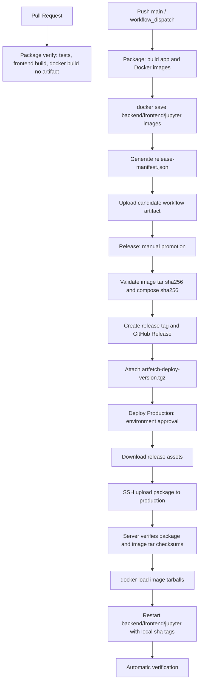

# GitHub Actions 制品构建与生产部署设计

状态：主设计文档

更新日期：2026-06-01

本文档是 ArtFetch 发布部署链路的事实来源。当前决策是：**不再把 ArtFetch 自有 Docker 镜像推送到 GHCR 或其他镜像仓库；GitHub Actions 构建镜像后导出为 `tar.gz`，随部署包一起作为 GitHub Release 附件发布。**

## 1. 核心结论

ArtFetch 发布链路分为三段：

- `Package`：构建后端、前端和 Jupyter 工具服务，构建 Docker 镜像，把镜像 `docker save` 为 `tar.gz`，生成候选部署包 artifact。
- `Release`：人工选择一次成功的 Package run，把候选部署包晋升为 GitHub Release 附件。
- `Deploy Production`：生产审批后下载 Release 附件，上传到服务器，服务器校验并 `docker load` 镜像 tar，然后重启服务。

生产服务器不再执行：

- `npm run build`
- `mvn package`
- `docker build`
- `docker pull ghcr.io/...`

生产服务器只消费：

- GitHub Release 附件 `artfetch-deploy-<version>.tgz`
- GitHub Release 附件 `artfetch-deploy-<version>.tgz.sha256`
- 部署包内的 `release-manifest.json`
- 部署包内的 `images/*.tar.gz`

## 2. 总体流程



## 3. 制品定义

每次成功的非 PR Package run 生成一个 workflow artifact：

```text
artfetch-package-<git-sha>/
├── docker-compose.prod.yml
├── .env.example
├── release-manifest.json
├── images/
│   ├── artfetch-backend-<git-sha>.tar.gz
│   ├── artfetch-backend-<git-sha>.tar.gz.sha256
│   ├── artfetch-frontend-<git-sha>.tar.gz
│   ├── artfetch-frontend-<git-sha>.tar.gz.sha256
│   ├── artfetch-jupyter-<git-sha>.tar.gz
│   └── artfetch-jupyter-<git-sha>.tar.gz.sha256
└── scripts/
    ├── artfetch-deploy-release.sh
    └── artfetch-rollback-release.sh
```

每次正式 Release 至少上传这些附件：

```text
release-manifest.json
artfetch-deploy-<version>.tgz
artfetch-deploy-<version>.tgz.sha256
deployment-instructions.md
```

其中 `artfetch-deploy-<version>.tgz` 内部包含完整部署目录和镜像 tar。Release 不单独依赖 GHCR。

部署包禁止包含：

- `.env`
- 数据库 dump
- 生产密码
- 雅昌 Cookie、账号、密码
- 对象存储 Access Key、Secret Key
- SSH 私钥
- GitHub token

## 4. 镜像命名

由于不再使用 registry，生产 Compose 使用本地 Docker image tag：

```text
artfetch-backend:sha-<full-git-sha>
artfetch-frontend:sha-<full-git-sha>
artfetch-jupyter:sha-<full-git-sha>
```

部署脚本会从部署包中读取镜像 tar，执行：

```bash
docker load -i images/artfetch-backend-<git-sha>.tar.gz
docker load -i images/artfetch-frontend-<git-sha>.tar.gz
docker load -i images/artfetch-jupyter-<git-sha>.tar.gz
```

然后写入服务器本地 `.env.release`：

```env
ARTFETCH_BACKEND_IMAGE=artfetch-backend:sha-<full-git-sha>
ARTFETCH_FRONTEND_IMAGE=artfetch-frontend:sha-<full-git-sha>
ARTFETCH_JUPYTER_IMAGE=artfetch-jupyter:sha-<full-git-sha>
```

`docker-compose.prod.yml` 继续通过这两个变量启动服务。

## 5. Manifest Schema

`release-manifest.json` 是发布、部署、排障和回滚的事实来源。示例：

```json
{
  "app": "artfetch",
  "version": "2026.06.01.1",
  "gitSha": "abcdef1234567890abcdef1234567890abcdef12",
  "gitShortSha": "abcdef1",
  "builtAt": "2026-06-01T08:00:00Z",
  "releasedAt": "2026-06-01T09:00:00Z",
  "packageRunId": "1234567890",
  "images": {
    "backend": {
      "tag": "artfetch-backend:sha-abcdef1234567890abcdef1234567890abcdef12",
      "ref": "artfetch-backend:sha-abcdef1234567890abcdef1234567890abcdef12",
      "imageId": "sha256:<docker-image-id>",
      "tar": "images/artfetch-backend-abcdef1234567890abcdef1234567890abcdef12.tar.gz",
      "tarSha256": "<tar-file-sha256>"
    },
    "frontend": {
      "tag": "artfetch-frontend:sha-abcdef1234567890abcdef1234567890abcdef12",
      "ref": "artfetch-frontend:sha-abcdef1234567890abcdef1234567890abcdef12",
      "imageId": "sha256:<docker-image-id>",
      "tar": "images/artfetch-frontend-abcdef1234567890abcdef1234567890abcdef12.tar.gz",
      "tarSha256": "<tar-file-sha256>"
    },
    "jupyter": {
      "tag": "artfetch-jupyter:sha-abcdef1234567890abcdef1234567890abcdef12",
      "ref": "artfetch-jupyter:sha-abcdef1234567890abcdef1234567890abcdef12",
      "imageId": "sha256:<docker-image-id>",
      "tar": "images/artfetch-jupyter-abcdef1234567890abcdef1234567890abcdef12.tar.gz",
      "tarSha256": "<tar-file-sha256>"
    }
  },
  "externalImages": {
    "postgres": {
      "service": "postgres",
      "ref": "postgres:16-alpine"
    }
  },
  "compose": {
    "file": "docker-compose.prod.yml",
    "sha256": "<compose-file-sha256>"
  },
  "build": {
    "backendTest": "passed",
    "frontendBuild": "passed",
    "imageBuild": "passed",
    "imageExport": "passed"
  }
}
```

校验规则：

- `app` 必须等于 `artfetch`。
- Release manifest 必须有 `version`。
- `images.backend.ref` 必须等于 `artfetch-backend:sha-<gitSha>`。
- `images.frontend.ref` 必须等于 `artfetch-frontend:sha-<gitSha>`。
- `images.jupyter.ref` 必须等于 `artfetch-jupyter:sha-<gitSha>`。
- 每个 `images.*.tar` 必须存在于部署包内。
- 每个镜像 tar 的实际 SHA256 必须等于 `tarSha256`。
- `compose.sha256` 必须与部署包内 `docker-compose.prod.yml` 实际 hash 一致。
- Git tag `release/<version>` 必须与 manifest `gitSha` 指向同一 commit。

## 6. GitHub Actions

### Package

触发：

- `pull_request`
- `push` 到 `main`
- `workflow_dispatch` 手动指定 `ref`

PR 行为：

- 执行后端测试。
- 执行前端构建。
- 执行 Docker build 验证。
- 不上传候选部署包。
- 不生成 Release 附件。

非 PR 行为：

1. Checkout 指定 ref。
2. 后端执行 `mvn test`。
3. 前端执行 `npm ci && npm run build`。
4. 构建 `artfetch-backend:sha-<gitSha>`。
5. 构建 `artfetch-frontend:sha-<gitSha>`。
6. 构建 `artfetch-jupyter:sha-<gitSha>`。
7. `docker save | gzip` 导出三个镜像 tar。
8. 生成镜像 tar 的 SHA256。
9. 生成候选 `release-manifest.json`。
10. 上传候选 workflow artifact，保留 30 天。

### Release

触发：

- `workflow_dispatch` 输入 `packageRunId`、`version`、`releaseNotes`
- 推送符合 `release/YYYY.MM.DD.N` 的 tag。tag 触发时，workflow 会自动查找同一 commit 上成功完成的 main 分支 Package run。

职责：

1. 校验版本号格式。
2. 校验指定 Package run 成功。
3. 下载候选 artifact。
4. 校验 manifest、Compose checksum、镜像 tar checksum。
5. 生成正式部署包和 SHA256。
6. 创建或校验 Git tag：`release/<version>`。
7. 创建 GitHub Release 并上传附件。

Release 不重新构建镜像，不推送镜像，不连接生产服务器。

### Deploy Production

触发：

- `workflow_dispatch` 输入 `version`
- `release.published`

保护：

- Job 使用 GitHub Environment：`production`。
- `production` 必须配置 required reviewers。
- Workflow 使用 `production-deploy` 并发锁。

职责：

1. 解析 Release 版本。
2. 下载 Release 附件并校验部署包 SHA256。
3. 展示非敏感 manifest 摘要。
4. 配置 SSH，使用固定 known hosts。
5. 上传部署包和部署脚本到生产服务器。
6. 远程执行 `artfetch-deploy-release.sh`。

远程部署脚本职责：

1. 校验服务器命令、磁盘空间、`.env` 必要变量。
2. 解包部署包并校验 manifest、Compose hash、镜像 tar hash。
3. 识别当前 active compose 文件。
4. 启动或确认 PostgreSQL 可用。
5. 检查运行中任务；发现 `RUNNING` 或上传中任务则阻断部署。
6. 在停止当前 app 容器前先 `docker load` 目标镜像 tar。
7. 停止 `frontend`、`backend`、`jupyter`，保留 `postgres`。
8. 保存部署前快照和数据库备份。
9. 安装新的 `docker-compose.prod.yml`、`release-manifest.json`、`.env.release`。
10. 启动 `backend`、`frontend`、`jupyter`。
11. 校验容器状态和实际 image tag。
12. 校验 `/actuator/health`。
13. 校验前端入口。
14. 校验 `/api/auth/me` 未登录返回 `401`。
15. 检查近期后端日志。
16. 写入 `backups/deploy-history.log`。

## 7. 生产服务器接入

生产目录：

```text
/opt/artfetch
├── .env
├── .env.release
├── docker-compose.prod.yml
├── release-manifest.json
├── active-compose-file
├── backend/logs/
├── storage/original-images/
├── backups/
├── releases/
└── scripts/
```

接入原则：

- 不删除 PostgreSQL volume。
- 不执行 `docker compose down -v`。
- 不覆盖现有 `.env`，只检查必要变量是否存在。
- 不打印 `.env`、Cookie、数据库密码、对象存储密钥等敏感值。
- 不依赖生产服务器访问 GHCR。
- Compose 中定义的每个服务都应默认启动；当前生产服务为 `postgres`、`backend`、`frontend`、`jupyter`。

## 8. 验证标准

Package 成功标准：

- 后端测试通过。
- 前端构建通过。
- 后端、前端和 Jupyter Docker 镜像构建成功。
- 非 PR 触发时，三个镜像 tar 导出成功。
- manifest 包含镜像 tar 路径和 tar SHA256。

Release 成功标准：

- Package run 是成功状态。
- manifest 结构有效。
- 镜像 tar 文件存在且 SHA256 匹配。
- Release tag 与 manifest `gitSha` 一致。
- 部署包 SHA256 文件有效。

Deploy 成功标准：

- 部署前数据库备份存在且非空。
- 服务器成功 `docker load` 后端、前端和 Jupyter 镜像。
- 线上 `backend`、`frontend`、`jupyter` 实际 image tag 与 manifest 一致。
- `postgres` 健康。
- `backend`、`frontend`、`jupyter` 运行且不处于 restarting。
- `/actuator/health` 返回 `UP`。
- 前端入口可访问。
- 未登录访问 `/api/auth/me` 返回 `401`。
- 后端近期日志没有持续启动错误、数据库连接错误或权限初始化错误。

人工冒烟验证：

- 登录页可以打开。
- 管理员账号可以登录。
- 任务列表可以加载。
- 艺术品列表可以加载。
- 图片访问和高清图状态正常。
- Excel 导出可以下载。
- 本次涉及权限、评估、对象存储、图片迁移或新任务类型时，验证对应入口和关键流程。

## 9. 回滚策略

应用回滚：

1. 选择上一个 GitHub Release 重新执行 `Deploy Production`；或
2. 使用部署失败时输出的 snapshot prefix 执行：

```bash
bash /opt/artfetch/scripts/artfetch-rollback-release.sh <snapshot-prefix>
```

应用回滚只恢复：

- `.env`
- `.env.release`
- active compose 文件
- `release-manifest.json`
- `backend`、`frontend`、`jupyter` 容器

Snapshot 回滚要求旧镜像仍存在于服务器本地 Docker image store。若旧镜像已被清理，应优先通过上一个 GitHub Release 重新部署。

应用回滚默认不恢复数据库。数据库恢复是破坏性操作，只能人工确认后执行。

## 10. 安全与权限

GitHub Secrets：

- `PROD_SSH_HOST`
- `PROD_SSH_USER`
- `PROD_SSH_PRIVATE_KEY`
- `PROD_SSH_KNOWN_HOSTS`
- `PROD_PROJECT_DIR`

安全约束：

- 生产 SSH Secret 只放在 `production` Environment。
- `production` Environment 必须 required reviewers。
- SSH 必须固定 host key，不允许静默信任未知主机。
- Workflow 日志不能打印 `.env` 内容。
- 部署包不能包含密钥。
- Release 附件包含可运行镜像，私有仓库应保持 Release 访问权限受控。

本设计不新增 ArtFetch 应用内 API、页面或按钮，因此不需要新增 Sa-Token 权限码。后续如果为发布、部署、业务任务创建内部 Ops API，则必须按 `AGENTS.md` 的授权要求补齐权限码、后端 `@SaCheckPermission`、前端按钮隐藏、审计日志和设计文档更新。

## 11. 当前范围

当前已落地范围：

- `backend` 镜像 tar 制品。
- `frontend` 镜像 tar 制品。
- `jupyter` 镜像 tar 制品。
- GitHub Release 附件承载部署包。
- 生产服务器从部署包加载镜像。
- Compose 中的每个服务默认启动。

最终成功标准：

- 任意 main commit 的 Package 都会构建并导出 `backend`、`frontend`、`jupyter` 镜像 tar。
- Package manifest 中记录每个镜像 tar 的 SHA256。
- Release 只接受成功 Package run，并校验所有 tar checksum。
- GitHub Release 上传 manifest、部署包和 SHA256。
- 生产 `.env.release` 只记录本地 sha tag。
- 生产服务器不执行源码构建、不拉取 GHCR。
- 部署前有运行中任务阻断和数据库备份。
- 部署后自动验证通过，并记录部署历史。
