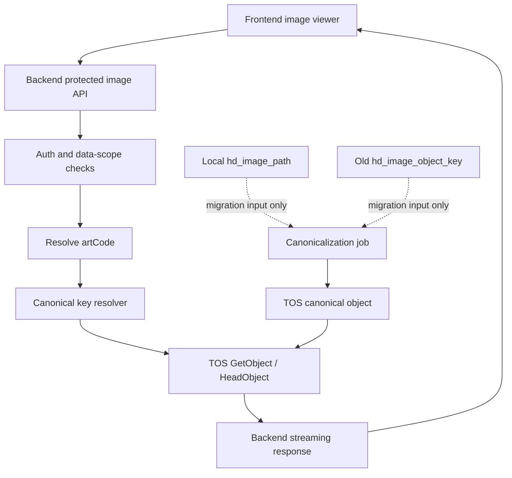
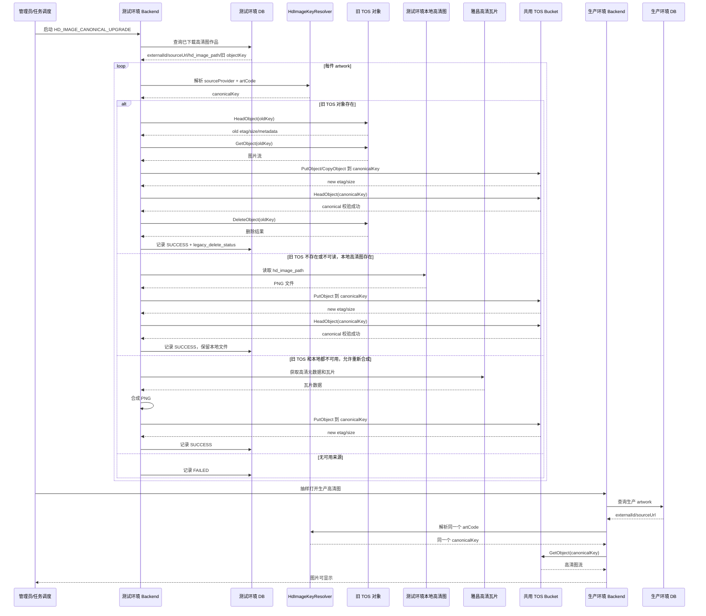

# ArtFetch 高清大图显示与存储解耦设计

编写日期：2026-06-07

## 1. 背景

当前高清大图显示逻辑已经支持本地文件和火山 TOS 对象存储，但读取路径仍然和历史存储状态强绑定：

- 本地路径依赖 `artworks.hd_image_path` 和 `artfetch.image.storage-path`。
- TOS 读取依赖 `artworks.hd_image_object_config_id`、`hd_image_object_bucket`、`hd_image_object_key`。
- `hd_image_storage_type=LOCAL_OBJECT` 会在对象存储失败时回退本地文件。
- 既有 TOS object key 规则继承了本地路径形态，包含 `task-{taskId}`。

这套逻辑适合“本地迁移到对象存储”的过渡阶段，但不适合作为长期读图模型。长期目标应该是：高清大图的显示只依赖后端服务和 TOS 中的规范对象；本地磁盘路径、数据库中记录的历史对象 key、旧 TOS 路径规则，都不能成为读图成功的必要条件。

## 2. 目标

- 建立新的高清大图显示模型：前端只访问后端受保护接口，后端只从 TOS 读取规范对象并流式返回。
- 显示逻辑和本地磁盘存储解耦：本地文件只允许作为迁移输入或临时生成 scratch，不作为最终显示回退。
- 显示逻辑和数据库图片存储字段解耦：数据库中的 `hd_image_path`、`hd_image_object_key`、`hd_image_storage_type` 不再参与读图定位。
- 显示逻辑和旧 TOS 路径解耦：不再依赖 `task-{taskId}/{externalId}/hd-lossless.png` 或现有 `path_prefix` 拼出来的历史 key。
- 建立稳定、可推导、版本化的 canonical object key 规则。
- 保留现有鉴权和数据范围控制，不向浏览器暴露 TOS 裸 URL、签名 URL 或 object key。
- 支持历史图片迁移到 canonical key，并提供可验证、可重试、可回滚的过渡方案。

## 3. 非目标

- 不要求前端直接访问 TOS 或 CDN。
- 不要求删除历史字段。历史字段可以保留用于迁移、排障、报表和回滚，但不作为新读图链路的输入。
- 不要求一次性删除本地高清图。清理本地文件是独立运维任务。
- 不要求第一阶段移除旧迁移页面。旧迁移能力可以保留，但新增 canonical 化迁移作为新的最终态迁移。
- 不改变艺术品业务数据的权限模型。`artwork:image:view` 和专家项目数据范围仍然必须生效。

## 4. 设计原则

### 4.1 读图定位只依赖业务标识

后端读取高清图时只使用稳定业务标识生成 TOS key：

```text
artworkId -> Artwork.externalId/sourceUrl -> artCode -> canonical object key
```

其中 `artworkId` 用于业务鉴权和查找拍品编号，`artCode` 才是高清图对象的身份。图片对象不再以“任务 ID + 本地路径”作为身份。

### 4.2 TOS 是高清图字节的唯一最终来源

最终态下：

- TOS canonical object 存在，高清图可显示。
- TOS canonical object 不存在，高清图不可显示。
- 本地文件存在与否不影响显示结果。
- 数据库旧对象 key 存在与否不影响显示结果。

### 4.3 数据库只做业务与缓存，不做图片位置索引

数据库仍然可以用于：

- 鉴权和数据范围判断。
- 查找 `externalId`、`sourceUrl` 等业务标识。
- 展示图片可用性的非权威缓存。
- 记录下载、迁移、检查任务的状态。

数据库不再用于：

- 决定高清图读取本地还是对象存储。
- 保存读图必须依赖的 object key。
- 保存最终读图必须依赖的 bucket/path。

换句话说，数据库可以帮助后端知道“这件作品是谁、用户能不能看、最近一次检查结果是什么”，但不能决定“图片字节在哪里”。

### 4.4 旧路径只作为迁移输入

旧字段和旧路径只允许出现在以下场景：

- canonical 迁移任务从旧本地文件读取源文件。
- canonical 迁移任务从旧 TOS object key 复制对象。
- 运维排障页面显示旧状态。
- 灾难恢复时人工回滚到旧读图逻辑。

常规显示接口不得读取旧路径。

## 5. 目标架构



核心变化：

- `HdImageService.loadHdImage` 不再根据 `hd_image_storage_type` 分支读取本地或对象存储。
- 新增 `HdImageReadService`，只负责 canonical TOS 读取。
- 新增 `HdImageKeyResolver`，集中生成 canonical object key。
- 新增 canonical 化迁移任务，把历史来源复制或重新生成到 canonical key。

## 6. Canonical Object Key 设计

### 6.1 图片身份

高清图 canonical 身份由两部分组成：

```text
sourceProvider + artCode
```

第一期 `sourceProvider` 固定为：

```text
artron
```

`artCode` 是雅昌拍品编号，获取优先级：

1. 优先读取 `Artwork.externalId`。
2. 如果 `externalId` 为空，则从 `Artwork.sourceUrl` 中解析 `/paimai-{artCode}`。

示例：

| 字段 | 示例值 | 来源 |
|---|---|---|
| `sourceProvider` | `artron` | 后端常量，第一期固定 |
| `artCode` | `art5060841293` | `Artwork.externalId` 或 `Artwork.sourceUrl` |

如果两个字段都无法得到 `artCode`，高清图不可定位，应返回业务错误：

```text
无法定位高清图：作品缺少拍品编号
```

### 6.2 参数获取规则

canonical key 中每个参数必须按下表获取，禁止实现时改用其他旧字段：

| 参数 | 示例 | 获取方式 | 失败处理 |
|---|---|---|---|
| `canonicalPrefix` | `artfetch/hd-images` | 后端程序常量 | 禁止从环境变量、数据库或前端配置读取 |
| `keyVersion` | `v2` | 后端常量 | 不允许为空 |
| `sourceProvider` | `artron` | 后端常量，第一期固定为雅昌 | 不允许从数据库或前端读取 |
| `rawArtCode` | `art5060841293` | 优先 `Artwork.externalId`，其次从 `Artwork.sourceUrl` 解析 `/paimai-{artCode}` | 解析失败返回 `409` |
| `normalizedArtCode` | `art5060841293` | 对 `rawArtCode` 做标准化 | 标准化后为空返回 `409` |
| `hashInput` | `artron:art5060841293` | `sourceProvider + ":" + normalizedArtCode` | 不允许改成只 hash artCode |
| `hashHex` | `5a8f...` | `sha256(hashInput)` 后转小写 hex | 计算失败视为服务端错误 |
| `hash2` | `5a` | `hashHex.substring(0, 2)` | 不允许手写或随机 |
| `hash4` | `5a8f` | `hashHex.substring(0, 4)` | 不允许手写或随机 |
| `filename` | `hd-lossless.png` | 后端常量 | 第一阶段固定为 PNG |

### 6.3 标准化规则

`artCode` 标准化为：

- trim 首尾空白。
- 保留大小写敏感性，但当前雅昌编号通常稳定为小写或数字。
- 只允许 `[A-Za-z0-9_-]`。
- 如果出现其他字符，使用 `_` 替换，并保留原始值写入 TOS metadata。

注意：

- `normalizedArtCode` 用于 key 和 hash。
- `rawArtCode` 应写入 TOS metadata，便于排障。
- 如果未来发现雅昌 artCode 大小写不稳定，再通过新版本 `v3` 调整为统一小写；不要在 `v2` 中悄悄改变规则。

### 6.4 Key 版本和路径模板

canonical key 必须带版本，避免未来再次迁移时破坏已有对象：

```text
{canonicalPrefix}/v2/source/{sourceProvider}/art-code/{hash2}/{hash4}/{normalizedArtCode}/hd-lossless.png
```

示例：

```text
artfetch/hd-images/v2/source/artron/art-code/00/00bf/art5060841293/hd-lossless.png
```

说明：

- `canonicalPrefix` 是后端程序常量，不沿用旧 `object_storage_configs.path_prefix` 的含义，也不按测试、生产环境区分。
- `v2` 表示新的显示规范版本。
- `sourceProvider` 用于区分雅昌、未来其他拍卖平台或人工导入来源。
- `hash2` 和 `hash4` 来自 `sha256(sourceProvider + ":" + normalizedArtCode)`，用于分散对象目录。
- `normalizedArtCode` 让人工排障时仍可读。
- 文件名固定为 `hd-lossless.png`。

完整生成伪代码：

```java
String canonicalPrefix = "artfetch/hd-images";
String keyVersion = "v2";
String sourceProvider = "artron";
String rawArtCode = resolveRawArtCode(artwork.getExternalId(), artwork.getSourceUrl());
String normalizedArtCode = normalizeArtCode(rawArtCode);
String hashHex = sha256Hex(sourceProvider + ":" + normalizedArtCode);
String hash2 = hashHex.substring(0, 2);
String hash4 = hashHex.substring(0, 4);

return canonicalPrefix
        + "/" + keyVersion
        + "/source/" + sourceProvider
        + "/art-code/" + hash2
        + "/" + hash4
        + "/" + normalizedArtCode
        + "/hd-lossless.png";
```

### 6.5 TOS Metadata

上传 canonical 对象时建议写入以下 metadata，用于排障、冲突检测和后续迁移：

| Metadata | 示例 | 获取方式 |
|---|---|---|
| `artfetch-source-provider` | `artron` | 后端常量 |
| `artfetch-art-code-raw` | `art5060841293` | 标准化前的 `rawArtCode` |
| `artfetch-art-code-normalized` | `art5060841293` | 标准化后的 `normalizedArtCode` |
| `artfetch-key-version` | `v2` | 后端常量 |
| `artfetch-artwork-id` | `12345` | 当前数据库 `Artwork.id`，仅用于排障，不参与读图定位 |
| `artfetch-generated-at` | `2026-06-07T12:00:00+08:00` | 后端上传时间 |

Metadata 不参与读图定位。读图定位只能由 resolver 根据业务标识实时生成 canonical key。

### 6.6 跨环境共享规则

为了让测试环境上传的高清图在生产环境也能直接打开，canonical key 规则不能包含环境名、任务 ID、数据库 ID 或部署实例 ID。

固定规则：

```text
canonicalPrefix = artfetch/hd-images
```

因此，同一个 `sourceProvider + artCode` 在测试环境和生产环境会生成完全相同的 object key。

明确决策：

- 测试 backend 和生产 backend 共用同一个 TOS bucket。
- 同一 `sourceProvider + artCode` 在任意环境生成同一个 object key，并指向同一个 TOS 对象。
- 测试环境上传或覆盖 canonical 对象后，生产环境立即读取同一个对象。
- 高清大图上传入口在测试和生产都可以保留；但所有环境都必须使用第二版 canonical TOS 写入逻辑。
- TOS endpoint、AK/SK、网络类型可以因环境不同而变化，但它们只决定“如何连接 bucket”，不能改变 object key。
- 任何测试/生产隔离都不能通过 key 前缀实现；如果未来必须隔离，应另行评估是否放弃“测试上传、生产可直接打开”的目标。

禁止规则：

- 禁止 key 中出现 `test`、`dev`、`prod` 等环境名。
- 禁止 key 中出现 `taskId`、`artworkId`、数据库自增 ID。
- 禁止从 `object_storage_configs.path_prefix`、`hd_image_object_key` 或环境变量覆盖 canonical key 前缀。

### 6.7 配置项

新增或明确后端配置：

```yaml
artfetch:
  image:
    hd-display-mode: TOS_CANONICAL
```

`hd-canonical-prefix` 不再作为配置项。它应在 `HdImageKeyResolver` 中以常量形式固定：

```java
private static final String CANONICAL_PREFIX = "artfetch/hd-images";
```

`hd-display-mode` 建议支持：

| 值 | 含义 |
|---|---|
| `LEGACY` | 沿用旧读取逻辑，仅用于回滚 |
| `DUAL_READ` | 优先 canonical，失败后可按受控配置读旧逻辑，仅用于迁移验证 |
| `TOS_CANONICAL` | 只读 canonical TOS 对象，最终态 |

生产最终应使用 `TOS_CANONICAL`。

## 7. 读图接口逻辑

### 7.1 通用艺术品接口

现有接口保持不变：

```http
GET /api/artworks/{id}/hd-image
```

处理流程：

1. Sa-Token 校验 `artwork:image:view`。
2. 调用数据范围检查，确认当前用户可查看该作品图片。
3. 根据 `id` 加载作品基础信息，只读取 `externalId`、`sourceUrl` 等业务字段。
4. 解析 `artCode`。
5. 使用 `HdImageKeyResolver` 生成 canonical object key。
6. 通过启用的 TOS 配置执行 `GetObject`。
7. 将 TOS object stream 作为响应 body 返回。

伪代码：

```java
Resource loadHdImage(Long artworkId) {
    ArtworkIdentity identity = artworkIdentityService.requireIdentity(artworkId);
    String artCode = artCodeResolver.resolve(identity);
    String objectKey = hdImageKeyResolver.canonicalKey(artCode);
    return tosHdImageStore.getObject(objectKey);
}
```

禁止事项：

- 禁止读取 `hd_image_path`。
- 禁止根据 `hd_image_storage_type` 选择本地回退。
- 禁止读取 `hd_image_object_key` 作为最终 key。
- 禁止把 TOS object key 返回给前端。

### 7.2 专家评估接口

专家端继续使用受保护接口：

```http
GET /api/expert/evaluations/{evaluationId}/artworks/{artworkId}/images/hd
```

处理流程和通用接口一致，但数据范围检查使用专家项目上下文：

1. 当前专家必须登录。
2. 当前专家必须被分配到项目。
3. 作品必须属于该项目。
4. 作品必须存在本人评估记录。
5. 通过后再进入 canonical TOS 读取。

### 7.3 响应头

后端返回：

```http
Content-Type: image/png
Content-Disposition: inline; filename*=UTF-8''{artCode}-hd.png
Cache-Control: private, max-age=300
ETag: "{tosEtag}"
Content-Length: {objectSize}
```

建议支持：

- `If-None-Match`：如果 ETag 相同，返回 `304`。
- `Range`：大图读取时透传 Range 到 TOS，返回 `206 Partial Content`。

如果第一阶段不做 Range，也必须保持流式返回，不能一次性把大图完整读入内存。

### 7.4 错误语义

| 场景 | HTTP | 前端提示 |
|---|---:|---|
| 无权限 | 403 | 无权查看该高清图 |
| 作品不存在 | 404 | 作品不存在 |
| 缺少 artCode | 409 | 该作品缺少拍品编号，无法定位高清图 |
| canonical 对象不存在 | 404 | 高清图尚未准备好 |
| TOS 配置缺失 | 503 | 高清图服务未配置 |
| TOS 临时不可用 | 503 | 高清图服务暂不可用，请稍后重试 |

错误响应和日志不得向前端暴露：

- 本地文件路径。
- TOS Access Key、Secret Key。
- 完整内部 endpoint。
- 旧 `hd_image_object_key`。

## 8. 可用性展示逻辑

列表页和详情页仍然需要知道高清图是否可用。新的可用性判断不再依赖 `hdImagePath` 或 `hdImageObjectKey` 是否为空。

推荐分两层：

### 8.1 权威判断

权威判断是 TOS `HeadObject(canonicalKey)`：

```text
HeadObject 成功 -> 可用
HeadObject 404 -> 不可用
HeadObject 其他错误 -> 未知
```

### 8.2 非权威缓存

为了避免列表页对每条记录实时 HeadObject，可以增加缓存字段或复用 DTO 中的状态字段，但必须明确它是缓存：

```text
hd_image_canonical_status:
- UNKNOWN
- AVAILABLE
- MISSING
- ERROR

hd_image_canonical_checked_at
hd_image_canonical_size
hd_image_canonical_etag
hd_image_canonical_last_error
```

缓存维护方式：

- 补高清图上传 canonical 成功后写 `AVAILABLE`。
- canonical 迁移成功后写 `AVAILABLE`。
- 用户打开图片时，如果读图成功，可顺手刷新缓存。
- 用户打开图片时，如果 TOS 返回 404，可刷新为 `MISSING`。
- 定时任务或后台检查任务可批量刷新。

读图接口不能因为缓存是 `AVAILABLE` 就跳过 TOS 读取；TOS 对象存在才是最终事实。

如果不增加新字段，也可以暂时让详情页按钮保持可点击，实际打开时由读图接口返回 404。用户体验较弱，但仍符合解耦目标。

## 9. 高清图生成与上传逻辑

补充高清大图任务仍然从雅昌高清瓦片接口下载并拼接 PNG，但持久化目标改为 TOS canonical object。

### 9.1 生成流程

1. 根据 artwork 解析 `artCode`。
2. 从雅昌获取高清图元数据。
3. 并发下载瓦片。
4. 拼接为 PNG。
5. 写入临时 scratch 文件或临时流。
6. 上传到 TOS staging key。
7. 校验 staging object size/checksum。
8. copy/rename 到 canonical key，或直接 PutObject 到 canonical key。
9. 删除 staging object 和本地 scratch。
10. 更新任务状态和可用性缓存。

本地 scratch 目录只作为进程临时工作区：

- 不进入数据库。
- 不参与显示。
- 任务完成后必须清理。
- 重启后可安全删除。

### 9.2 上传原子性

推荐使用 staging key：

```text
{canonicalPrefix}/_staging/{taskId}/{uuid}.png
```

其中：

- `canonicalPrefix` 获取方式同第 6 章。
- `taskId` 来自当前补高清图任务或 canonical 化迁移任务 ID，只用于临时隔离，不参与最终读图定位。
- `uuid` 由后端生成，用于避免并发任务临时对象冲突。

上传完成并校验后，再复制到 canonical key：

```text
{canonicalPrefix}/v2/source/{sourceProvider}/art-code/{hash2}/{hash4}/{normalizedArtCode}/hd-lossless.png
```

这样可以避免读图接口读到半成品。若 TOS PutObject 对同一 key 本身已具备完整对象可见语义，也可以第一阶段直接 PutObject 到 canonical key，但文档和日志必须明确失败时不会留下可被读图接口误认为成功的对象。

### 9.3 覆盖策略

默认策略：

- canonical key 不存在：上传。
- canonical key 存在且 size/etag 匹配：跳过，标记成功。
- canonical key 存在但大小不一致：允许覆盖，但必须记录覆盖来源、旧对象元信息和新对象元信息。

覆盖规则：

- 测试环境和生产环境生成的是同一个 canonical key，因此任一环境覆盖对象，另一环境都会立即读取新对象。
- 测试和生产都可以保留高清大图上传、重新下载和 canonical 对象覆盖入口。
- 无论从哪个环境触发，写入逻辑都必须生成同一个 v2 canonical key，并覆盖同一个 TOS 对象。
- 禁止任何环境继续把本地文件路径、旧 `hd_image_object_key` 或旧 `path_prefix/task-{taskId}` 作为写入后的最终显示位置。
- 覆盖前应先 `HeadObject` 记录旧对象 `etag`、`size`、metadata。
- 覆盖后应再次 `HeadObject` 记录新对象 `etag`、`size`、metadata。

管理员重新下载单件高清图或迁移任务覆盖 canonical 对象时，应记录审计日志：

```text
hd-image.redownload.force
hd-image.canonical.overwrite
```

### 9.4 既有上传入口的新职责

现有“补充超清无损图任务”和单件“重新下载高清图”入口可以继续保留，但实现语义必须调整：

| 入口 | 新职责 |
|---|---|
| `HD_IMAGE` 补充任务 | 批量生成高清图并写入 v2 canonical TOS 对象 |
| `POST /api/artworks/{id}/hd-image/redownload` | 重新生成单件高清图并覆盖 v2 canonical TOS 对象 |
| canonical 化迁移任务 | 从旧 TOS、本地文件或重新生成结果补齐 v2 canonical TOS 对象 |

这些入口完成后可以更新可用性缓存和审计信息，但不得再把 `hd_image_path`、`hd_image_storage_type`、`hd_image_object_key` 作为最终显示依据。

## 10. Canonical 化迁移

现有历史图片需要迁移到 canonical key。新增迁移任务可以称为“高清图 canonical 化任务”。

### 10.1 测试环境已下载高清图升级任务

需要提供一个单独的数据升级任务，用于把测试环境中已经下载好的高清大图迁移到第二版 canonical TOS 路径。这个任务是第二版上线前的关键兼容步骤：只要测试环境已经有高清图，升级任务成功后，生产环境就可以通过第二版读图逻辑直接打开同一份 TOS 对象。

任务名称建议：

```text
HD_IMAGE_CANONICAL_UPGRADE
```

任务目标：

- 扫描测试环境数据库中已有高清大图的作品。
- 优先从旧 TOS 对象读取源图片，并在 v2 canonical 对象校验成功后删除旧 TOS 对象。
- 旧 TOS 对象不可用时，再从测试环境本地高清图文件读取源图片。
- 本地高清图文件只读不删，保留作后续核验、审计或人工恢复使用。
- 旧 TOS 和本地文件都不可用时，最后再通过雅昌原始数据和瓦片重新合成高清图。
- 按第 6 章规则生成 v2 canonical key。
- 上传或覆盖共用 TOS bucket 中的 v2 canonical 对象。
- 更新 canonical 可用性缓存。
- 生成成功、跳过、失败明细，便于重试。

输入范围：

| 条件 | 说明 |
|---|---|
| `hd_image_status=DOWNLOADED` | 表示测试环境已经完成高清图下载 |
| `hd_image_path` 非空或旧 `hd_image_object_key` 非空 | 至少有一个可迁移来源 |
| 能解析出 `artCode` | 优先 `externalId`，其次 `sourceUrl` |

源数据优先级：

1. 如果旧 TOS object key 存在且 `HeadObject` 成功，从旧 TOS 对象复制或下载后上传到 v2 canonical key；v2 canonical 对象 `HeadObject` 校验成功后，删除旧 TOS object key。
2. 如果旧 TOS object key 不存在或读取失败，再检查测试环境本地 `hd_image_path`；本地文件存在时，从本地文件上传到 v2 canonical key，但不删除本地文件。
3. 如果旧 TOS 和本地文件都不可用，并且允许重新生成、雅昌登录态可用，则重新下载瓦片、合成 PNG 并上传到 v2 canonical key。
4. 如果以上都不可用，记录失败。

删除旧 TOS 对象的安全顺序：

```text
HeadObject(oldKey)
-> PutObject/CopyObject(canonicalKey)
-> HeadObject(canonicalKey)
-> 校验 canonical size/etag/metadata
-> DeleteObject(oldKey)
```

禁止先删除旧 TOS 对象再写 canonical 对象。

输出结果：

| 字段 | 说明 |
|---|---|
| `artwork_id` | 测试环境作品 ID，仅用于任务明细排障 |
| `art_code` | 解析后的拍品编号 |
| `canonical_key` | v2 目标 key |
| `source_type` | `OLD_TOS`、`LOCAL_FILE`、`REGENERATED`、`CANONICAL_EXISTS` |
| `status` | `SUCCESS`、`FAILED`、`SKIPPED` |
| `old_etag` / `old_size` | 覆盖前对象元信息，如对象已存在 |
| `new_etag` / `new_size` | 上传后 canonical 对象元信息 |
| `legacy_object_key` | 旧 TOS object key，仅任务排障使用 |
| `legacy_delete_status` | `NOT_REQUIRED`、`DELETED`、`FAILED` |
| `legacy_delete_error` | 删除旧 TOS 对象失败原因 |
| `error_message` | 失败原因 |

幂等规则：

- canonical key 已存在且可通过 `HeadObject` 读取时，默认仍可覆盖，以保证测试环境最新高清图成为共享对象。
- 如果任务以 `checkOnly=true` 运行，只检查 canonical key 是否存在和 metadata 是否匹配，不执行覆盖。
- 同一作品重复运行升级任务，应生成同一个 canonical key。
- 任务失败后重试，不应产生第二个目标路径。
- 如果 v2 canonical 对象已经成功写入，但删除旧 TOS 对象失败，图片升级视为成功，`legacy_delete_status=FAILED`，后续可单独重试旧对象清理。
- 如果源来自本地磁盘，`legacy_delete_status=NOT_REQUIRED`，任务不得删除本地文件。

验证方式：

1. 升级任务完成后，对成功项执行 `HeadObject(canonicalKey)`。
2. 抽样调用测试环境 `GET /api/artworks/{id}/hd-image`，在 `TOS_CANONICAL` 或 `DUAL_READ` 模式下验证可显示。
3. 使用生产环境中同一 `artCode` 对应的作品调用生产读图接口，验证无需本地文件和旧数据库路径即可显示。

注意：

- 该任务可以运行在测试环境 backend 中，因为测试环境拥有已下载高清图和旧数据库路径。
- 该任务写入的是测试/生产共用 TOS bucket，因此结果会立即对生产读图可见。
- 该任务不得要求生产数据库保存测试环境的 `hd_image_path` 或旧 object key。
- 生产环境作品记录必须能解析出与测试环境上传对象相同的 `artCode`；不要求生产保存图片路径或 object key。
- 旧 TOS 对象是需要退场的历史路径，升级成功后应删除。
- 测试环境本地高清图是保留资产，升级任务只能读取，不能删除。

### 10.2 数据升级任务时序图



### 10.3 通用迁移输入优先级

对每件作品：

1. 如果 canonical key 已存在，校验 size/metadata 后标记成功。
2. 如果旧 TOS object key 存在且 HeadObject 成功，从旧 key 复制到 canonical key；canonical 校验成功后删除旧 key。
3. 如果本地 `hd_image_path` 存在，从本地文件上传到 canonical key；不删除本地文件。
4. 如果允许重新生成，并且有雅昌登录态，则重新下载瓦片、合成 PNG 并上传 canonical key。
5. 以上都失败则标记失败。

注意：第 2、3 步只发生在迁移任务内，常规显示接口不能使用这些来源。

### 10.4 迁移状态

建议新增独立任务表或扩展现有迁移表。迁移项至少记录：

| 字段 | 说明 |
|---|---|
| `artwork_id` | 作品 ID |
| `art_code` | 解析后的拍品编号 |
| `canonical_key` | 本次计算出的 canonical key，可用于排障 |
| `source_type` | `CANONICAL_EXISTS`、`OLD_TOS`、`LOCAL_FILE`、`REGENERATED` |
| `status` | `PENDING`、`RUNNING`、`SUCCESS`、`FAILED`、`SKIPPED` |
| `object_size` | canonical 对象大小 |
| `object_etag` | canonical 对象 ETag |
| `error_message` | 失败原因 |

`canonical_key` 可以记录在迁移明细表中用于排障，但读图接口仍应实时通过 resolver 计算，不从迁移表读取。

### 10.5 迁移完成标准

一个作品迁移成功的标准是：

- `HeadObject(canonicalKey)` 成功。
- object size 大于 0。
- content type 或 metadata 表示 `image/png`。
- 可选：metadata 中 `artfetch-art-code` 等于当前 artCode。

一个任务完成的标准是：

- 所有目标作品都进入 `SUCCESS`、`FAILED` 或 `SKIPPED`。
- 成功项已写入可用性缓存。
- 失败项有明确错误原因。

## 11. 新旧读图切换策略

### 11.1 阶段 A：实现 canonical 读取

- 增加 `HdImageKeyResolver`。
- 增加 `HdImageReadService`。
- 增加配置 `hd-display-mode=LEGACY|DUAL_READ|TOS_CANONICAL`。
- 默认仍使用 `LEGACY`。

### 11.2 阶段 B：运行测试环境高清图升级任务

- 在测试环境创建 `HD_IMAGE_CANONICAL_UPGRADE` 数据升级任务。
- 扫描测试环境中已经下载好的高清大图。
- 优先从旧 TOS 复制到 v2 canonical key，canonical 校验成功后删除旧 TOS 对象。
- 旧 TOS 不可用时，从测试环境本地文件上传，但不删除本地文件。
- 对失败项允许重新生成。
- 迁移期间用户仍走旧读图逻辑。

### 11.3 阶段 C：双读验证

切到 `DUAL_READ`：

```text
先读 canonical TOS
canonical 缺失时按旧逻辑读取
记录 fallback 指标和日志
```

此阶段用于发现漏迁对象，不应长期运行。

必须记录指标：

```text
artfetch_hd_image_canonical_read_total
artfetch_hd_image_canonical_missing_total
artfetch_hd_image_legacy_fallback_total
artfetch_hd_image_tos_error_total
```

### 11.4 阶段 D：最终态

切到 `TOS_CANONICAL`：

```text
只读 canonical TOS
不读本地
不读旧 object key
不根据 storage_type 回退
```

只有在生产事故时才临时回滚到 `LEGACY` 或 `DUAL_READ`。

## 12. 权限与安全

- 继续使用 `@SaCheckPermission(PermissionCodes.ARTWORK_IMAGE_VIEW)`。
- 专家端必须保留项目分配、作品归属、本人评估记录等数据范围检查。
- TOS bucket 必须是私有 bucket。
- 前端不能得到 TOS URL、签名 URL、bucket、object key。
- 后端日志可以记录 `artworkId`、`artCode`、canonical key 的 hash 或脱敏版本。
- 重新下载、强制覆盖、迁移重试、配置变更必须记录审计日志。
- 读图接口可不逐次记录审计日志，但需要保留访问日志和异常指标。

## 13. 运维与监控

建议新增或补充以下日志字段：

```text
artworkId
artCode
canonicalKeyHash
tosConfigId
endpointType
objectSize
etag
durationMs
result
```

建议指标：

```text
artfetch_hd_image_read_total{result="success|not_found|forbidden|tos_error"}
artfetch_hd_image_read_latency_ms
artfetch_hd_image_read_bytes_total
artfetch_hd_image_canonical_migration_total{source="old_tos|local|regenerated",result="success|failed"}
artfetch_hd_image_canonical_conflict_total
```

告警建议：

- `tos_error` 5 分钟内持续升高。
- canonical 404 比例异常升高。
- DUAL_READ 阶段 legacy fallback 非零且持续不下降。
- canonical 迁移失败率超过阈值。

## 14. 数据库字段处理建议

不建议立即删除旧字段。推荐标记为 legacy：

| 字段 | 新定位 |
|---|---|
| `hd_image_path` | legacy 本地来源，仅迁移和回滚使用 |
| `hd_image_storage_type` | legacy 读取策略，仅旧逻辑使用 |
| `hd_image_object_config_id` | legacy 对象配置，仅迁移和回滚使用 |
| `hd_image_object_bucket` | legacy 对象 bucket，仅迁移和回滚使用 |
| `hd_image_object_key` | legacy 对象 key，仅迁移和回滚使用 |
| `hd_image_migration_status` | legacy 对象迁移状态，可保留 |

新增字段如果需要，应命名为 canonical cache，避免误解为读图位置：

```text
hd_image_canonical_status
hd_image_canonical_checked_at
hd_image_canonical_size
hd_image_canonical_etag
hd_image_canonical_last_error
```

字段注释必须明确：这些字段是缓存，不是读图 key。

## 15. 代码改造建议

### 15.1 新增组件

```text
HdImageKeyResolver
HdImageReadService
HdImageCanonicalMigrationService
HdImageCanonicalAvailabilityService
```

职责：

| 组件 | 职责 |
|---|---|
| `HdImageKeyResolver` | 根据 artCode 和配置生成 canonical key |
| `HdImageReadService` | 从 TOS canonical key 读取对象并返回流 |
| `HdImageCanonicalMigrationService` | 把旧来源复制或生成到 canonical key |
| `HdImageCanonicalAvailabilityService` | HeadObject 检查和可用性缓存维护 |

### 15.2 改造组件

| 组件 | 改造点 |
|---|---|
| `HdImageService.loadHdImage` | 委托新读图服务；`TOS_CANONICAL` 模式不再读本地 |
| `HdImageService.ensureHdImageStored` | 上传 canonical TOS，不把本地文件作为持久结果 |
| `HdImageObjectStorageService` | 增加 `copyObject`、`headObject`、Range 读取支持 |
| `ArtworkDto` | `hdImageAvailable` 改为来自 canonical 缓存或检查结果 |
| `ArtworkController` | 接口不变，错误语义调整 |
| `ExpertEvaluationImageService` | 高清图读取委托 canonical 读取 |

## 16. 测试策略

### 16.1 单元测试

- `HdImageKeyResolver` 对同一 artCode 永远生成相同 key。
- `HdImageKeyResolver` 使用固定 `CANONICAL_PREFIX`，不会被环境变量、数据库配置或 TOS `path_prefix` 覆盖。
- 同一 `sourceProvider + artCode` 在测试环境和生产环境生成完全相同的 key。
- 特殊字符 artCode 能得到合法 key。
- 旧字段为空时，只要 artCode 存在，读图定位仍可生成 key。

### 16.2 集成测试

- TOS 中存在 canonical object，`GET /api/artworks/{id}/hd-image` 返回 200。
- 数据库 `hd_image_path` 为空但 canonical object 存在，仍返回 200。
- 数据库 `hd_image_object_key` 错误但 canonical object 存在，仍返回 200。
- `hd_image_storage_type=LOCAL` 但 canonical object 存在，仍返回 200。
- canonical object 不存在，即使本地文件存在，`TOS_CANONICAL` 模式返回 404。
- `DUAL_READ` 模式下 canonical 不存在且旧本地存在，可以返回 200，并记录 fallback 指标。
- 专家不能通过枚举 artworkId 读取未分配项目作品的高清图。

### 16.3 迁移测试

- 从旧 TOS key 复制到 canonical key。
- 旧 TOS key 复制并校验成功后会删除旧 TOS 对象。
- 从本地文件上传到 canonical key。
- 从本地文件上传成功后，本地文件仍保留。
- 已存在 canonical key 且大小一致时跳过。
- 已存在 canonical key 但大小不一致时允许覆盖，并记录覆盖前后的 etag、size、metadata。
- 测试环境 `HD_IMAGE_CANONICAL_UPGRADE` 成功后，生产环境可用同一 artCode 通过 `TOS_CANONICAL` 读取。
- 迁移完成后切到 `TOS_CANONICAL`，抽样图片可正常显示。

## 17. 验收标准

- 前端高清图入口仍使用后端接口，不出现 TOS 裸 URL。
- `TOS_CANONICAL` 模式下，读图代码不访问 `hd_image_path`。
- `TOS_CANONICAL` 模式下，读图代码不访问 `hd_image_object_key`。
- `TOS_CANONICAL` 模式下，读图代码不根据 `hd_image_storage_type` 做分支。
- 修改数据库中的旧路径字段不会影响已 canonical 化图片的显示。
- 删除本地高清图文件不会影响已 canonical 化图片的显示。
- 改变旧 TOS `path_prefix` 或旧 object key 字段不会影响已 canonical 化图片的显示。
- 数据升级任务从旧 TOS 成功升级到 v2 canonical 后，旧 TOS object key 被删除。
- 数据升级任务从本地磁盘成功升级到 v2 canonical 后，本地高清图文件仍保留。
- 生产环境作品记录只要能解析出同一 `artCode`，即可读取测试环境升级任务上传的 canonical 对象。
- canonical object 缺失时返回清晰的“高清图尚未准备好”，不会静默回退。
- 强制重新下载会覆盖或重建 canonical object，并记录审计日志。

## 18. 风险与对策

| 风险 | 对策 |
|---|---|
| artCode 缺失导致无法定位 | 迁移前生成缺失清单，必要时从 sourceUrl、extraData 或人工补录 |
| 旧数据同一 artCode 出现多张不同图片 | 允许覆盖，但必须记录覆盖前后 etag、size、metadata 和操作人 |
| v2 canonical 已写入但旧 TOS 删除失败 | 图片升级视为成功，记录 `legacy_delete_status=FAILED` 并提供旧对象清理重试 |
| 误删旧 TOS 对象导致源丢失 | 严格按先写 canonical、再 HeadObject 校验、最后 DeleteObject 的顺序执行；禁止先删旧对象 |
| 本地高清图被升级任务误删 | 升级任务对本地文件只读，删除本地文件必须是独立清理任务 |
| TOS 短暂故障导致所有高清图不可用 | 保留 `DUAL_READ` 或 `LEGACY` 作为应急开关，但最终态不静默回退 |
| 列表页实时 HeadObject 成本高 | 使用非权威缓存和后台检查任务 |
| 大图经 backend 代理占用带宽 | 支持 Range、ETag、private cache；后续可评估受控 CDN，但不能绕过鉴权 |
| 本地 scratch 清理不彻底 | scratch 目录独立，启动时清理过期文件，任务结束 finally 清理 |

## 19. 推荐实施顺序

1. 增加 `HdImageKeyResolver` 和 canonical key 单元测试。
2. 增加 TOS canonical 读取服务和 `hd-display-mode` 开关。
3. 在 `DUAL_READ` 模式下接入现有高清图接口并打指标。
4. 增加 `HD_IMAGE_CANONICAL_UPGRADE` 数据升级任务，把测试环境已下载高清图迁移到 v2 canonical TOS 路径。
5. 改造补高清图任务，新图直接写 canonical TOS。
6. 增加可用性缓存或后台 HeadObject 检查。
7. 运行测试环境升级任务，并用生产环境同一 artCode 抽样验证。
8. 切换生产到 `TOS_CANONICAL`。
9. 观察稳定后再规划本地文件清理和 legacy 字段归档。

## 20. 最终态总结

最终态下，高清大图显示链路应简化为：

```text
用户点击高清图
-> 前端请求 backend 鉴权接口
-> backend 校验权限和数据范围
-> backend 从 artwork 业务标识解析 artCode
-> backend 生成 canonical TOS key
-> backend 从 TOS 读取对象并流式返回
```

任何本地磁盘路径、数据库中保存的图片路径、历史 TOS object key、旧迁移状态，都不再决定高清大图能否显示。高清大图能否显示，只由两个事实决定：

1. 当前用户是否被 backend 授权查看。
2. TOS 中是否存在该作品 artCode 对应的 canonical 高清图对象。
