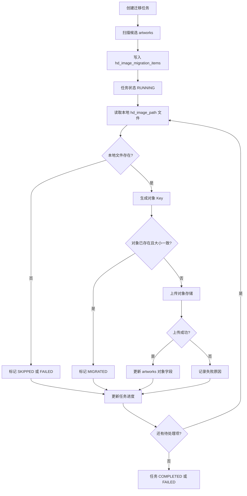

# ArtFetch 高清大图对象存储迁移方案设计

编写日期：2026-05-17

## 1. 背景

当前 ArtFetch 的高清大图由后端从雅昌超清瓦片接口下载、拼接为 PNG 文件，并保存到本地磁盘目录。数据库 `artworks.hd_image_path` 只记录相对路径，文件实际位于 `artfetch.image.storage-path` 配置的根目录下。

当前默认路径：

```text
storage/original-images/task-{taskId}/{externalId}/hd-lossless.png
```

Docker 部署中，容器内路径为：

```text
/app/storage/original-images/task-{taskId}/{externalId}/hd-lossless.png
```

宿主机映射路径为：

```text
./storage/original-images/task-{taskId}/{externalId}/hd-lossless.png
```

随着高清图数量增长，本地磁盘会出现容量、备份、迁移、扩容和多实例共享问题。需要将高清大图迁移到对象存储服务，并提供配置页面、迁移任务、进度可视化和增量迁移能力。

## 2. 目标

- 支持将既有本地高清大图迁移到对象存储。
- 支持后续新下载的高清大图直接写入对象存储，或按配置保留本地写入模式。
- 提供对象存储配置页面，可保存、测试、启用、禁用对象存储配置。
- 提供高清大图迁移页面，可创建迁移任务、查看迁移进度、失败原因、重试失败项。
- 支持增量迁移，避免每次全量扫描和重复上传。
- 保留现有 `/api/artworks/{id}/hd-image` 受权限保护的访问方式，不向前端暴露裸对象存储 URL。
- 支持迁移失败后的重试和回滚，不影响已有本地高清图访问。
- 对敏感配置做安全存储，对配置变更、迁移执行和失败重试记录审计日志。

## 3. 非目标

- 第一阶段不要求迁移原始图片 `original_image_*`，只迁移高清大图 `hd_image_*`。
- 第一阶段不要求删除本地文件。迁移完成后可以通过单独清理任务按策略删除。
- 第一阶段不要求支持多个对象存储配置同时生效。系统只允许一个 active 配置。
- 第一阶段不要求前端直接访问对象存储 CDN。继续通过后端鉴权接口读取或转发。

## 4. 当前数据设计

高清大图字段位于 `artworks` 表：

| 字段 | 当前含义 |
|---|---|
| `hd_image_source_url` | 雅昌高清图查看页 |
| `hd_image_status` | 下载状态：`MISSING`、`DOWNLOADED`、`FAILED` |
| `hd_image_path` | 本地磁盘相对路径 |
| `hd_image_content_type` | 当前固定为 `image/png` |
| `hd_image_size` | 本地 PNG 文件大小，单位字节 |
| `hd_image_downloaded_at` | 下载完成时间 |
| `hd_image_last_error` | 最近失败原因 |

现状问题：

- `hd_image_path` 默认表达的是本地相对路径，不能区分本地文件和对象存储对象。
- 无法记录对象存储 bucket、object key、etag、上传时间、迁移状态。
- 无法知道哪些高清图已经迁移、哪些失败、哪些本地仍可作为回退。
- 迁移过程没有任务表和明细表，无法展示进度和失败项。

## 5. 总体方案

采用“数据库记录对象存储元数据 + 后端受控读取 + 迁移任务异步执行”的方案。

核心思路：

1. 新增对象存储配置表，第一期仅支持火山引擎 TOS，保存 endpoint、bucket、region、access key、secret key、path prefix 等配置。
2. 扩展 `artworks` 表，记录高清图当前存储位置、对象存储 key、迁移状态和错误信息。
3. 新增迁移任务表和迁移明细表，记录每次迁移的范围、进度、成功数、失败数和单件失败原因。
4. 高清图读取接口根据 `hd_image_storage_type` 判断读取本地文件还是对象存储对象。
5. 高清图下载服务根据配置决定新文件写入本地、本地加对象存储双写，或直接写入对象存储。
6. 迁移任务支持全量、增量、失败重试三种模式。

推荐第一阶段采用“迁移到对象存储后仍保留本地文件”的双保险策略。等线上访问稳定、备份策略确认后，再做本地文件清理。

## 6. 对象存储兼容性

第一期暂时只支持火山引擎对象存储 TOS。后端优先使用火山引擎 TOS Java SDK，而不是先走通用 AWS S3 SDK。

原因：

- 火山 TOS 有官方 Java SDK，接口语义更直接，异常类型和鉴权更贴近 TOS。
- 火山 TOS 同时提供普通 Endpoint 和 S3 Endpoint。使用通用 S3 SDK 时需要特别使用 `tos-s3-{region}.volces.com` 这类 S3 Endpoint，容易和控制台展示的普通 Endpoint 混淆。
- 当前业务只需要一个对象存储供应商，先做窄而稳的实现，后续再扩展多供应商抽象。

第一期 provider 固定为：

```text
VOLCENGINE_TOS
```

火山 TOS endpoint 规则参考：

| Region | 普通外网 Endpoint | S3 外网 Endpoint |
|---|---|---|
| `cn-beijing` | `tos-cn-beijing.volces.com` | `tos-s3-cn-beijing.volces.com` |
| `cn-guangzhou` | `tos-cn-guangzhou.volces.com` | `tos-s3-cn-guangzhou.volces.com` |
| `cn-shanghai` | `tos-cn-shanghai.volces.com` | `tos-s3-cn-shanghai.volces.com` |
| `cn-hongkong` | `tos-cn-hongkong.volces.com` | `tos-s3-cn-hongkong.volces.com` |

如果后端使用火山 TOS Java SDK，配置页面默认提示普通 Endpoint。如果后续切换为 AWS S3 SDK 兼容方式，则必须提示用户填写 S3 Endpoint。

后续扩展多云时，可以在 `provider` 字段中增加 `AWS_S3`、`ALIYUN_OSS`、`TENCENT_COS`、`MINIO` 等，但不是第一期范围。

## 7. 数据库设计

### 7.1 对象存储配置表

新增表：`object_storage_configs`

```sql
create table object_storage_configs (
    id bigserial primary key,
    name varchar(100) not null,
    provider varchar(50) not null,
    endpoint text not null,
    region varchar(100),
    bucket varchar(255) not null,
    path_prefix varchar(500),
    access_key text not null,
    secret_key_encrypted text not null,
    public_base_url text,
    sdk_mode varchar(30) not null default 'VOLCENGINE_TOS_SDK',
    network_type varchar(30) not null default 'PUBLIC',
    enabled boolean not null default false,
    upload_enabled boolean not null default false,
    migrate_enabled boolean not null default false,
    last_test_status varchar(30),
    last_test_message text,
    last_test_at timestamp,
    created_by bigint,
    updated_by bigint,
    created_at timestamp not null default now(),
    updated_at timestamp not null default now()
);

create unique index uk_object_storage_configs_active
on object_storage_configs (enabled)
where enabled = true;
```

字段说明：

| 字段 | 说明 |
|---|---|
| `provider` | 第一期固定为 `VOLCENGINE_TOS` |
| `endpoint` | 火山 TOS Endpoint，例如 `tos-cn-beijing.volces.com`；如保存协议前缀也允许 `https://tos-cn-beijing.volces.com` |
| `region` | 火山 Region ID，例如 `cn-beijing`、`cn-shanghai` |
| `bucket` | 存储桶名称 |
| `path_prefix` | 对象 key 前缀，例如 `artfetch/hd-images/prod` |
| `access_key` | 火山 Access Key ID，可加密存储；最小要求不在前端回显完整值 |
| `secret_key_encrypted` | 加密后的 Secret Key，绝不明文返回前端 |
| `public_base_url` | 可选 CDN 或公开域名，第一阶段只作为展示和未来扩展 |
| `sdk_mode` | 第一期固定为 `VOLCENGINE_TOS_SDK`，为后续 S3 兼容模式预留 |
| `network_type` | `PUBLIC` 或 `INTERNAL`，用于提示 endpoint 类型 |
| `enabled` | 是否当前启用配置 |
| `upload_enabled` | 新下载高清图是否写入对象存储 |
| `migrate_enabled` | 是否允许迁移任务使用该配置 |
| `last_test_*` | 最近一次连接测试结果 |

安全要求：

- `secret_key_encrypted` 必须使用服务端密钥加密后保存。
- 前端读取配置时只返回 masked access key 和 `secretConfigured=true/false`。
- 更新配置时，如果 Secret Key 为空，则保留旧密钥；如果填写新 Secret Key，则覆盖。
- 审计日志记录配置创建、更新、启用、禁用、测试连接，但不能记录密钥明文。

### 7.2 artworks 表扩展字段

新增高清图对象存储字段：

```sql
alter table artworks
    add column if not exists hd_image_storage_type varchar(30) not null default 'LOCAL',
    add column if not exists hd_image_object_config_id bigint,
    add column if not exists hd_image_object_bucket varchar(255),
    add column if not exists hd_image_object_key text,
    add column if not exists hd_image_object_etag varchar(255),
    add column if not exists hd_image_object_size bigint,
    add column if not exists hd_image_object_uploaded_at timestamp,
    add column if not exists hd_image_migration_status varchar(30) not null default 'NOT_MIGRATED',
    add column if not exists hd_image_migration_last_error text,
    add column if not exists hd_image_migration_updated_at timestamp;

create index if not exists idx_artworks_hd_storage_type
on artworks (hd_image_storage_type);

create index if not exists idx_artworks_hd_migration_status
on artworks (hd_image_migration_status);

create index if not exists idx_artworks_hd_object_key
on artworks (hd_image_object_key);
```

枚举建议：

```text
hd_image_storage_type:
- LOCAL          只在本地
- OBJECT         只在对象存储
- LOCAL_OBJECT   本地和对象存储都有，可读对象存储，失败时回退本地

hd_image_migration_status:
- NOT_MIGRATED   未迁移
- PENDING        已进入迁移任务队列
- MIGRATING      迁移中
- MIGRATED       已迁移成功
- FAILED         迁移失败
- SKIPPED        跳过，例如本地文件不存在或高清图未下载
```

兼容原则：

- 老数据默认 `hd_image_storage_type=LOCAL`、`hd_image_migration_status=NOT_MIGRATED`。
- `hd_image_path` 继续保留，作为本地回退路径。
- 对象存储成功后写入 `hd_image_object_*` 字段。
- 第一阶段不改变 `hd_image_status=DOWNLOADED` 的含义，它表示高清图业务上可用，不表示具体存储介质。

### 7.3 迁移任务表

新增表：`hd_image_migration_tasks`

```sql
create table hd_image_migration_tasks (
    id bigserial primary key,
    name varchar(150) not null,
    config_id bigint not null,
    mode varchar(30) not null,
    scope_type varchar(30) not null,
    target_task_id bigint,
    status varchar(30) not null,
    total_count int not null default 0,
    processed_count int not null default 0,
    success_count int not null default 0,
    skipped_count int not null default 0,
    failed_count int not null default 0,
    current_artwork_id bigint,
    error_message text,
    started_at timestamp,
    completed_at timestamp,
    created_by bigint,
    created_at timestamp not null default now(),
    updated_at timestamp not null default now()
);

create index if not exists idx_hd_image_migration_tasks_status
on hd_image_migration_tasks (status);

create index if not exists idx_hd_image_migration_tasks_target_task
on hd_image_migration_tasks (target_task_id);
```

字段说明：

| 字段 | 说明 |
|---|---|
| `mode` | `FULL`、`INCREMENTAL`、`RETRY_FAILED` |
| `scope_type` | `ALL`、`SEARCH_TASK`、`SELECTED_ARTWORKS` |
| `target_task_id` | 当范围是某个检索任务时填写 |
| `status` | `PENDING`、`RUNNING`、`PAUSED`、`COMPLETED`、`FAILED`、`CANCELLED` |
| `total_count` | 本次需要处理的候选数量 |
| `processed_count` | 已处理数量 |
| `success_count` | 上传成功数量 |
| `skipped_count` | 跳过数量 |
| `failed_count` | 失败数量 |

### 7.4 迁移明细表

新增表：`hd_image_migration_items`

```sql
create table hd_image_migration_items (
    id bigserial primary key,
    migration_task_id bigint not null,
    artwork_id bigint not null,
    local_path text,
    object_key text,
    status varchar(30) not null,
    file_size bigint,
    uploaded_size bigint,
    etag varchar(255),
    error_message text,
    attempt_count int not null default 0,
    started_at timestamp,
    completed_at timestamp,
    created_at timestamp not null default now(),
    updated_at timestamp not null default now()
);

create unique index uk_hd_image_migration_items_task_artwork
on hd_image_migration_items (migration_task_id, artwork_id);

create index if not exists idx_hd_image_migration_items_status
on hd_image_migration_items (migration_task_id, status);
```

明细状态：

```text
PENDING
UPLOADING
MIGRATED
SKIPPED
FAILED
```

## 8. 对象 Key 规则

对象存储 key 应稳定、可预测、便于按环境和任务归档。

推荐规则：

```text
{pathPrefix}/task-{taskId}/{externalId}/hd-lossless.png
```

示例：

```text
artfetch/hd-images/prod/task-1/art5169980066/hd-lossless.png
```

规则说明：

- `pathPrefix` 来自对象存储配置，可为空。
- `taskId` 使用艺术品所属检索任务 ID，不使用迁移任务 ID。
- `externalId` 仍按当前规则清洗：非 `A-Za-z0-9_-` 替换为 `_`。
- 没有 `externalId` 时使用 `artwork_{artworkId}`。
- 文件名第一阶段固定为 `hd-lossless.png`。

对象 key 不建议包含艺术品标题、作者、拍卖公司等中文业务字段，避免重命名、编码、重复和隐私问题。

## 9. 后端服务设计

### 9.1 新增服务

建议新增服务：

| 服务 | 职责 |
|---|---|
| `ObjectStorageConfigService` | 配置增删改查、启用、禁用、测试连接、密钥加密处理 |
| `ObjectStorageClientFactory` | 根据 active 配置创建火山 TOS Client |
| `HdImageObjectStorageService` | 上传、读取、检查对象存在、生成 object key |
| `HdImageMigrationService` | 创建迁移任务、扫描候选数据、执行上传、更新进度 |
| `HdImageMigrationItemService` | 查询迁移明细、重试失败项 |

### 9.2 读取高清图

保持现有接口不变：

```http
GET /api/artworks/{id}/hd-image
```

读取逻辑：

1. 查询 `Artwork`。
2. 如果 `hd_image_storage_type` 为 `OBJECT` 或 `LOCAL_OBJECT`，优先从对象存储读取。
3. 对象存储读取失败时：
   - `LOCAL_OBJECT`：尝试回退本地文件。
   - `OBJECT`：返回错误，提示对象存储文件不可用。
4. 如果 `hd_image_storage_type` 为 `LOCAL`，继续走当前本地文件读取逻辑。
5. 响应头仍使用 `hd_image_content_type`，默认 `image/png`。

第一阶段不建议前端直接使用对象存储 URL，因为：

- 现有权限要求 `artwork:image:view` 必须在后端强制执行。
- 裸 URL 或公开 CDN URL 难以携带 Sa-Token。
- 对象存储签名 URL 会带来过期时间、缓存、泄露和审计复杂度。

### 9.3 新下载高清图写入策略

新增配置项：

```text
artfetch.image.hd-storage-mode:
- LOCAL_ONLY
- OBJECT_ONLY
- LOCAL_AND_OBJECT
```

推荐默认值：

```text
LOCAL_ONLY
```

上线对象存储后推荐切换为：

```text
LOCAL_AND_OBJECT
```

含义：

| 模式 | 行为 |
|---|---|
| `LOCAL_ONLY` | 与当前一致，只写本地 |
| `OBJECT_ONLY` | 拼接完成后直接上传对象存储，不保留本地 |
| `LOCAL_AND_OBJECT` | 先写本地，再上传对象存储，数据库标记为 `LOCAL_OBJECT` |

第一阶段推荐 `LOCAL_AND_OBJECT`，因为可以最大限度降低对象存储配置错误导致图片不可用的风险。

## 10. API 设计

### 10.1 对象存储配置 API

```http
GET /api/settings/object-storage
POST /api/settings/object-storage
PUT /api/settings/object-storage/{id}
POST /api/settings/object-storage/{id}/test
POST /api/settings/object-storage/{id}/enable
POST /api/settings/object-storage/{id}/disable
```

返回配置时不返回密钥明文：

```json
{
  "id": 1,
  "name": "prod-volcengine-tos",
  "provider": "VOLCENGINE_TOS",
  "endpoint": "tos-cn-beijing.volces.com",
  "region": "cn-beijing",
  "bucket": "artfetch",
  "pathPrefix": "hd-images/prod",
  "accessKeyMasked": "AKLT****9Q",
  "secretConfigured": true,
  "sdkMode": "VOLCENGINE_TOS_SDK",
  "networkType": "PUBLIC",
  "enabled": true,
  "uploadEnabled": true,
  "migrateEnabled": true,
  "lastTestStatus": "SUCCESS",
  "lastTestMessage": "连接成功，bucket 可写",
  "lastTestAt": "2026-05-17 20:30:00"
}
```

测试连接应至少验证：

- endpoint 可连接，且 region 与 bucket 匹配。
- access key 和 secret key 有效。
- bucket 存在或可访问。
- 能写入并删除一个临时对象，例如 `_healthcheck/{uuid}.txt`。

### 10.2 迁移任务 API

```http
GET /api/hd-image-migrations
POST /api/hd-image-migrations
GET /api/hd-image-migrations/{id}
POST /api/hd-image-migrations/{id}/start
POST /api/hd-image-migrations/{id}/pause
POST /api/hd-image-migrations/{id}/resume
POST /api/hd-image-migrations/{id}/cancel
GET /api/hd-image-migrations/{id}/items
POST /api/hd-image-migrations/{id}/retry-failed
```

创建迁移任务请求：

```json
{
  "name": "2026-05 高清大图增量迁移",
  "configId": 1,
  "mode": "INCREMENTAL",
  "scopeType": "ALL",
  "targetTaskId": null,
  "concurrency": 4
}
```

任务详情返回：

```json
{
  "id": 12,
  "name": "2026-05 高清大图增量迁移",
  "mode": "INCREMENTAL",
  "scopeType": "ALL",
  "status": "RUNNING",
  "totalCount": 10000,
  "processedCount": 3210,
  "successCount": 3188,
  "skippedCount": 10,
  "failedCount": 12,
  "progressPercent": 32.1,
  "currentArtworkId": 516998,
  "startedAt": "2026-05-17 20:30:00"
}
```

## 11. 前端配置页面设计

新增菜单：`系统设置 / 对象存储`

建议页面路径：

```text
/settings/object-storage
```

页面能力：

- 查看当前对象存储配置列表。
- 新建或编辑配置。
- 密钥输入框支持“留空则不修改旧密钥”。
- 测试连接，展示测试状态、测试时间和错误信息。
- 启用配置。启用前必须测试成功。
- 控制“允许新高清图上传对象存储”和“允许迁移任务使用该配置”两个开关。

表单字段：

| 字段 | 控件 | 必填 | 说明 |
|---|---|---|---|
| 配置名称 | Input | 是 | 例如 `prod-minio` |
| 服务商 | Static Text | 是 | 第一期固定显示“火山引擎 TOS” |
| Region | Select/Input | 是 | `cn-beijing`、`cn-shanghai`、`cn-guangzhou`、`cn-hongkong` 等 |
| Endpoint | Input | 是 | 火山 TOS endpoint，默认可按 Region 自动填充 |
| Bucket | Input | 是 | 存储桶 |
| 路径前缀 | Input | 否 | 建议按环境区分 |
| Access Key | Input.Password | 是 | 编辑时可留空保留 |
| Secret Key | Input.Password | 是 | 永不回显 |
| 网络类型 | Segmented | 否 | 外网/内网，用于自动提示 endpoint |
| 允许新图上传 | Switch | 否 | 控制新下载高清图写对象存储 |
| 允许迁移任务 | Switch | 否 | 控制迁移任务是否可用 |

页面提示：

- 不展示密钥明文。
- 启用前必须测试通过。
- 启用新配置不会自动迁移历史高清图，需要单独创建迁移任务。
- 如果应用和 TOS 在火山内网同地域，可选择内网 Endpoint，降低公网流量成本；跨网络部署时使用外网 Endpoint。
- 关闭上传不会影响已迁移图片读取。

## 12. 前端迁移进度页面设计

新增菜单：`任务管理 / 高清图迁移`

建议页面路径：

```text
/hd-image-migrations
```

列表页字段：

| 字段 | 说明 |
|---|---|
| 任务名称 | 迁移任务名称 |
| 模式 | 全量、增量、失败重试 |
| 范围 | 全部、某检索任务、选中艺术品 |
| 状态 | PENDING、RUNNING、PAUSED、COMPLETED、FAILED、CANCELLED |
| 进度 | `processedCount / totalCount` + Progress |
| 成功 | `successCount` |
| 跳过 | `skippedCount` |
| 失败 | `failedCount` |
| 开始时间 | `startedAt` |
| 完成时间 | `completedAt` |
| 操作 | 启动、暂停、恢复、取消、查看明细、重试失败 |

明细页字段：

| 字段 | 说明 |
|---|---|
| 艺术品 ID | `artwork_id` |
| 拍品编号 | `external_id` |
| 本地路径 | `local_path` |
| 对象 Key | `object_key` |
| 状态 | PENDING、UPLOADING、MIGRATED、SKIPPED、FAILED |
| 文件大小 | `file_size` |
| 已上传大小 | `uploaded_size` |
| 重试次数 | `attempt_count` |
| 错误信息 | `error_message` |

页面刷新策略：

- RUNNING 状态下每 3 到 5 秒轮询一次任务详情。
- 明细表支持按状态筛选，默认展示失败和上传中。
- 对失败项提供“重试失败项”按钮，创建新的 `RETRY_FAILED` 任务或复用当前任务下的失败项重试。

## 13. 增量迁移设计

需要增量迁移，而且建议作为默认模式。

原因：

- 高清大图可能持续新增，全量迁移成本高。
- 已迁移成功的对象不应重复上传。
- 迁移任务中断后，需要从未完成项继续处理。
- 对象存储切换后，仍可能有新本地文件产生。

增量候选条件：

```sql
where hd_image_status = 'DOWNLOADED'
  and hd_image_path is not null
  and hd_image_path <> ''
  and (
      hd_image_migration_status in ('NOT_MIGRATED', 'FAILED')
      or hd_image_object_key is null
      or hd_image_storage_type = 'LOCAL'
  )
```

全量迁移候选条件：

```sql
where hd_image_status = 'DOWNLOADED'
  and hd_image_path is not null
  and hd_image_path <> ''
```

失败重试候选条件：

```sql
where hd_image_migration_status = 'FAILED'
```

上传前幂等检查：

1. 根据规则生成 object key。
2. 如果数据库已有 `hd_image_object_key` 且状态为 `MIGRATED`，跳过。
3. 如果对象存储中已存在同 key 对象：
   - 文件大小一致：标记为迁移成功。
   - 文件大小不一致：按配置决定覆盖或失败。第一阶段建议失败，避免误覆盖。
4. 如果对象不存在，执行上传。

上传成功后更新：

```text
hd_image_storage_type = LOCAL_OBJECT
hd_image_object_config_id = 当前配置 ID
hd_image_object_bucket = bucket
hd_image_object_key = object key
hd_image_object_etag = 上传返回 etag
hd_image_object_size = 对象大小
hd_image_object_uploaded_at = now
hd_image_migration_status = MIGRATED
hd_image_migration_last_error = null
hd_image_migration_updated_at = now
```

如果未来执行本地清理并确认不需要本地回退，可以将 `hd_image_storage_type` 从 `LOCAL_OBJECT` 更新为 `OBJECT`，并删除本地文件。

## 14. 迁移执行流程



并发策略：

- 第一阶段建议任务级单任务运行，同一时刻只允许一个高清图迁移任务 RUNNING。
- 单任务内上传并发建议默认 4，可配置上限 16。
- 大文件上传建议支持 multipart upload，但第一阶段可以先用普通 putObject；如果单张 PNG 超过对象存储单次上传限制，再启用 multipart。

失败策略：

- 单件失败不终止整个任务。
- 连续失败超过阈值时，将任务置为 FAILED，避免密钥错误或网络故障导致大量失败。
- 失败项保留错误信息和重试次数。

## 15. 权限与审计

新增权限码：

| 权限码 | 名称 | 用途 |
|---|---|---|
| `settings:object-storage:view` | 查看对象存储配置 | 进入配置页面、查询配置 |
| `settings:object-storage:manage` | 管理对象存储配置 | 新建、编辑、启用、禁用、测试连接 |
| `hd-image:migration:view` | 查看高清图迁移 | 查看迁移任务和明细 |
| `hd-image:migration:manage` | 管理高清图迁移 | 创建、启动、暂停、恢复、取消、重试 |

后端要求：

- 所有新增 API 必须使用 `@SaCheckPermission`。
- 密钥配置管理只授予管理员。
- 迁移任务管理默认只授予管理员。
- 高清图读取仍使用现有 `artwork:image:view` 权限。

前端要求：

- 菜单显示受权限控制。
- 配置按钮、启用按钮、迁移操作按钮受权限控制。
- 前端隐藏只是 UX，后端权限检查必须完整。

审计日志：

| 操作 | 建议 action |
|---|---|
| 创建对象存储配置 | `object-storage.create` |
| 更新对象存储配置 | `object-storage.update` |
| 测试连接 | `object-storage.test` |
| 启用配置 | `object-storage.enable` |
| 禁用配置 | `object-storage.disable` |
| 创建迁移任务 | `hd-image-migration.create` |
| 启动迁移任务 | `hd-image-migration.start` |
| 暂停迁移任务 | `hd-image-migration.pause` |
| 取消迁移任务 | `hd-image-migration.cancel` |
| 重试失败项 | `hd-image-migration.retry-failed` |

审计日志不得记录 `secret_key` 明文。

## 16. 配置项

建议新增后端配置：

```yaml
artfetch:
  image:
    hd-storage-mode: LOCAL_ONLY
    migration:
      max-concurrent-tasks: 1
      upload-concurrency: 4
      batch-size: 100
      fail-fast-threshold: 50
      delete-local-after-migrated: false
```

说明：

| 配置 | 默认值 | 说明 |
|---|---|---|
| `hd-storage-mode` | `LOCAL_ONLY` | 新高清图写入模式 |
| `migration.max-concurrent-tasks` | `1` | 同时运行迁移任务数 |
| `migration.upload-concurrency` | `4` | 单任务上传并发 |
| `migration.batch-size` | `100` | 每批扫描和提交数量 |
| `migration.fail-fast-threshold` | `50` | 连续失败阈值 |
| `migration.delete-local-after-migrated` | `false` | 迁移成功后是否删除本地文件，第一阶段必须为 false |

## 17. 部署与迁移步骤

推荐分阶段上线。

### 17.1 第一阶段：结构准备

1. 新增数据库表和字段。
2. 新增对象存储配置页面和 API。
3. 新增迁移任务页面和 API。
4. 新增对象存储客户端和连接测试。
5. 保持 `hd-storage-mode=LOCAL_ONLY`。

验证点：

- 老高清图仍可通过原接口访问。
- 对象存储配置可以保存、测试、启用。
- 前端权限、菜单和按钮可见性符合预期。

### 17.2 第二阶段：小范围迁移验证

1. 创建对象存储配置并测试通过。
2. 选择一个小的检索任务创建 `SEARCH_TASK + INCREMENTAL` 迁移。
3. 检查迁移任务进度、成功数、失败数。
4. 抽查迁移后高清图是否可通过原接口访问。
5. 验证对象存储中 key 与设计规则一致。

### 17.3 第三阶段：全量增量迁移

1. 创建 `ALL + INCREMENTAL` 迁移任务。
2. 观察失败率和上传速度。
3. 对失败项执行重试。
4. 迁移完成后，统计：
   - `MIGRATED` 数量
   - `FAILED` 数量
   - `SKIPPED` 数量
   - 对象存储总容量
   - 本地文件总容量

### 17.4 第四阶段：新图双写

1. 将 `hd-storage-mode` 调整为 `LOCAL_AND_OBJECT`。
2. 运行新的高清图补充任务。
3. 验证新下载高清图同时有本地路径和对象存储字段。
4. 验证对象存储读取失败时可以回退本地。

### 17.5 第五阶段：本地文件清理

本阶段不是第一期必做。

前置条件：

- 对象存储访问稳定。
- 已完成至少一次完整备份策略验证。
- 迁移成功图片抽检通过。
- 已确认不再需要本地文件作为回退。

清理策略：

- 仅清理 `hd_image_storage_type=LOCAL_OBJECT` 且 `hd_image_migration_status=MIGRATED` 的文件。
- 删除前再次检查对象存储对象存在且大小一致。
- 删除后将 `hd_image_storage_type` 更新为 `OBJECT`。
- 记录审计日志和清理任务日志。

## 18. 回滚方案

### 18.1 配置回滚

如果对象存储不可用：

1. 禁用对象存储配置或关闭 `upload_enabled`。
2. 将 `hd-storage-mode` 改回 `LOCAL_ONLY`。
3. 已迁移为 `LOCAL_OBJECT` 的图片仍可回退本地读取。

### 18.2 迁移任务回滚

迁移任务不会修改或删除本地文件，因此回滚方式是：

```sql
update artworks
set hd_image_storage_type = 'LOCAL'
where hd_image_storage_type = 'LOCAL_OBJECT';
```

这会让读取逻辑重新只使用本地文件。对象存储中已上传对象可以保留，后续重新启用。

### 18.3 数据库回滚

不建议删除新增字段。即使临时停用对象存储，也保留迁移元数据，避免丢失已上传记录。

## 19. 风险与处理

| 风险 | 处理 |
|---|---|
| 密钥泄露 | 密钥加密存储，前端不回显，审计不记录明文 |
| 上传中断 | 明细状态保留 `FAILED`，支持重试 |
| 对象 key 冲突 | key 使用任务 ID + externalId；大小不一致时失败而不是覆盖 |
| 对象存储读取慢 | 后续可接 CDN 或签名 URL；第一阶段先保证权限闭环 |
| 本地文件缺失 | 标记 `SKIPPED` 或 `FAILED`，提示需重新下载高清图 |
| 大文件上传失败 | 支持重试；必要时引入 multipart upload |
| 新旧路径混乱 | `hd_image_storage_type` 明确当前读取策略，`hd_image_path` 只表示本地路径 |

## 20. 推荐实施顺序

1. 数据库 schema 扩展。
2. 对象存储配置后端和配置页面。
3. 火山 TOS Java SDK 客户端封装和连接测试。
4. 高清图读取逻辑支持对象存储，但默认仍读本地。
5. 迁移任务表、任务服务和迁移进度页面。
6. 小范围迁移验证。
7. 增量迁移全量铺开。
8. 新图切换到 `LOCAL_AND_OBJECT`。
9. 稳定后再设计本地文件清理任务。

## 21. 火山 TOS 官方参考

- 火山引擎对象存储 TOS Java SDK 简介：`https://www.volcengine.com/docs/6349/79895`
- 火山引擎 TOS 地域和访问域名：`https://www.volcengine.com/docs/6349/107356`
- 火山引擎 TOS 使用 AWS S3 SDK 访问说明：`https://www.volcengine.com/docs/6349/2387330`

## 22. 待确认问题

- 火山 TOS bucket 所在 Region，例如 `cn-beijing`、`cn-shanghai`。
- 部署环境是否能走火山内网 Endpoint；如果不能，使用外网 Endpoint。
- 是否要求对象存储内文件私有访问。如果是，第一阶段后端代理读取最稳。
- 单张高清 PNG 平均大小和最大大小，用于决定是否必须 multipart upload。
- 迁移期间是否允许多个迁移任务并行。建议第一阶段不允许。
- 迁移成功后本地文件保留多久。建议至少保留一个完整业务周期。
- 是否需要对对象存储使用独立备份或跨区域复制。
