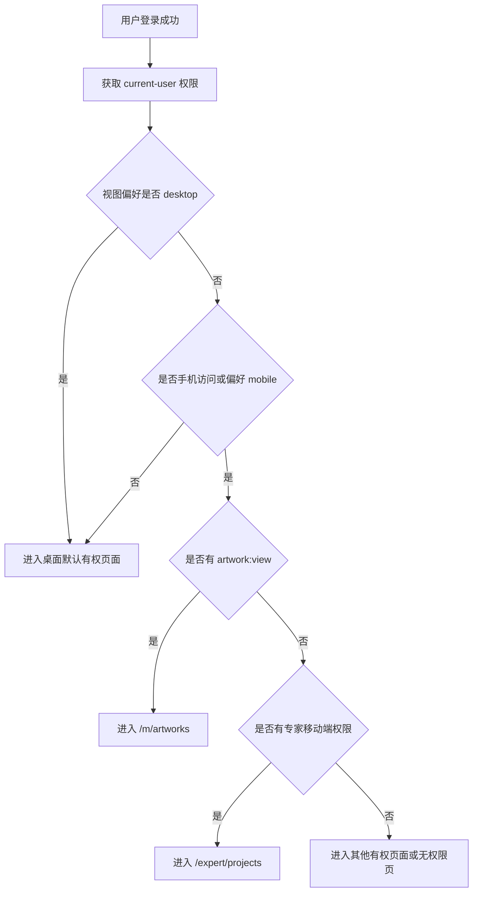
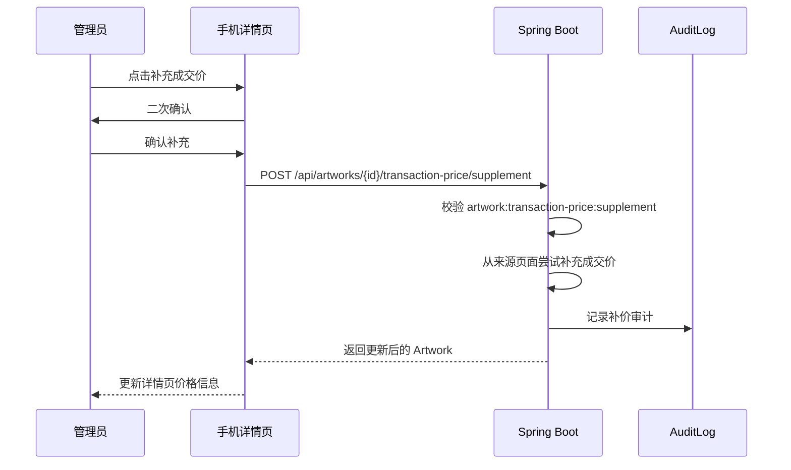
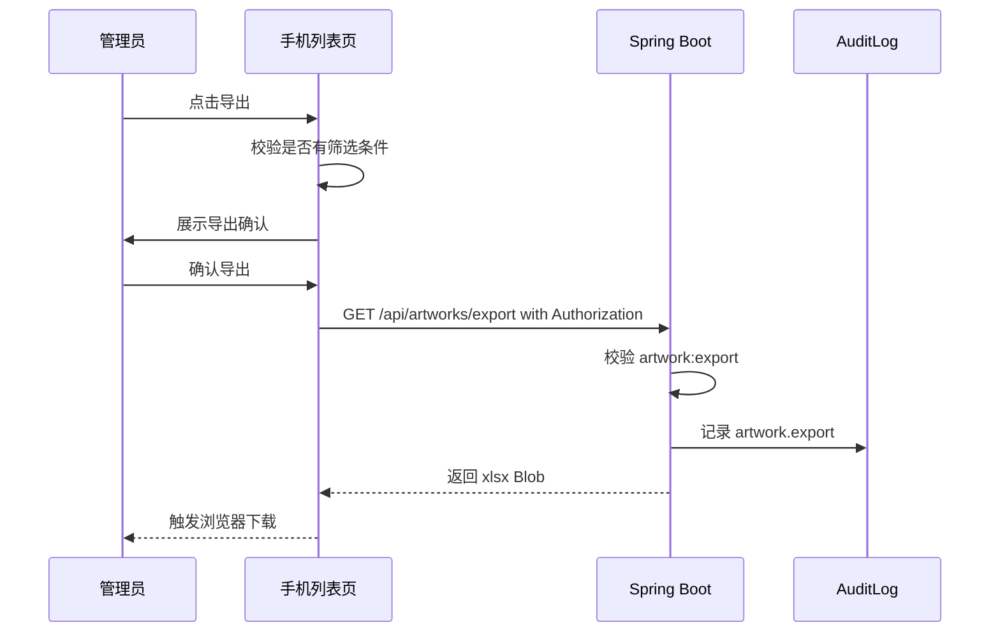

# ArtFetch 管理员手机端艺术品数据功能设计

## 文档信息

| 项 | 内容 |
|---|---|
| 当前版本 | v2 |
| 文档状态 | 设计讨论中 |
| 最后更新日期 | 2026-06-12 |
| 关联文档 | `docs/design-auth-sa-token.md`、`docs/prd-users-roles-permissions.md`、`docs/design-expert-mobile-web.md` |
| 适用范围 | 管理员或拥有艺术品数据权限的内部管理用户，在手机浏览器登录后浏览、筛选、查看、导出艺术品数据，并执行少量艺术品详情内操作 |

## 版本记录

| 版本 | 日期 | 变更说明 |
|---|---|---|
| v1 | 2026-06-12 | 初版，定义手机端艺术品浏览、详情和导出能力。 |
| v2 | 2026-06-12 | 根据设计讨论收紧范围为管理员手机端艺术品数据功能；明确不展示检索任务管理；新增单件补充成交价、成交价状态筛选、图片防下载和高清大图审计要求。 |

## 1. 背景

ArtFetch 当前已有桌面端后台，用户登录后可以按照权限访问检索任务、艺术品数据、评估项目、用户角色、审计日志、对象存储配置和高清图迁移等模块。艺术品数据页面已经支持列表筛选、详情查看、图片查看和 Excel 导出，但当前布局以桌面表格为主，在手机浏览器中横向滚动较多，操作成本高。

本设计面向管理员或内部管理用户在手机浏览器中临时查看艺术品数据的场景。手机端不是完整后台手机版，也不是专家评估移动端的替代入口。第一阶段只建设艺术品数据相关功能和账号自服务能力。

## 2. 设计目标

### 2.1 业务目标

- 管理员使用现有账号登录。
- 手机浏览器登录后，若当前账号拥有艺术品查看权限，默认进入手机端艺术品数据入口。
- 手机端只展示艺术品数据相关功能和我的账号功能。
- 管理员可以浏览艺术品数据列表。
- 管理员可以按常用条件筛选艺术品。
- 管理员可以查看单件艺术品详情页。
- 管理员可以基于当前筛选条件导出艺术品 Excel。
- 管理员可以在详情页补充单件艺术品成交价。
- 管理员可以按需查看原图和无损高清大图。
- 无损高清大图查看成功和失败都必须记录审计日志。

### 2.2 产品目标

- 优先适配 `360px` 至 `430px` 宽度手机屏幕。
- 列表以轻量卡片为主，避免桌面表格横向滚动。
- 首屏提供搜索框、筛选入口和导出入口，不直接铺开全部筛选项。
- 详情页按信息分组展示，首屏优先显示图片、标题、作者、拍卖基础信息。
- 价格信息只在详情页展示，列表页不展示估价和成交价。
- 导出前明确提示导出范围，禁止手机端无筛选条件导出全库。
- 写操作只保留“详情页单件补充成交价”，并要求二次确认。
- 手机端页面不出现完整后台导航，不暴露任务管理、权限管理、系统配置等入口。

### 2.3 非目标

- 不开发 iOS、Android、小程序或独立 H5 工程。
- 不新增独立后端服务、独立域名或独立登录体系。
- 不新增单独的 `/m/login` 登录页。
- 不在手机端展示检索任务列表、任务详情或任务操作。
- 不在手机端创建、启动、暂停、恢复、取消或删除检索任务。
- 不在手机端管理用户、角色、权限、审计日志、对象存储、高清图迁移或评估项目。
- 不在手机端重新下载原图或高清图。
- 不在手机端批量补充成交价。
- 不在手机端下载图片、分享图片链接或复制图片真实地址。
- 第一阶段不做离线缓存、收藏、分享、复杂看板、图表分析或异步导出中心。
- 第一阶段不加图片水印。

## 3. 用户与权限边界

手机端产品主语是“管理员手机端”，但实现不硬编码 `ADMIN` 角色，而是继续使用现有权限码控制。管理员拥有全部权限，因此天然可用；后续如需要给业务主管或数据查看员开放手机端，只需分配对应权限。

| 功能 | 所需权限 | 后端校验 | 前端表现 |
|---|---|---|---|
| 进入手机艺术品入口 | `artwork:view` | `/api/artworks`、`/api/artworks/{id}` 注解校验 | 有权限才进入 `/m/artworks` |
| 浏览艺术品列表 | `artwork:view` | `ArtworkController.listArtworks` | 展示列表、搜索、筛选、分页 |
| 查看艺术品详情 | `artwork:view` | `ArtworkController.getArtwork` | 点击卡片进入详情 |
| 导出艺术品 Excel | `artwork:export` | `ArtworkController.exportArtworks` | 有权限才显示导出按钮 |
| 查看原图 | `artwork:image:view` | 原图接口注解和服务层数据范围校验 | 详情页按需进入图片查看页 |
| 查看无损高清大图 | `artwork:image:view` | 高清图接口注解和服务层数据范围校验 | 详情页按需进入图片查看页，并记录审计 |
| 补充成交价 | `artwork:transaction-price:supplement` | 成交价补充接口注解校验 | 详情页显示单件补价按钮 |
| 修改自己的密码 | 登录用户 | `/api/auth/change-password` 登录态校验 | 我的账号页展示 |

权限要求：

- 前端按钮隐藏只是用户体验，不能替代后端权限校验。
- 手机端复用现有权限码，不新增 `mobile:*` 权限。
- 专家账号如果没有 `artwork:view`，不应因为使用手机访问而看到全库艺术品数据。
- 专家评估移动端 `/expert/*` 是独立入口，不属于本设计范围。

## 4. 手机端功能边界

### 4.1 允许的一级功能

| 功能 | 首期是否提供 | 说明 |
|---|---|---|
| 艺术品数据 | 是 | 手机端主功能，进入后直接看到艺术品列表 |
| 我的账号 | 是 | 显示账号信息、修改密码、退出登录、切换桌面版 |

### 4.2 不允许的一级功能

| 功能 | 首期是否提供 | 说明 |
|---|---|---|
| 检索任务 | 否 | 不展示任务列表、任务进度、失败记录或任务操作 |
| 评估项目 | 否 | 使用已有桌面端或专家移动端，不放进管理员手机入口 |
| 用户角色 | 否 | 后台管理功能，不适合手机端 |
| 审计日志 | 否 | 不在手机端提供审计日志查询 |
| 对象存储 | 否 | 运维配置能力，不适合手机端 |
| 高清图迁移 | 否 | 运维任务能力，不适合手机端 |

### 4.3 艺术品相关允许操作

| 操作 | 手机端是否允许 | 位置 |
|---|---|---|
| 浏览艺术品列表 | 是 | 列表页 |
| 筛选艺术品 | 是 | 列表页搜索框和筛选抽屉 |
| 查看艺术品详情 | 是 | 详情页 |
| 导出艺术品数据 | 是 | 列表页 |
| 查看缩略图 | 是 | 列表页、详情页 |
| 查看原图 | 是 | 详情页进入图片查看页 |
| 查看无损高清大图 | 是 | 详情页进入图片查看页 |
| 补充单件成交价 | 是 | 详情页 |
| 重新下载原图 | 否 | 不展示 |
| 重新下载高清图 | 否 | 不展示 |
| 批量补充成交价 | 否 | 不展示 |

## 5. 入口与设备识别

### 5.1 登录页

手机端复用现有 `/login`，不新增 `/m/login`。

登录成功后读取当前用户权限，并根据设备环境和视图偏好选择默认入口。

### 5.2 登录后跳转规则



推荐默认优先级：

1. 用户已选择桌面版：进入桌面默认有权页面。
2. 手机访问且有 `artwork:view`：进入 `/m/artworks`。
3. 手机访问且无 `artwork:view` 但有 `evaluation-review:assigned:view`：进入 `/expert/projects`。
4. 其他情况沿用现有桌面端默认入口逻辑。

### 5.3 手机识别策略

设备识别只作为入口选择和布局选择，不作为安全边界。

推荐实现：

- 优先使用 `window.matchMedia('(max-width: 768px)')` 判断当前视口。
- 辅助参考 User-Agent 中的 `Mobile`、`Android`、`iPhone` 等关键词。
- 当用户在平板或窄窗口桌面访问时，也允许进入 `/m/artworks`。
- 我的账号页提供“切换到桌面版”入口。

### 5.4 视图模式偏好

使用浏览器本地偏好保存用户主动切换：

```text
artfetch.viewMode = auto | mobile | desktop
```

规则：

- `auto`：根据屏幕宽度自动判断。
- `desktop`：即使是手机宽度，也进入桌面后台。
- `mobile`：即使是窄窗口桌面，也进入手机艺术品入口。
- 退出登录时清除该偏好，避免同一设备上下一个用户继承视图选择。

### 5.5 路由设计

建议新增移动端数据浏览路由：

| 路由 | 页面 | 权限 |
|---|---|---|
| `/m/artworks` | 手机艺术品列表 | `artwork:view` |
| `/m/artworks/:id` | 手机艺术品详情 | `artwork:view` |
| `/m/artworks/:id/images/original` | 手机原图查看页 | `artwork:image:view` |
| `/m/artworks/:id/images/hd` | 手机无损高清大图查看页 | `artwork:image:view` |
| `/m/profile` | 我的账号 | 登录即可 |

说明：

- `/artworks` 和 `/artworks/:id` 保持桌面端页面。
- `/expert/*` 保持专家评估移动端入口，不与 `/m/*` 混用。
- `/m/*` 使用独立 `MobileDataLayout`，避免桌面后台 Header、Menu、Table 样式影响手机体验。

## 6. 手机艺术品列表页

路由：

```text
/m/artworks
```

页面目标：让管理员快速浏览、搜索、筛选和定位艺术品。

### 6.1 页面结构

```text
┌─────────────────────────────┐
│ 艺术品数据              我的 │
├─────────────────────────────┤
│ 搜索标题 / 艺术家 / 编号       │
│ [筛选]              [导出]    │
│ 已筛选：高清图=已同步 · 成交价=待补充 │
├─────────────────────────────┤
│ 图片  标题                    │
│       作者 / 拍品编号          │
│       拍卖公司 · 拍卖日期      │
│       来源：2024春拍数据       │
│       [高清已同步]             │
├─────────────────────────────┤
│ 图片  标题                    │
│       作者 / 拍品编号          │
│       拍卖公司 · 拍卖日期      │
│       来源：2024春拍数据       │
│       [高清未同步]             │
├─────────────────────────────┤
│ 上一页    第 3 / 18 页    下一页 │
│ 共 356 条                    │
└─────────────────────────────┘
```

### 6.2 列表卡片字段

| 字段 | 展示规则 |
|---|---|
| 图片 | 使用 `imageUrl` 缩略图；无图时显示占位 |
| 标题 | 必显，最多两行 |
| 艺术家 | 无值显示“未知” |
| 拍品编号 | 有值时展示 |
| 拍卖公司 | 有值时展示 |
| 拍卖日期 | 有值时展示 |
| 来源任务名称 | 默认展示，只读信息，单行省略，不提供任务跳转 |
| 高清图状态 | 小标签展示“高清已同步/高清未同步/高清失败/无权限” |

列表页不展示：

- 估价。
- 成交价。
- 成交价备注。
- 补充成交价按钮。
- 原图状态。
- 任务 ID。
- 任务详情链接。
- 原始数据链接。

### 6.3 搜索和筛选

列表采用“搜索框 + 筛选抽屉 + 筛选摘要”的模式。

首屏搜索框：

| 条件 | 说明 |
|---|---|
| 关键词 | 匹配标题、艺术家或拍品编号，具体匹配规则沿用后端 `keyword` 实现 |

筛选抽屉：

| 条件 | 参数 | 说明 |
|---|---|---|
| 艺术家 | `artist` | 按艺术家筛选 |
| 拍品编号 | `lotNumber` | 快速定位单件 |
| 拍卖日期 | `auctionDate` | 支持年份或日期文本 |
| 高清大图状态 | `hdImageSyncStatus` | 复用现有状态 |
| 成交价状态 | `transactionPriceStatus` | 新增筛选，见下方规则 |

成交价状态筛选：

| 展示值 | 参数值 | 说明 |
|---|---|---|
| 全部 | 空 | 不限制成交价状态 |
| 已有成交价 | `HAS_PRICE` | `transactionPrice` 有有效值 |
| 待补充 | `MISSING` | 没有成交价且不是明确失败 |
| 补充失败 | `FAILED` | 没有成交价且 `transactionPriceNote` 表达失败或后端标记为失败 |

来源任务处理：

- 列表卡片显示来源任务名称。
- 筛选抽屉不提供来源任务下拉。
- 不加载任务列表。
- 不提供任务详情跳转。
- 如果从外部链接带入 `taskId`，可以保留该 URL 条件并展示“已按来源范围筛选”的摘要，但不提供任务选择器。

### 6.4 分页

手机端保留分页，但使用简化分页控件。

规则：

- 默认每页 `20` 条。
- 底部显示“上一页 / 第 N / M 页 / 下一页”。
- 底部显示总条数。
- 第一页禁用“上一页”。
- 最后一页禁用“下一页”。
- 筛选条件变化后回到第 1 页。
- URL 保留 `page` 参数。
- 不提供页码跳转器。
- 不提供每页条数选择器。

### 6.5 返回恢复

从详情页返回列表时必须恢复：

- 筛选条件。
- 页码。
- 当前列表状态。

推荐 URL 示例：

```text
/m/artworks?page=7&keyword=张大千&hdImageSyncStatus=SYNCED&transactionPriceStatus=MISSING
```

实现可以使用 URL search params、location state 或本地页面缓存，但用户体验上必须表现为回到原来的列表位置和页码。

## 7. 手机艺术品详情页

路由：

```text
/m/artworks/:id
```

页面目标：让管理员在手机上清晰查看单件艺术品资料，并在确认上下文后执行少量单件操作。

### 7.1 信息分组

| 分组 | 字段 |
|---|---|
| 首屏摘要 | 图片、标题、艺术家、拍品编号、拍卖公司、拍卖日期 |
| 作品信息 | 材质、形制、尺寸、拍品描述 |
| 价格信息 | 估价、成交价、成交价备注/状态 |
| 拍卖信息 | 拍卖会、拍卖专场、拍卖地点、预展时间、预展地点 |
| 图片状态 | 原图状态、高清图状态 |
| 系统信息 | 来源任务名称、抓取时间、原始数据链接 |

来源任务在详情页中作为只读来源信息展示：

- 显示完整来源任务名称。
- 不显示任务 ID。
- 不跳转任务详情。
- 不展示任务操作。

### 7.2 操作按钮

| 操作 | 首期是否提供 | 权限 | 说明 |
|---|---|---|---|
| 返回列表 | 是 | `artwork:view` | 返回时恢复筛选条件和页码 |
| 查看原始数据 | 是 | `artwork:view` | 有 `sourceUrl` 时展示，点击后打开外部来源页面 |
| 查看原图 | 是 | `artwork:image:view` | 进入独立图片查看页，不自动预加载 |
| 查看无损高清大图 | 是 | `artwork:image:view` | 进入独立图片查看页，使用 `hd-image-v2`，成功/失败都审计 |
| 补充成交价 | 是 | `artwork:transaction-price:supplement` | 详情页单件操作，必须二次确认 |
| 重新下载原图 | 否 | `artwork:image:redownload` | 后台维护操作，手机端不展示 |
| 重新下载高清图 | 否 | `artwork:image:redownload` | 后台维护操作，手机端不展示 |

### 7.3 补充成交价

手机端只支持在详情页补充单件成交价。

交互流程：



确认文案建议：

```text
标题：补充成交价
内容：将尝试从原始来源补充该艺术品成交价，并更新当前记录。
按钮：取消 / 确认补充
```

结果处理：

| 结果 | 页面反馈 | 审计 |
|---|---|---|
| 获取到成交价 | 更新成交价，提示“成交价已补充：xxx” | success=true |
| 请求成功但未获取到成交价 | 更新成交价备注，提示“未获取到成交价：xxx” | success=true，description 说明结果为空 |
| 接口异常 | 不改当前展示数据，提示“补充失败：xxx” | success=false，errorMessage 记录异常 |

审计建议：

```text
action = artwork.transaction-price.supplement
resourceType = ARTWORK
resourceId = artworkId
```

当前后端 `ArtworkController.supplementTransactionPrice` 需要补充审计记录，不能只依赖前端提示。

## 8. 图片查看设计

### 8.1 图片入口

详情页默认只展示缩略图或低成本预览图。

原图和无损高清大图必须由用户主动点击后再加载：

```text
查看原图：
/m/artworks/:id/images/original
GET /api/artworks/{id}/original-image

查看无损高清大图：
/m/artworks/:id/images/hd
GET /api/artworks/{id}/hd-image-v2
```

手机端查看高清大图统一使用 `/api/artworks/{id}/hd-image-v2`，不使用旧的 `/api/artworks/{id}/hd-image` 作为主入口。

如果缺少 `externalId` 或 `sourceUrl` 无法解析 artCode，详情页禁用“查看无损高清大图”按钮，并显示“作品缺少高清图识别信息，暂不能读取高清大图”。

### 8.2 图片查看页

原图和无损高清大图使用独立图片查看页，不使用普通新窗口、裸链接或直接打开对象存储地址。

图片查看页能力：

- 顶部返回详情。
- 图片居中显示。
- 支持缩放。
- 支持拖拽平移。
- 加载中状态。
- 加载失败状态。
- 重试按钮。

### 8.3 防下载要求

手机端不支持下载图片，并尽量防止普通用户直接下载。

第一阶段防护措施：

- 不提供下载按钮。
- 不使用裸对象存储 URL。
- 使用带 `Authorization` 的 API 请求读取图片 Blob。
- 不展示可复制图片地址。
- 禁用右键菜单。
- 尽量禁用移动端长按保存交互。
- 图片接口返回 `inline`，不返回 `attachment`。

明确限制：

- 浏览器里只要图片能被看到，就无法 100% 防止截图、录屏、抓包或开发者工具提取。
- 第一阶段不加水印。
- 第一阶段不提供追踪水印或动态水印。

### 8.4 高清大图失败提示

高清大图打不开时，手机端显示业务化错误提示，不直接暴露底层 TOS 异常、对象 key、Java stack 或凭据。

推荐前端提示：

| 失败原因 | 主提示 | 辅助提示 |
|---|---|---|
| 无权限 | 暂无法查看高清大图 | 当前账号没有高清图查看权限 |
| 缺少识别信息 | 暂无法查看高清大图 | 作品缺少高清图识别信息 |
| 未同步 | 暂无法查看高清大图 | 高清图尚未同步 |
| 对象不存在 | 暂无法查看高清大图 | 高清图文件不存在 |
| 读取失败 | 暂无法查看高清大图 | 高清图读取失败，请稍后重试 |
| 超时 | 暂无法查看高清大图 | 请求超时，请稍后重试 |
| 未知错误 | 暂无法查看高清大图 | 请稍后重试 |

操作：

- 返回详情。
- 重试。

### 8.5 高清大图审计

无损高清大图查看必须记录审计日志。原图查看第一阶段不强制审计。

审计范围：

- `/api/artworks/{id}/hd-image-v2` 成功读取。
- `/api/artworks/{id}/hd-image-v2` 失败，包括权限失败、识别信息缺失、对象不存在、TOS 读取失败、超时和未知异常。

统一审计格式：

```text
action = artwork.image.hd.view
resourceType = ARTWORK
resourceId = artworkId
success = true | false
```

成功描述建议：

```text
查看高清大图成功，imageVersion=hd-v2，title=作品标题
```

失败描述建议：

```text
查看高清大图失败，imageVersion=hd-v2，reasonCode=TOS_OBJECT_NOT_FOUND，title=作品标题
```

失败 `errorMessage`：

- 记录后端异常或更具体的失败信息。
- 不写入访问密钥、签名 URL、对象存储密钥、数据库密码等敏感凭据。
- 可以写入非敏感诊断信息，如 `reasonCode`、artworkId、解析到的 artCode 是否为空、HTTP 状态码。

建议失败原因码：

| reasonCode | 说明 |
|---|---|
| `NO_PERMISSION` | 当前用户无高清图查看权限 |
| `MISSING_ART_CODE` | 缺少 `externalId`，且 `sourceUrl` 无法解析 artCode |
| `HD_NOT_AVAILABLE` | 艺术品未形成可读取的高清图状态 |
| `TOS_OBJECT_NOT_FOUND` | 对象存储中不存在对应高清图 |
| `TOS_READ_FAILED` | 对象存储读取失败 |
| `TIMEOUT` | 请求超时 |
| `UNKNOWN_ERROR` | 未分类异常 |

现有审计表 `auth_audit_logs` 已支持记录：

- `userId`
- `username`
- `action`
- `resourceType`
- `resourceId`
- `description`
- `ipAddress`
- `userAgent`
- `success`
- `errorMessage`
- `createdAt`

因此第一阶段不要求新增审计表字段。若后续需要结构化查询 `reasonCode`，再考虑增加 `metadata` JSON 字段。

## 9. 导出设计

手机端导出 Excel 字段、文件名和格式与桌面端保持一致，不做移动端专属导出模板。

导出流程：



导出交互规则：

- 无 `artwork:export`：不显示导出按钮。
- 无筛选条件：提示“请先设置筛选条件后再导出”。
- 有筛选条件：展示确认框，提示“将按当前筛选条件导出 Excel”。
- 导出失败：展示后端错误信息，不清空列表。
- 导出文件名沿用后端 `artworks_yyyyMMdd_HHmmss.xlsx`。
- 导出请求必须携带 `Authorization`，不能使用普通 `<a href>` 裸链接。

手机端允许作为导出条件的字段：

- `keyword`
- `artist`
- `lotNumber`
- `auctionDate`
- `hdImageSyncStatus`
- `transactionPriceStatus`
- 外部深链带入的 `taskId`

手机端禁止无筛选条件导出全库。该限制第一阶段可先由前端拦截，但建议后端后续增加同等保护，避免绕过前端直接请求。

## 10. 我的账号页

路由：

```text
/m/profile
```

功能：

- 显示当前登录用户名和显示名。
- 修改自己的密码，复用 `/api/auth/change-password`。
- 切换到桌面版。
- 退出登录，复用 `/api/auth/logout`。

不展示：

- 当前角色列表。
- 权限明细。
- 用户管理入口。
- 角色管理入口。
- 审计日志入口。

## 11. 前端设计

### 11.1 建议新增结构

```text
frontend/src/layouts/MobileDataLayout.tsx
frontend/src/pages/mobile/MobileArtworksPage.tsx
frontend/src/pages/mobile/MobileArtworkDetailPage.tsx
frontend/src/pages/mobile/MobileArtworkImageViewerPage.tsx
frontend/src/pages/mobile/MobileProfilePage.tsx
frontend/src/pages/mobile/MobileRoutes.tsx
frontend/src/styles/mobile-data.css
```

### 11.2 布局原则

- 顶部栏只展示页面标题和账号入口。
- 底部导航只保留“艺术品”和“我的”两个入口。
- 列表卡片不使用嵌套卡片。
- 筛选面板使用抽屉。
- 按钮触控高度不小于 `44px`。
- 内容宽度使用 `100%`，不得产生横向滚动。
- 字段值长文本默认折行或省略，不撑破容器。
- 价格信息不进入列表卡片，避免卡片过重。
- 写操作按钮只放在详情页。

### 11.3 与桌面端复用关系

可复用：

- `api.listArtworks`
- `api.getArtwork`
- `api.downloadArtworksExport`
- `api.createProtectedBlobUrl`
- `api.supplementTransactionPrice`
- `permissions`
- `AuthContext`
- `RequireAuth`

建议抽取：

- 艺术品高清图状态标签渲染。
- 成交价展示逻辑。
- 导出筛选条件校验。
- 艺术品筛选 query 与 URL search params 转换。
- 图片 Blob 查看加载逻辑。

不建议复用：

- 桌面端 `ArtworksPage` 的 Ant Design `Table` 布局。
- 桌面端全局 Header 横向菜单。
- 桌面端详情页右上角的一组后台维护按钮。

## 12. 后端设计

### 12.1 复用接口

第一阶段复用现有艺术品接口，并对部分接口增加参数或审计：

```http
GET /api/artworks
GET /api/artworks/{id}
GET /api/artworks/export
GET /api/artworks/{id}/original-image
GET /api/artworks/{id}/hd-image-v2
POST /api/artworks/{id}/transaction-price/supplement
```

### 12.2 必须保持的权限校验

- `GET /api/artworks` 保持 `@SaCheckPermission(ARTWORK_VIEW)`。
- `GET /api/artworks/{id}` 保持 `@SaCheckPermission(ARTWORK_VIEW)`。
- `GET /api/artworks/export` 保持 `@SaCheckPermission(ARTWORK_EXPORT)`。
- `GET /api/artworks/{id}/original-image` 保持 `@SaCheckPermission(ARTWORK_IMAGE_VIEW)`。
- `GET /api/artworks/{id}/hd-image-v2` 保持 `@SaCheckPermission(ARTWORK_IMAGE_VIEW)`。
- `POST /api/artworks/{id}/transaction-price/supplement` 保持 `@SaCheckPermission(ARTWORK_TRANSACTION_PRICE_SUPPLEMENT)`。

### 12.3 必须新增或调整的后端能力

| 能力 | 说明 |
|---|---|
| 成交价状态筛选 | `GET /api/artworks` 支持 `transactionPriceStatus` |
| 成交价状态导出 | `GET /api/artworks/export` 支持同样的 `transactionPriceStatus` |
| 补充成交价审计 | `POST /api/artworks/{id}/transaction-price/supplement` 成功、结果为空、失败均记录审计 |
| 高清大图审计 | `GET /api/artworks/{id}/hd-image-v2` 成功和失败均记录 `artwork.image.hd.view` |
| 高清失败原因映射 | 将后端异常映射为稳定 `reasonCode`，供审计和前端提示使用 |

### 12.4 不新增任务依赖

手机端不要为了显示来源任务名称而要求用户拥有 `task:view`。

要求：

- 艺术品列表和详情 DTO 已经包含或应包含来源任务名称。
- 手机端不调用任务列表接口加载来源任务筛选项。
- 手机端不跳转任务详情。
- 如果未来需要来源任务筛选，应新增受 `ARTWORK_VIEW` 保护的轻量筛选项接口，而不是复用完整任务管理接口。

## 13. 数据与状态

### 13.1 URL 状态

`/m/artworks` 应保留筛选条件到 URL，方便刷新后恢复：

```text
/m/artworks?page=3&keyword=张大千&auctionDate=2023&hdImageSyncStatus=SYNCED&transactionPriceStatus=MISSING
```

保留字段：

- `page`
- `keyword`
- `artist`
- `auctionDate`
- `lotNumber`
- `hdImageSyncStatus`
- `transactionPriceStatus`
- 外部深链带入的 `taskId`

### 13.2 返回列表体验

从详情页返回列表时：

- 保留筛选条件。
- 保留当前页。
- 尽量恢复当前列表状态。
- 如果列表缓存过期，先展示旧列表，再后台刷新。

## 14. 安全与审计

### 14.1 通用安全要求

- 手机端不引入新的认证机制，继续使用 Sa-Token 和 `Authorization: Bearer <token>`。
- 所有 API 请求继续走 Axios 统一拦截器。
- 导出必须使用已鉴权请求，不能使用普通 `<a href>` 直连裸 URL。
- 图片、导出、补充成交价等资源和操作都必须经过后端权限校验。
- 设备识别不参与权限判断，用户即使伪造手机 User-Agent，也只能访问自己已有权限允许的功能。

### 14.2 审计要求

| 动作 | action | success 规则 | 说明 |
|---|---|---|---|
| 导出艺术品 | `artwork.export` | 成功返回 Excel 为 true，异常为 false | 现有接口已有成功审计，建议补充失败审计 |
| 补充成交价 | `artwork.transaction-price.supplement` | 接口成功但无价格也记 true；异常记 false | description 写清楚结果 |
| 查看高清大图 | `artwork.image.hd.view` | 读取成功为 true；权限、缺失、TOS、超时、异常均为 false | 必须记录 `hd-v2` 和 `reasonCode` |

原图查看第一阶段不要求审计。

## 15. 验收标准

### 15.1 权限验收

- 拥有 `artwork:view` 的管理员在手机登录后进入 `/m/artworks`。
- 没有 `artwork:view` 的用户直接访问 `/m/artworks` 返回无权限页或跳转到有权页面。
- 没有 `artwork:export` 的用户看不到导出按钮。
- 没有 `artwork:export` 的用户直接请求 `/api/artworks/export` 返回 403。
- 没有 `artwork:transaction-price:supplement` 的用户看不到补充成交价按钮。
- 没有 `artwork:image:view` 的用户看不到原图和高清大图入口，直接请求图片接口返回 403。
- 专家账号若没有 `artwork:view`，手机端不能看到全库艺术品列表。

### 15.2 功能验收

- 手机端不显示检索任务一级入口。
- 手机端不显示用户、角色、权限、审计日志、对象存储、高清图迁移入口。
- 列表卡片显示图片、标题、艺术家、拍品编号、拍卖公司、拍卖日期、来源任务名称和高清图状态。
- 列表卡片不显示估价和成交价。
- 列表不提供来源任务筛选和任务跳转。
- 详情页显示估价、成交价和成交价备注/状态。
- 详情页显示来源任务名称，但不跳转任务页。
- 详情页可以打开原始数据链接。
- 详情页补充成交价必须二次确认。

### 15.3 筛选与分页验收

- 列表采用搜索框、筛选抽屉和筛选摘要。
- 支持 `keyword`、`artist`、`lotNumber`、`auctionDate`、`hdImageSyncStatus`、`transactionPriceStatus`。
- 筛选变化后回到第 1 页。
- 使用简化分页控件显示上一页、当前页/总页数、下一页和总条数。
- 从详情返回列表后恢复筛选条件和页码。

### 15.4 导出验收

- 有筛选条件且有权限时可以下载 Excel。
- 无筛选条件时前端阻止导出并提示。
- 导出请求携带 `Authorization`。
- 导出 Excel 字段和桌面端保持一致。
- 导出支持 `transactionPriceStatus` 筛选。
- 后端产生 `artwork.export` 审计日志。
- 导出失败时列表仍可继续使用。

### 15.5 图片验收

- 详情页默认不自动加载原图或无损高清大图。
- 原图和高清大图通过独立图片查看页按需加载。
- 高清大图统一读取 `/api/artworks/{id}/hd-image-v2`。
- 图片查看页不提供下载按钮。
- 图片查看页不暴露对象存储 URL 或可复制图片地址。
- 图片查看页禁用右键菜单，并尽量禁用移动端长按保存。
- 高清大图成功查看记录 `artwork.image.hd.view`，success=true。
- 高清大图查看失败记录 `artwork.image.hd.view`，success=false，并包含 `reasonCode`。
- 原图查看第一阶段不要求审计。
- 高清图失败时前端显示业务化错误提示，不暴露底层 TOS 异常细节。

### 15.6 响应式验收

- `360px`、`390px`、`430px` 宽度下无横向滚动。
- 列表卡片图片、标题、拍卖信息、来源任务和高清状态不重叠。
- 筛选抽屉可打开、应用、重置。
- 详情页字段分组清晰，长文本不撑破布局。
- 底部导航和分页控件触控目标不小于 `44px`。

### 15.7 测试限制

- 自动化测试不得打开或反复请求高清大图二进制流。
- 验证高清图相关状态时优先检查接口返回字段、对象 key、文件大小、ETag、迁移状态或审计记录。
- 不使用脚本批量请求 `/api/artworks/{id}/hd-image`、`/api/artworks/{id}/hd-image-v2` 或专家高清图接口。

## 16. 分阶段实施建议

### 第一阶段：管理员手机艺术品闭环

- 新增 `/m/*` 路由和移动端布局。
- 复用现有 `/login`，登录后按设备和权限跳转 `/m/artworks`。
- 实现手机艺术品列表页。
- 实现搜索框、筛选抽屉、筛选摘要和简化分页。
- 实现手机艺术品详情页。
- 实现详情页单件补充成交价和审计。
- 实现手机原图和高清大图查看页。
- 实现图片防下载基础措施。
- 实现高清大图 `hd-v2` 成功/失败审计。
- 实现手机端导出，并禁止无筛选条件导出。

### 第二阶段：体验优化

- 优化返回列表时的状态恢复。
- 增加最近筛选条件。
- 增加图片懒加载占位。
- 优化弱网加载和重试。
- 优化高清图失败原因提示。

### 第三阶段：数据安全增强

- 后端限制无筛选全量导出。
- 后端增加导出最大条数或异步导出任务。
- 审计日志补充导出筛选摘要。
- 如存在按部门、项目或任务的数据范围要求，再增加服务层数据范围校验。
- 如后续确实需要更强图片追责，再评估用户水印或动态水印。

