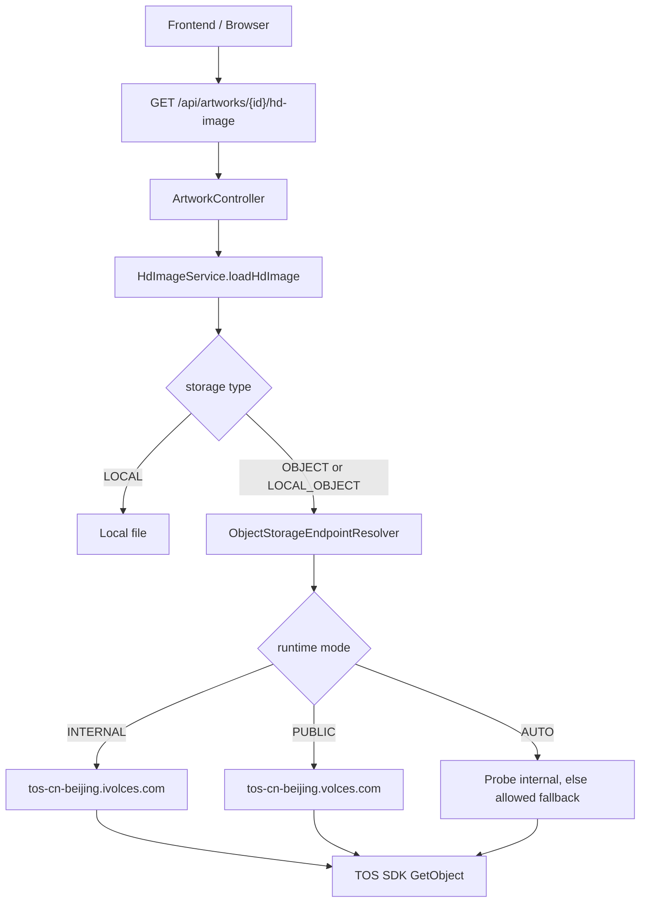
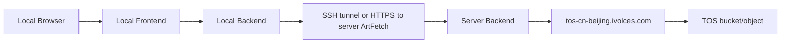

# ArtFetch TOS 内网 Endpoint 访问设计文档

编写日期：2026-05-20

## 1. 背景

ArtFetch 高清大图已经支持迁移到火山引擎 TOS。当前后端读取高清图时，前端仍访问受保护接口：

```text
GET /api/artworks/{id}/hd-image
```

后端再根据 `artworks.hd_image_storage_type` 判断读取本地文件或 TOS 对象。已迁移数据的 TOS 对象路径形态为：

```text
bucket: artfetch
key: artfetch/hd-images/prod/task-{taskId}/{externalId}/hd-lossless.png
```

当前对象存储配置中，启用配置使用的是公网 Endpoint：

```text
tos-cn-beijing.volces.com
```

这会导致部署在火山云服务器上的后端，在读取和上传高清大图时仍走公网 TOS Endpoint，产生不必要的公网流量成本。火山 TOS 北京地域同时提供内网 Endpoint：

```text
tos-cn-beijing.ivolces.com
```

服务器位于同地域可访问内网时，应优先使用内网 Endpoint。本地开发、异地调试、非火山云环境不应默认使用公网 Endpoint，而应通过远程内网代理、远程开发环境或本地 mock/cache 完成调试。公网 Endpoint 只作为故障应急开关。

## 2. 官方依据与约束

火山引擎文档列出了 TOS 北京地域普通 Endpoint：

| Region | 外网 Endpoint | 内网 Endpoint |
|---|---|---|
| `cn-beijing` | `tos-cn-beijing.volces.com` | `tos-cn-beijing.ivolces.com` |

文档还说明 `ivolces` 表示内网访问，`volces` 表示公网访问。本设计基于这个网络边界做访问路径选择。

重要约束：

- 内网 Endpoint 只应在能够访问火山内网的运行环境使用，例如同地域 VPC 内的 ECS、容器或通过私网连接打通的环境。
- 本地开发机通常无法直接访问 `*.ivolces.com` 内网地址，强行直连会导致调试失败；但可以通过同地域服务器转发、远程开发或 mock/cache 避免 TOS 公网流量。
- 不能在代码或配置里硬编码解析出来的 IP。官方文档提示 TOS 域名解析网段可能变化，应始终使用域名。
- 计费规则以火山引擎账单和最新计费文档为准。系统侧只负责确保生产读写优先走内网 Endpoint，避免误走公网。

参考：

- 火山引擎 TOS 地域和访问域名：`https://www.volcengine.com/docs/6349/74822`
- 火山引擎 Lance/TOS 文档中关于本地用公网、ECS 用内网的说明：`https://www.volcengine.com/docs/6491/1359395`

## 3. 目标

- 生产服务器读取和上传 TOS 高清大图默认走内网 Endpoint。
- 本地开发和远程调试不走 TOS 公网 Endpoint；优先使用远程内网代理、服务器远程开发或本地 mock/cache。
- 公网 Endpoint 仅作为紧急恢复业务的 break-glass 开关，使用后必须恢复。
- 保持 `/api/artworks/{id}/hd-image` 前端访问方式不变，不把 TOS 裸地址暴露给浏览器。
- 对象 key、bucket、权限、鉴权模型不变，避免重新迁移对象。
- 支持启动时校验当前 endpoint 可达，避免生产静默退回公网。
- 增加日志、健康检查和指标，能看出当前实际使用的是内网还是公网。
- 支持灰度、回滚和紧急绕过。

## 4. 非目标

- 不改变高清大图在 TOS 中的 object key 规则。
- 不要求前端直接访问 TOS/CDN。
- 不在第一阶段改造为 CDN 图片分发。
- 不引入多云对象存储抽象。
- 不在客户端保存 AK/SK 或临时 STS 凭证。

## 5. 当前实现问题

当前对象存储配置表已有字段：

```text
endpoint
network_type
bucket
path_prefix
public_base_url
```

但当前 `ObjectStorageClientFactory` 只读取 `config.endpoint` 创建 TOS SDK client。`network_type` 目前主要是配置展示字段，并没有参与 endpoint 选择。

因此存在几个问题：

- 生产和本地共用一个 `endpoint`，无法同时保存公网和内网地址。
- 管理员如果把 `endpoint` 改成内网，本地调试后端会连不上 TOS。
- 管理员如果为了本地调试保留公网，生产就会继续产生公网流量。
- 无法通过日志或健康检查确认生产是否实际走了内网。
- `LOCAL_OBJECT` 回退本地时会掩盖对象存储访问失败，生产可能长时间不知道 TOS endpoint 配置错误。

## 6. 总体方案

采用“同一份对象元数据 + 双 endpoint 配置 + 运行环境选择”的方案。

核心原则：

1. 数据库中的对象身份仍然是 `bucket + object_key`。
2. Endpoint 是运行时访问策略，不是对象身份的一部分。
3. 对象存储配置保存公网和内网两个 Endpoint。
4. 后端根据运行环境选择 Endpoint。
5. 生产默认强制内网；本地默认不直连 TOS。
6. 本地需要真实高清图时，通过服务器内网代理读取。
7. 如果要求零 TOS 公网成本，所有环境禁止自动回退公网。

目标架构：



## 7. Endpoint 配置设计

### 7.1 数据库字段

建议扩展 `object_storage_configs`：

```sql
alter table object_storage_configs
    add column if not exists public_endpoint text,
    add column if not exists internal_endpoint text,
    add column if not exists preferred_endpoint_type varchar(30) not null default 'AUTO',
    add column if not exists allow_public_fallback boolean not null default false;
```

字段说明：

| 字段 | 说明 |
|---|---|
| `public_endpoint` | 公网普通 TOS Endpoint，例如 `tos-cn-beijing.volces.com` |
| `internal_endpoint` | 内网普通 TOS Endpoint，例如 `tos-cn-beijing.ivolces.com` |
| `preferred_endpoint_type` | 配置级偏好：`AUTO`、`PUBLIC`、`INTERNAL` |
| `allow_public_fallback` | 内网不可达时是否允许回退公网，生产建议 `false` |
| `endpoint` | 兼容旧字段，迁移后保留为 legacy 字段，不再作为唯一来源 |
| `network_type` | 兼容旧 UI 字段，后续可弱化为展示或废弃 |

兼容迁移：

```sql
update object_storage_configs
set public_endpoint = endpoint
where public_endpoint is null
  and endpoint is not null
  and endpoint <> '';

update object_storage_configs
set internal_endpoint = replace(public_endpoint, '.volces.com', '.ivolces.com')
where internal_endpoint is null
  and public_endpoint like '%.volces.com';
```

当前生产配置迁移后的期望值：

```text
public_endpoint: tos-cn-beijing.volces.com
internal_endpoint: tos-cn-beijing.ivolces.com
preferred_endpoint_type: AUTO 或 INTERNAL
allow_public_fallback: false
```

### 7.2 应用配置

新增后端配置：

```yaml
artfetch:
  object-storage:
    endpoint-mode: ${ARTFETCH_OBJECT_STORAGE_ENDPOINT_MODE:AUTO}
    allow-public-fallback: ${ARTFETCH_OBJECT_STORAGE_ALLOW_PUBLIC_FALLBACK:false}
    fail-startup-if-unreachable: ${ARTFETCH_OBJECT_STORAGE_FAIL_STARTUP_IF_UNREACHABLE:false}
    probe-timeout-ms: ${ARTFETCH_OBJECT_STORAGE_PROBE_TIMEOUT_MS:2000}
```

枚举：

```text
EndpointMode:
- AUTO      自动选择。生产建议配合 allow-public-fallback=false。
- INTERNAL 只使用内网 Endpoint，不可达直接失败。
- PUBLIC   只使用公网 Endpoint，仅用于紧急恢复业务，不用于日常本地调试。
```

推荐环境变量：

| 环境 | `ARTFETCH_OBJECT_STORAGE_ENDPOINT_MODE` | `ARTFETCH_OBJECT_STORAGE_ALLOW_PUBLIC_FALLBACK` |
|---|---|---|
| 生产服务器 | `INTERNAL` | `false` |
| 预发服务器 | `INTERNAL` 或 `AUTO` | `false` |
| 本地开发 | `INTERNAL` 或禁用直连，配合远程代理/mock | `false` |
| 成本排查 | `INTERNAL` | `false` |
| 紧急恢复业务 | `PUBLIC` | `true`，使用后必须恢复 |

### 7.3 Endpoint 解析规则

新增 `ObjectStorageEndpointResolver`：

```text
resolve(config, purpose):
  mode = env endpoint-mode 优先，否则 config.preferred_endpoint_type
  if mode = INTERNAL:
      require internal_endpoint
      return internal_endpoint
  if mode = PUBLIC:
      require public_endpoint
      return public_endpoint
  if mode = AUTO:
      if internal_endpoint 可达:
          return internal_endpoint
      if allow_public_fallback:
          return public_endpoint
      throw "内网 Endpoint 不可达，且禁止回退公网"
```

`purpose` 用于日志和后续扩展：

```text
READ_HD_IMAGE
UPLOAD_HD_IMAGE
MIGRATE_HD_IMAGE
TEST_CONNECTION
```

第一阶段不同 purpose 可以共用同一选择规则。后续如果上传和读取策略不同，再拆分。

## 8. 调试场景设计

### 8.1 本地零 TOS 公网流量原则

本地调试分三类，不再默认走 `tos-cn-beijing.volces.com`：

| 场景 | 推荐方案 | 是否访问 TOS 公网 |
|---|---|---|
| 调页面、权限、列表、错误处理 | 本地 mock/cache | 否 |
| 需要真实高清图内容 | 远程内网图片代理 | 否 |
| 需要排查服务器真实行为 | 远程开发或服务器 debug | 否 |
| TOS 内网故障下恢复线上业务 | 临时 PUBLIC break-glass | 是，仅应急 |

### 8.2 方案 A：远程内网图片代理

这是本地看真实高清大图的首选方案。

思路：

1. 生产或调试服务器位于火山同地域 VPC，可以访问 `tos-cn-beijing.ivolces.com`。
2. 本地后端不直接连 TOS。
3. 本地后端在需要读取高清图时，把请求转发到服务器上的 ArtFetch 受保护接口。
4. 服务器后端通过内网 Endpoint 从 TOS 读取对象，再把响应流返回给本地。

链路：



特点：

- TOS 侧看到的是服务器访问内网 Endpoint。
- 本地不需要保存 TOS AK/SK。
- 前端 URL 可以保持 `/api/artworks/{id}/hd-image` 不变。
- 本地和服务器之间会传输图片字节，但这不是 TOS 公网流量；如果服务器公网出带宽也计费，应限制调试图片大小或使用远程浏览器。

建议新增后端 dev 配置：

```text
ARTFETCH_HD_IMAGE_READ_MODE=REMOTE_PROXY
ARTFETCH_HD_IMAGE_REMOTE_BASE_URL=http://127.0.0.1:18080/api
ARTFETCH_HD_IMAGE_REMOTE_TOKEN=<developer-token>
```

本地启动 SSH 隧道示例：

```bash
ssh -N -L 18080:127.0.0.1:8080 artfetch-server
```

`HdImageService.loadHdImage` 在 `REMOTE_PROXY` 模式下：

```text
GET {remoteBaseUrl}/artworks/{id}/hd-image
Authorization: Bearer {remoteToken}
```

然后把远端响应流原样返回给本地浏览器。

安全要求：

- `remoteToken` 使用独立调试账号或短期 token。
- 只在本地 profile 允许 `REMOTE_PROXY`。
- 日志要标记 `hdImageReadMode=REMOTE_PROXY`。
- 不把远程 token 写入仓库。

### 8.3 方案 B：远程开发或服务器 debug

服务器环境：

```text
ARTFETCH_OBJECT_STORAGE_ENDPOINT_MODE=INTERNAL
ARTFETCH_OBJECT_STORAGE_ALLOW_PUBLIC_FALLBACK=false
```

行为：

- 后端只访问 `tos-cn-beijing.ivolces.com`。
- 如果内网不可达，请修 VPC、地域、DNS 或安全组，不自动切到公网。
- 这是验证“生产是否省钱”的标准调试方式。

推荐方式：

- 通过 SSH 登录服务器运行后端 debug 实例。
- 使用远程 IDE、Codex/CLI、VS Code Remote SSH 等方式在服务器目录开发。
- 前端本地调试时，把 `/api` 代理到 SSH 隧道后的服务器后端。

如果希望连图片字节也尽量少出服务器公网，使用远程浏览器或服务器桌面查看页面；本地只接收压缩后的屏幕画面。

### 8.4 方案 C：本地 mock/cache

大多数前端和业务调试不需要真实 TOS。

建议新增本地图片读取模式：

```text
ARTFETCH_HD_IMAGE_READ_MODE=LOCAL_CACHE
ARTFETCH_HD_IMAGE_LOCAL_CACHE_PATH=storage/dev-hd-cache
```

规则：

- 如果本地 cache 命中：直接返回本地文件。
- 如果未命中：返回固定测试图或 404，由前端展示错误状态。
- 本地 cache 文件名沿用 object key 的安全映射，例如：

```text
storage/dev-hd-cache/artfetch/hd-images/prod/task-1/art5060841293/hd-lossless.png
```

cache 来源：

- 从服务器导出少量低风险样本。
- 使用脚本生成小尺寸 PNG 占位图。
- 使用测试 bucket 的非生产数据。

这条路线完全不访问 TOS，适合做 UI、权限、导出、错误处理和列表筛选。

### 8.5 方案 D：SSH SOCKS 代理访问内网 TOS

不推荐作为第一期主方案，但可以作为高级调试手段。

思路：

1. 本地启动 SSH dynamic SOCKS 代理到火山服务器。
2. 本地后端仍配置内网 Endpoint：`tos-cn-beijing.ivolces.com`。
3. Java HTTP client 通过 SOCKS 代理发起连接，让服务器侧访问 TOS 内网。

示例：

```bash
ssh -N -D 1080 artfetch-server
```

本地 JVM 参数：

```text
-DsocksProxyHost=127.0.0.1
-DsocksProxyPort=1080
```

风险和限制：

- 需要确认火山 TOS Java SDK 使用的 HTTP client 是否完整遵循 JVM SOCKS 配置。
- 需要确认域名解析和 TLS SNI 仍使用 `tos-cn-beijing.ivolces.com`。
- 如果 SDK 不走 JVM 代理，需要定制 SDK HTTP client，实施成本高于远程图片代理。

因此第一期不把 SOCKS 作为主路径。

### 8.6 明确禁止的本地调试方式

不推荐：

- 为了本地调试把数据库里的主 endpoint 改成公网。
- 在生产环境打开 `allow_public_fallback=true` 后长期遗忘。
- 把内网域名写死到代码里，导致本地不可用。
- 本地直接使用 `tos-cn-beijing.volces.com` 拉取高清大图。

### 8.7 临时公网回退

只有在 TOS 内网故障、VPC 故障或紧急恢复业务时使用：

```text
ARTFETCH_OBJECT_STORAGE_ENDPOINT_MODE=PUBLIC
ARTFETCH_OBJECT_STORAGE_ALLOW_PUBLIC_FALLBACK=true
```

要求：

- 操作必须记录审计或运维变更。
- 日志中持续输出 `endpointType=PUBLIC`。
- 故障结束后恢复 `INTERNAL`。
- 可以增加启动时警告：生产 profile 下使用 `PUBLIC` 输出 ERROR 级别日志。

## 9. 后端改造点

### 9.1 配置实体和 DTO

修改：

- `ObjectStorageConfig`
- `ObjectStorageConfigDto`
- `SaveObjectStorageConfigRequest`
- `ObjectStorageConfigService`
- `ObjectStorageSettingsPage`

新增或调整字段：

```text
publicEndpoint
internalEndpoint
preferredEndpointType
allowPublicFallback
```

UI 建议：

- Region 选择后自动填充公网和内网 Endpoint。
- 北京地域默认：
  - 公网：`tos-cn-beijing.volces.com`
  - 内网：`tos-cn-beijing.ivolces.com`
- 网络策略用单选：
  - 自动
  - 生产内网优先
  - 远程代理调试
  - 本地 mock/cache
  - 应急公网
- 明确提示：生产服务器请使用内网；本地调试优先远程代理或 mock/cache；公网只用于应急恢复。

### 9.2 TOS Client 创建

当前：

```java
new TOSV2ClientBuilder().build(region, config.getEndpoint(), accessKey, secretKey)
```

目标：

```java
String endpoint = endpointResolver.resolve(config, purpose).endpoint();
new TOSV2ClientBuilder().build(region, endpoint, accessKey, secretKey)
```

建议 result 结构：

```java
record ResolvedEndpoint(
    String endpoint,
    EndpointType type,
    EndpointMode mode,
    boolean fallbackUsed
) {}
```

### 9.3 连接测试

对象存储配置页测试连接时，应支持测试三类结果：

```text
public endpoint: SUCCESS / FAILED / SKIPPED
internal endpoint: SUCCESS / FAILED / SKIPPED
effective endpoint: INTERNAL / PUBLIC
```

本地开发点击测试：

- 默认不测试公网 Endpoint。
- 如果使用 `REMOTE_PROXY`，测试远程服务器健康检查。
- 如果使用 `LOCAL_CACHE`，测试本地 cache 路径可读。
- 内网直连失败是可接受的，但 UI 要显示“当前本机不可达，请使用远程代理或服务器调试，不要切公网”。

服务器生产点击测试：

- 内网必须成功。
- 如果内网失败且不允许公网回退，配置不能启用或健康检查失败。

### 9.4 健康检查

新增内部健康检查：

```http
GET /api/settings/object-storage/active/health
```

权限：

```text
settings:object-storage:view
```

返回示例：

```json
{
  "configId": 1,
  "bucket": "artfetch",
  "mode": "INTERNAL",
  "endpointType": "INTERNAL",
  "endpoint": "tos-cn-beijing.ivolces.com",
  "reachable": true,
  "fallbackUsed": false,
  "message": "OK"
}
```

不要返回 AK/SK。

### 9.5 读取高清图

`HdImageService.loadHdImage` 行为：

- `OBJECT`：只读 TOS。TOS 失败直接报错。
- `LOCAL_OBJECT`：优先读 TOS；如果 TOS 失败，是否回退本地由配置控制。

建议新增：

```yaml
artfetch:
  object-storage:
    local-fallback-enabled: ${ARTFETCH_OBJECT_STORAGE_LOCAL_FALLBACK_ENABLED:true}
```

生产成本控制重点是 TOS endpoint，不是本地回退。本地回退可以保留，但必须记录 WARN 日志和指标，避免长期隐性失败。

## 10. 日志、指标与告警

### 10.1 日志

每次创建 TOS client 或完成 endpoint 解析时，输出低频 INFO 日志：

```text
TOS endpoint resolved: configId=1, purpose=READ_HD_IMAGE, mode=INTERNAL, endpointType=INTERNAL, endpoint=tos-cn-beijing.ivolces.com, fallbackUsed=false
```

读取失败时：

```text
TOS read failed: artworkId=123, objectKey=..., endpointType=INTERNAL, fallbackToLocal=true, message=...
```

生产使用公网时输出 ERROR：

```text
Production object storage is using PUBLIC endpoint. This may cause public traffic charges.
```

### 10.2 指标

建议增加计数指标：

```text
artfetch_tos_request_total{purpose,endpoint_type,result}
artfetch_tos_bytes_total{purpose,endpoint_type}
artfetch_tos_fallback_total{from="INTERNAL",to="PUBLIC"}
artfetch_hd_image_local_fallback_total
```

如果暂未接 Prometheus，也可先写入结构化日志，后续由日志平台聚合。

### 10.3 启动保护

生产环境建议：

```text
ARTFETCH_OBJECT_STORAGE_ENDPOINT_MODE=INTERNAL
ARTFETCH_OBJECT_STORAGE_FAIL_STARTUP_IF_UNREACHABLE=true
```

启动时执行一次 `HeadBucket` 或轻量测试对象操作。失败时阻止应用启动，避免生产上线后悄悄走公网或高清图不可用。

## 11. 安全与权限

- 前端仍通过 `/api/artworks/{id}/hd-image` 访问高清图。
- 后端继续使用 `@SaCheckPermission(PermissionCodes.ARTWORK_IMAGE_VIEW)` 控制高清图查看。
- 对象存储配置继续使用：
  - `settings:object-storage:view`
  - `settings:object-storage:manage`
- 配置变更、测试、启用、禁用必须写审计日志。
- 审计日志和应用日志不得记录 Secret Key。
- `public_base_url` 不参与高清图读取，不应因为配置了公开域名就绕过后端鉴权。

## 12. 发布与迁移计划

### P0 文档和配置确认

- 确认生产后端部署环境是否在 `cn-beijing` 同地域 VPC。
- 确认生产服务器 DNS 可以解析并访问 `tos-cn-beijing.ivolces.com`。
- 确认公网回退策略：生产默认禁止。

### P1 数据库兼容迁移

- 新增 endpoint 字段。
- 将旧 `endpoint` 迁移到 `public_endpoint`。
- 自动生成 `internal_endpoint`。
- 保留旧字段，避免旧版本应用启动失败。

### P2 后端 endpoint resolver

- 新增 `ObjectStorageEndpointResolver`。
- 修改 `ObjectStorageClientFactory` 支持 purpose 和 resolved endpoint。
- 增加配置项和启动校验。
- 增加日志。

### P3 前端配置页

- 展示公网 Endpoint、内网 Endpoint、运行策略。
- 测试连接展示公网/内网分别结果。
- 增加远程代理调试和本地 mock/cache 的说明。
- 提示本地调试不要使用公网 Endpoint。

### P4 生产切换

1. 发布兼容版本。
2. 在服务器上测试 `INTERNAL` 可达。
3. 设置生产环境变量：

```text
ARTFETCH_OBJECT_STORAGE_ENDPOINT_MODE=INTERNAL
ARTFETCH_OBJECT_STORAGE_ALLOW_PUBLIC_FALLBACK=false
```

4. 重启后端。
5. 查看日志确认：

```text
endpointType=INTERNAL
endpoint=tos-cn-beijing.ivolces.com
fallbackUsed=false
```

6. 抽样打开高清图，确认成功。

### P5 回滚

如果内网不可达且需要恢复业务，优先回滚到本地文件读取或 `LOCAL_OBJECT` 本地回退；只有确认业务必须读 TOS 且内网暂时无法恢复时，才启用公网应急：

```text
ARTFETCH_OBJECT_STORAGE_ENDPOINT_MODE=PUBLIC
ARTFETCH_OBJECT_STORAGE_ALLOW_PUBLIC_FALLBACK=true
```

重启后端即可临时回到公网访问。回滚后必须记录原因、限定时长，并继续修复内网网络问题。

## 13. 验收标准

- 生产服务器打开高清大图时，日志显示 `endpointType=INTERNAL`。
- 本地开发打开高清大图时，可以通过 `REMOTE_PROXY` 或 `LOCAL_CACHE` 正常调试，不访问 TOS 公网 Endpoint。
- 前端访问 URL 不变。
- 数据库中的 `hd_image_object_key` 不变，不需要重新迁移图片。
- 生产 `INTERNAL` 模式下，内网不可达时不会自动走公网。
- 对象存储配置页面能清楚看到公网和内网 Endpoint。
- 审计日志记录配置变更，但不泄露密钥。
- 至少抽样 10 张 `LOCAL_OBJECT` 高清图可通过内网 Endpoint 正常读取。

## 14. 后续增强

- 增加运维页面展示近 24 小时 TOS 访问 endpoint 分布。
- 支持一键“服务器环境测试”，由后端返回内网连通性。
- 增加公网流量风险告警。
- 若未来要直接给浏览器分发图片，再单独设计 CDN、签名 URL、鉴权和防盗链方案。
